# The Pain-First Way: Cloud Native for AI Developers

Cloud native is the operating system for production software. AI development grew up parallel to it, mostly in notebooks and on rented GPU boxes. That's changed. Inference at scale, multi-agent systems, enterprise rollouts. The walls between an experiment and a system are coming down, and on the other side of those walls is a vocabulary AI developers haven't had to learn yet.

This guide is that vocabulary, pain-first. Each pain starts with a problem you've hit or are about to, names what's actually happening, and points at the cloud native primitive that solves it. Read in order, or jump to the one biting you this week.

What this guide is not: a Kubernetes tutorial. There are 500 of those. This is a translation between two worlds that increasingly need each other, with an honest accounting of where the translation runs out.

## Who this guide is for

AI developers whose work has outgrown a notebook:

- **ML engineers** shipping models from training to production
- **LLM app developers** serving inference at scale
- **Agent builders** running multi-step systems that fail in ways the notebook never did

Not the target audience: researchers who live in notebooks, data analysts, or MLOps engineers who already speak Kubernetes. You might still find parts of this useful sideways, but the guide assumes you're crossing from "trained a model" toward "operating a system," not coming the other direction.

## The pains

A growing catalog of pains across two on-ramps, notebook and HPC, and the production lifecycle from foundation to compliance. Click any pain to jump to it.

```mermaid
flowchart LR
    subgraph F["Foundation (F)"]
        direction TB
        F01[✓ F.01 Model breaks in prod]
        F02[F.02 Model supply chain]
        F01 ~~~ F02
    end
    subgraph C["Compute (C)"]
        direction TB
        C01[✓ C.01 GPU job crashed]
        C02[✓ C.02 Can't get a GPU]
        C03[C.03 Can't express GPU config]
        C04[✓ C.04 Multi-node falling over]
        C05[C.05 GPUs starve for data]
        C01 ~~~ C02
        C02 ~~~ C03
        C03 ~~~ C04
        C04 ~~~ C05
    end
    subgraph S["Serving (S)"]
        direction TB
        S01[✓ S.01 Cold start]
        S02[✓ S.02 Server image coupling]
        S03[✓ S.03 Can't roll back]
        S04[S.04 Quality gates]
        S05[S.05 Inference routing]
        S06[S.06 Serving many models]
        S07[S.07 Weight stampede]
        S01 ~~~ S02
        S02 ~~~ S03
        S03 ~~~ S04
        S04 ~~~ S05
        S05 ~~~ S06
        S06 ~~~ S07
    end
    subgraph O["Operations (O)"]
        direction TB
        O01[✓ O.01 GPU at 30 percent]
        O02[O.02 Latency spiked]
        O03[O.03 Model drift]
        O04[O.04 Costs out of control]
        O05[O.05 GPU device health]
        O01 ~~~ O02
        O02 ~~~ O03
        O03 ~~~ O04
        O04 ~~~ O05
    end
    subgraph G["Governance (G)"]
        direction TB
        G01[✓ G.01 Prompt version in prod]
        G02[G.02 Reproduce shipped model]
        G03[✓ G.03 Deploy guardrails]
        G01 ~~~ G02
        G02 ~~~ G03
    end
    subgraph R["Compliance (R)"]
        direction TB
        R01[R.01 Data residency]
        R02[R.02 Tenant isolation]
        R03[R.03 Audit evidence]
        R01 ~~~ R02
        R02 ~~~ R03
    end
    subgraph A["Agent Systems (A)"]
        direction TB
        A01[✓ A.01 Durable agents]
        A02[A.02 Sandboxed code exec]
        A03[A.03 Tool/MCP fleet]
        A04[A.04 Agent egress control]
        A05[A.05 Runaway-loop governance]
        A01 ~~~ A02
        A02 ~~~ A03
        A03 ~~~ A04
        A04 ~~~ A05
    end
    subgraph H["Coming from HPC (H)"]
        direction TB
        H01[H.01 SLURM rewrite]
        H02[H.02 SLURM bridge]
        H01 ~~~ H02
    end
    F --> C --> S --> O --> G --> R --> A
    H ==> C
    classDef avail fill:#bbf7d0,stroke:#16a34a,stroke-width:1px,color:#14532d;
    class F01,C01,C02,C04,S01,S02,O01,S03,G01,G03,A01 avail;
    style H fill:#fef3c7,stroke:#d97706,stroke-width:2px,color:#1f2937;
    linkStyle 30 stroke:#d97706,stroke-width:3px;
    click F01 "https://github.com/arun-gupta/the-pain-first-way/blob/main/pains/foundation/F01-model-works-locally.md"
    click C01 "https://github.com/arun-gupta/the-pain-first-way/blob/main/pains/compute/C01-gpu-job-crashed.md"
    click C02 "https://github.com/arun-gupta/the-pain-first-way/blob/main/pains/compute/C02-cant-get-a-gpu.md"
    click C03 "https://github.com/arun-gupta/the-pain-first-way/blob/main/pains/compute/C03-whole-gpus-only.md"
    click C04 "https://github.com/arun-gupta/the-pain-first-way/blob/main/pains/compute/C04-multi-node-training.md"
    click S01 "https://github.com/arun-gupta/the-pain-first-way/blob/main/pains/serving/S01-cold-start.md"
    click S02 "https://github.com/arun-gupta/the-pain-first-way/blob/main/pains/serving/S02-server-image-coupling.md"
    click O01 "https://github.com/arun-gupta/the-pain-first-way/blob/main/pains/operations/O01-gpu-underutilized.md"
    click S03 "https://github.com/arun-gupta/the-pain-first-way/blob/main/pains/serving/S03-cant-roll-back.md"
    click O02 "https://github.com/arun-gupta/the-pain-first-way/blob/main/pains/operations/O02-latency-spiked.md"
    click O04 "https://github.com/arun-gupta/the-pain-first-way/blob/main/pains/operations/O04-costs-out-of-control.md"
    click G01 "https://github.com/arun-gupta/the-pain-first-way/blob/main/pains/governance/G01-prompt-version.md"
    click R01 "https://github.com/arun-gupta/the-pain-first-way/blob/main/pains/compliance/R01-data-residency.md"
    click H01 "https://github.com/arun-gupta/the-pain-first-way/blob/main/pains/hpc/H01-slurm-migration.md"
    click H02 "https://github.com/arun-gupta/the-pain-first-way/blob/main/pains/hpc/H02-slurm-bridge.md"
    click S05 "https://github.com/arun-gupta/the-pain-first-way/blob/main/pains/serving/S05-inference-routing.md"
    click S06 "https://github.com/arun-gupta/the-pain-first-way/blob/main/pains/serving/S06-serving-many-models.md"
    click S07 "https://github.com/arun-gupta/the-pain-first-way/blob/main/pains/serving/S07-weight-stampede.md"
    click C05 "https://github.com/arun-gupta/the-pain-first-way/blob/main/pains/compute/C05-data-starvation.md"
    click F02 "https://github.com/arun-gupta/the-pain-first-way/blob/main/pains/foundation/F02-model-supply-chain.md"
    click O05 "https://github.com/arun-gupta/the-pain-first-way/blob/main/pains/operations/O05-device-health.md"
    click S04 "https://github.com/arun-gupta/the-pain-first-way/blob/main/pains/serving/S04-quality-gates.md"
    click G02 "https://github.com/arun-gupta/the-pain-first-way/blob/main/pains/governance/G02-model-reproducibility.md"
    click A01 "https://github.com/arun-gupta/the-pain-first-way/blob/main/pains/agents/A01-durable-agents.md"
    click R02 "https://github.com/arun-gupta/the-pain-first-way/blob/main/pains/compliance/R02-tenant-isolation.md"
    click O03 "https://github.com/arun-gupta/the-pain-first-way/blob/main/pains/operations/O03-model-drift.md"
    click A02 "https://github.com/arun-gupta/the-pain-first-way/blob/main/pains/agents/A02-agent-sandbox.md"
    click A03 "https://github.com/arun-gupta/the-pain-first-way/blob/main/pains/agents/A03-tool-fleet.md"
    click A04 "https://github.com/arun-gupta/the-pain-first-way/blob/main/pains/agents/A04-agent-egress.md"
    click A05 "https://github.com/arun-gupta/the-pain-first-way/blob/main/pains/agents/A05-runaway-agents.md"
    click G03 "https://github.com/arun-gupta/the-pain-first-way/blob/main/pains/governance/G03-deploy-guardrails.md"
    click R03 "https://github.com/arun-gupta/the-pain-first-way/blob/main/pains/compliance/R03-audit-evidence.md"
```

**Legend:** ✓ (green) = a runnable before/after example exists today; unmarked = planned. The amber **Coming from HPC** path is an alternate on-ramp into Compute for teams migrating off SLURM.

## How to use this guide

Each pain is meant to be worked through end-to-end:

1. **Pick a pain.** The landscape diagram above links to each pain's page.
2. **Read the pattern and primitives.** What's actually happening, and the cloud native pieces that solve it.
3. **Try the example.** A runnable manifest demonstrating the primitives in action.

Examples live in [`examples/`](examples/) and are filled in pain-by-pain as the guide evolves. When a pain's example ships, the pain page links to it directly. See [examples/README.md](examples/README.md) for current status and to contribute one.

## The mental model shift

Before reading a pain, the reframe:

| From (your world) | To (cloud native) | The shift |
|---|---|---|
| Notebook kernel on your laptop | Pod: ephemeral, scheduled, identical to N others | Compute is interchangeable |
| `python serve.py` (an invocation) | Deployment: declared state of N replicas, platform keeps it true | Imperative becomes declarative |
| Local file on a disk you own | Volume: survives the pod, lives on infrastructure, mounted in | Storage outlives compute |
| `.env` with `HF_TOKEN` in plain text | Secret: scoped, rotated, audited | Secrets are first-class, not afterthoughts |
| "It works on my machine" | Container image: identical run, everywhere | The artifact is the contract |

The shift, in one line: invoke less, declare more.

## Reference

- [The Rosetta table](reference/rosetta-table.md): one-to-one mappings between your world and cloud native
- [CN primitives glossary](reference/cn-glossary.md): plain-language definitions for lower-level CN terms with no direct ML equivalent
- [Where cloud native doesn't help](reference/where-cn-doesnt-help.md): honest scope statement on what this guide doesn't cover
- [What not to translate](reference/what-not-to-translate.md): cloud native dogma that bends or breaks for AI workloads
- [Reading path](reference/reading-path.md): five things to actually touch, in order

## Contributing

Feedback, corrections, and additional pains welcome. See [CONTRIBUTING.md](CONTRIBUTING.md).

## License

Licensed under [Apache-2.0](LICENSE).
