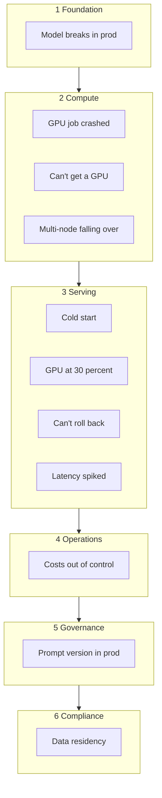
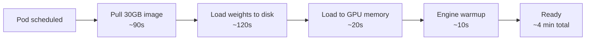
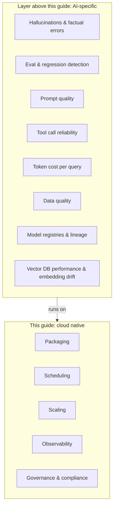
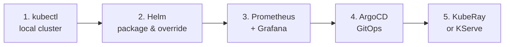

# Cloud Native for AI Developers: A Pain-First Field Guide

## Why this guide exists

Cloud native is the operating system for production software. AI development grew up parallel to it, mostly in notebooks and on rented GPU boxes, mostly stateless about anything beyond the next training run. That's changed. Inference at scale, multi-agent systems, enterprise rollouts. The walls between an experiment and a system are coming down, and on the other side of those walls is a vocabulary AI developers haven't had to learn yet.

This guide is that vocabulary, pain-first. Each section starts with a problem you've probably hit or are about to, names what's actually happening, and points at the cloud native primitive that solves it. You don't have to read it in order. Hit the wall you're hitting this week.

What this guide is not: a Kubernetes tutorial. There are 500 of those. This is a translation between two worlds that increasingly need each other, with an honest accounting of where the translation runs out.

## The mental model shift

Before any specific primitive, the reframe:

| From (your world) | To (cloud native) | The shift |
|---|---|---|
| Notebook kernel on your laptop | Pod: ephemeral, scheduled, identical to N others | Compute is interchangeable |
| `python serve.py` (an invocation) | Deployment: declared state of N replicas, platform keeps it true | Imperative becomes declarative |
| Local file on a disk you own | Volume: survives the pod, lives on infrastructure, mounted in | Storage outlives compute |
| `.env` with `HF_TOKEN` in plain text | Secret: scoped, rotated, audited | Secrets are first-class, not afterthoughts |
| "It works on my machine" | Container image: identical run, everywhere | The artifact is the contract |

The shift, in one line: invoke less, declare more.

## The pains

Eleven pains, sequenced from foundation to compliance. Read in order, or jump to the one you're hitting this week.

### "Model works locally, breaks in prod"

What's happening: your model serves perfectly on your laptop. On the prod VM, it crashes on import. Different Python, different CUDA, missing system lib, drift in `transformers` minor version. Nobody can reproduce your environment because nobody captured it.

The pattern: the unit of deployment is not your code, it's your code plus everything it depends on. You declare that whole thing once, freeze it, sign it, and ship the frozen artifact to every environment.

The primitives:
- **Container image**: your code, runtime, system libs, model weights (optionally), built from a Dockerfile, stored in a registry, addressable by digest
- **Dockerfile**: the declarative recipe for how that image gets built
- **Image registry** (GHCR, ECR, Harbor): the place every environment pulls from

What you keep: your code, your `requirements.txt`, your model artifacts. The Dockerfile is a wrapper.

What you give up: "it works on my machine" as a defense. The image either runs or doesn't, identically, everywhere.

### "My GPU job crashed at hour 14 and I lost everything"

What's happening: you ran `python train.py` on a rented GPU box. Process died. No checkpoint policy, no auto-restart, no record of which step you were on. The box is fine. Your run isn't.

The pattern: long-running compute should be declared, not invoked. You describe what you want (image, command, resources, retry policy, where state lives) and the platform owns running it to completion.

The primitives:
- **Job**: a workload that runs to completion with retry-on-failure built in
- **PersistentVolumeClaim**: durable storage that outlives the pod, so checkpoints survive process death
- **Checkpoint hooks**: your code writes state on a cadence; on restart, it resumes from the last good one

What you keep: your training code, mostly unchanged. The diff is a YAML manifest and a `--resume-from` flag.

What you give up: `htop` and `ls -la`. Logs come from `kubectl logs`. State lives on a volume you don't see directly. Worth it the first time hour 14 doesn't cost you a day.

### "I can't get a GPU when I need one"

What's happening: you submit a training job. It sits `Pending` for hours. The cluster has GPUs but they're all claimed. You don't know who's using them, when they'll free up, or whether your job will ever schedule.

The pattern: GPUs are a constrained resource, and constrained resources need a queue, a priority order, and a clear answer to "when will my job run?" The scheduler enforces this, not human luck or Slack messages.

The primitives:
- **Kueue**: native Kubernetes job queueing with quotas, priorities, and fair sharing per team
- **PriorityClasses**: production inference outranks experiments; high-priority jobs preempt lower ones if needed
- **GPU sharing** (MIG, time-slicing, MPS): one A100 or H100 split across multiple smaller workloads when you don't need a whole one
- **Cluster autoscaler with GPU node pools**: capacity comes online when the queue grows, scales down when idle

What you keep: your training and inference code.

What you give up: walking up to a box and grabbing it. Allocation becomes declared, queued, and visible.

### "Multi-node training keeps falling over"

What's happening: your distributed training job needs 32 GPUs across 4 nodes. One node hiccups at hour 6, NCCL hangs, the whole run dies. Or three workers come up, the fourth is still pulling the image, and the others time out waiting.

The pattern: distributed training is all-or-nothing. The platform either gives you every node you asked for at the same time, with the right network and the ability to recover, or it shouldn't start the job at all.

The primitives:
- **Gang scheduling** (Volcano, Kueue): the job starts when all N pods can run together, not pod-by-pod
- **Training operators** (KubeRay, PyTorchJob, MPIJob, TorchX): primitives that understand distributed training semantics, including elastic recovery
- **High-performance networking**: RDMA, GPUDirect, configured at the node and CNI layer so NCCL isn't going over a slow path
- **Topology-aware scheduling**: pods land on nodes connected to the same fast switch, not scattered across the rack

What you keep: your PyTorch or JAX training code.

What you give up: the assumption that you can just `torchrun` 32 ranks and it'll work. The platform has to know this is a distributed job and treat it as one.

### "Cold start for my 70B model takes 4 minutes"

What's happening: a new replica needs to scale up. It pulls a 30GB image, downloads model weights from object storage, loads them into GPU memory, and warms the inference engine. Your users wait 4 minutes for the first response after a scale event.

The pattern: cold start is real cost in AI workloads, and the answer isn't "make the model smaller." It's keeping ready capacity, splitting what loads when, and caching aggressively at every layer.

The primitives:
- **Pre-pulled images on nodes**: cache the image so node startup doesn't repull 30GB
- **Init containers**: load weights into a shared volume before the main container starts
- **PVCs and node-local caches**: model weights stored once per node, mounted into pods
- **Warm pools and minimum replicas**: HPA's `minReplicas` higher than zero, plus headroom for traffic spikes
- **KServe and serving-aware autoscalers** (KEDA HTTP, Knative): frameworks that explicitly model load-once, serve-many

What you keep: your model and your model server.

What you give up: scale-to-zero as a default. For big models, the math usually favors a warm floor.

### "My GPU sits at 30% but my bill says 100%"

What's happening: your inference server runs on an H100. `nvidia-smi` shows 30% utilization at p50 load. You're paying for the whole GPU every hour. Latency is fine, efficiency is awful.

The pattern: GPU utilization comes from feeding the GPU enough work per unit time. That's mostly a model-server config problem (batching, KV cache, sequence packing), but the layer around it matters too: routing enough requests to each replica, autoscaling on the right signal, sometimes sharing one GPU across multiple smaller workloads.

The primitives:
- **Continuous batching** (in vLLM, TGI, SGLang): not strictly cloud native, but the prerequisite for any of the rest to matter
- **Custom-metric HPA**: scale on tokens-per-second or queue depth, not CPU
- **Service mesh request routing**: hold a queue at the proxy so each replica stays busy without overloading
- **GPU sharing** (MIG, time-slicing): when one workload genuinely can't fill the card

What you keep: your model. The wins come from how you serve it.

What you give up: the comfort of "one GPU per workload" as a default. Efficiency comes from sharing and shaping.

### "I can't roll back a bad model without downtime"

What's happening: you pushed v3 of your model. p99 doubled and accuracy on your top intent dropped 4 points. Reverting means SSHing into N boxes, hoping the previous binary is still there, and praying nothing is half-deployed.

The pattern: deployment is a controlled state transition, not a script. Old replicas keep serving until new ones prove healthy. Rollback is reverting the declared state, not re-running install.

The primitives:
- **Deployment**: declares "I want N replicas of this image with these resources"; the controller makes reality match
- **Rolling update**: replaces pods in batches, only after each new one passes a health check
- **Canary and blue-green** (Argo Rollouts, Flagger): route 5% of traffic to v3, watch metrics, ramp or revert

What you keep: your model server. The Deployment is a YAML manifest wrapping it.

What you give up: deploying as a verb you do. Deployment becomes a state you declare, and the platform converges to it.

### "Inference latency spiked and I can't tell why"

What's happening: your model server's p99 jumped from 200ms to 4s overnight. Logs show nothing weird. You don't know if it's the model, the GPU, the network, the queue, or the upstream caller.

The pattern: you can't fix what you can't see. Production systems instrument three layers before traffic exists. Metrics over time, logs as discrete events, traces showing the path of one request across services.

The primitives:
- **Prometheus**: scrapes numeric metrics from your service (tokens/sec, queue depth, GPU utilization, p50/p95/p99)
- **OpenTelemetry**: instruments your code to emit traces and logs in a standard format
- **Grafana**: dashboards and alerts over the above

What you keep: your inference server code. vLLM, TGI, and FastAPI either expose Prometheus metrics already or are one decorator away.

What you give up: debugging from `print` statements after the fact. You instrument up front, or you stay blind.

### "Costs are out of control"

What's happening: your AI app's GPU bill tripled. Half your replicas are idle at 3am, the other half OOM'd at peak yesterday, and nobody capped how many GPUs the new fine-tuning experiment can grab.

The pattern: capacity follows demand, not the other way around. Workloads scale based on signal. Idle workloads scale down (within the warm-pool floor you set for cold start). Best-effort jobs ride cheap, preemptible capacity.

The primitives:
- **HPA (Horizontal Pod Autoscaler)**: replicas track a metric (CPU, GPU, custom)
- **KEDA**: HPA on event sources like queue length, Kafka lag, or a Prometheus query
- **Spot and preemptible nodes**: cheap capacity for training, fine-tuning, and other interruptible work
- **ResourceQuotas**: hard caps per team or namespace so one experiment can't eat the cluster

What you keep: your model server and your training jobs. The scaling and capping happen around them.

What you give up: the comfort of a fixed fleet. Capacity becomes elastic, and you have to think about what's interruptible.

### "I can't tell which prompt version is in prod"

What's happening: a customer reports a regression on a specific kind of query. You suspect a prompt change from two weeks ago. The prompt lives partly in code, partly in a Notion doc, partly in a `.env` file on the prod box. Nobody can answer "what prompt was running on August 12th."

The pattern: any value that affects behavior is config, and config has a version, an owner, and a history. The prod environment doesn't have hidden state. What's running is what's in git.

The primitives:
- **ConfigMaps**: non-secret config (prompts, model names, feature flags) mounted into pods, versioned in git alongside the manifest
- **Image tags and digests**: every deploy references a specific image digest, so you can reproduce any past state
- **GitOps history**: the git log of your environment repo is your deployment audit trail; rollback is `git revert`

What you keep: your prompts and your prompt-engineering process. They move from scattered storage into a tracked file.

What you give up: editing a prompt in prod via the web UI. Prompt changes become PRs, which is annoying for about a week and load-bearing forever after.

### "Customer X's data can't leave their region"

What's happening: enterprise sale closes on the condition that the customer's prompts, embeddings, and outputs never leave the EU. Your inference cluster is in us-east-1. You promise it'll be fine. It isn't.

The pattern: data locality is a hard requirement, not a preference. Workloads run in the region where the data sits, with the network paths and access controls to prove it. Compliance lives in declarative policy, not in a Confluence page.

The primitives:
- **Multi-cluster** (one cluster per region, or per customer): your control plane spans regions, your data planes don't
- **Namespace isolation with RBAC**: per-tenant boundaries inside a cluster, with bounded permissions
- **NetworkPolicies**: explicit allow-lists for which pods can talk to what; egress denied by default
- **External Secrets and KMS integration**: keys live in the customer's vault, not your image
- **Service mesh policies**: enforce mTLS, allowed destinations, and audit logging at the network layer

What you keep: your app. The fleet wraps it.

What you give up: a single global cluster as the default mental model. Some workloads have to live where the data lives.

## Where cloud native doesn't help

A field guide is only credible if it admits its limits. Cloud native answers a specific class of problems: packaging, scheduling, scaling, network, observability, governance, compliance. There's another class it has nothing useful to say about. Knowing the difference saves you from forcing a Kubernetes-shaped answer onto a non-Kubernetes-shaped problem.

A working AI system needs both layers: the one this guide covers, and the one it doesn't. Don't expect either to do the other's job.

## The Rosetta table

For the parts that genuinely map one-to-one:

| What you're doing today | What changes in prod | What that's called |
|---|---|---|
| `pip install -r requirements.txt` on a server | Frozen, signed, reproducible artifact | Container image |
| `python train.py` and hoping | Scheduled, checkpointed, retried | Job |
| `uvicorn serve:app` on a VM | Rolling updates, health checks, N replicas | Deployment + Service |
| `.env` with HF_TOKEN | Rotated, audited, scoped per workload | Secret |
| Hyperparameters in argparse | Per-tenant config without rebuilding the image | ConfigMap |
| `ssh` into the GPU box | `kubectl exec` into the pod | (same idea, different door) |
| Ray cluster spun up by hand | Cluster as a declared object | KubeRay / Operator |
| Local model files on disk | Durable storage that survives the pod | PersistentVolume / PVC |
| "Restart if it dies" | Self-healing replicas | ReplicaSet / Deployment |

The table covers what cleanly maps. The pain sections cover what doesn't.

## What not to translate

A few places where cloud native dogma either bends or breaks for AI workloads. Knowing these makes you fluent, not just compliant.

- **Stateless is not the default for AI.** Twelve-factor assumes workloads are stateless and can be rescheduled cheaply. Models are big, slow to load, and warm slowly. Cold start is a real cost, not a footnote.
- **Pods are not always ephemeral.** A serving replica with a 70B model in GPU memory is not "interchangeable" the way a stateless Go service is. Treat it that way operationally, but build for graceful drain.
- **Microservices is not always the right shape.** An agent pipeline can be a graph inside one process or a fleet of services. The right boundary depends on failure isolation, scaling needs, and latency, not on a default.
- **Horizontal scaling has a ceiling at GPU prices.** Sometimes the answer is one bigger box, not more small ones.
- **Scale-to-zero is often the wrong choice.** Defensible for small CPU workloads, expensive for big models. Most AI workloads want a warm minimum, not a cold zero.
- **CRDs are not free.** A new operator is a new dependency. Use the upstream one (KubeRay, Kubeflow, KServe) before you write your own.

## Reading path

Five things to actually touch, in order. One weekend each.

1. **kubectl** against a local cluster (kind, k3d). Deploy a FastAPI inference server. Read its logs.
2. **Helm**. Package the same app. Override values for a second environment.
3. **Prometheus and Grafana**. Scrape one metric. Build one dashboard. Set one alert.
4. **ArgoCD**. Put your Helm chart in a git repo. Deploy by merging a PR.
5. **An operator**. Pick KubeRay or KServe. Run a training job or serve a model declaratively.

After this, the rest of cloud native is variations on patterns you've already touched.

## Closing

Cloud native didn't ask the AI world's permission to become a prerequisite. It just became one, the moment AI workloads started serving real traffic, sharing real infrastructure, and shipping to real customers. The patterns are the same ones that took the rest of the industry from "it works on my laptop" to "it works for ten million users." They translate, mostly cleanly, with a handful of honest exceptions called out above.

The faster the translation happens, the faster AI in production stops being heroic and starts being boring. Boring is the goal.

---

Feedback, corrections, and additional pains welcome. Open an issue or PR.

Licensed under [Apache-2.0](LICENSE).
