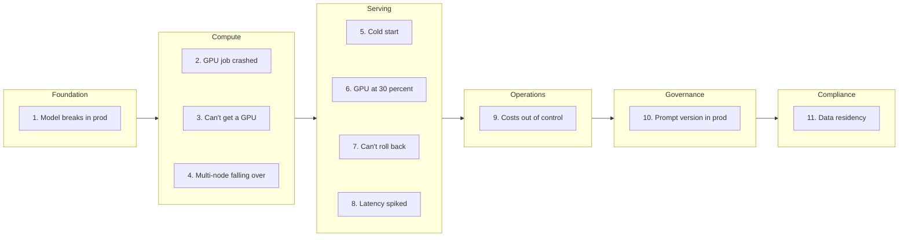

# Cloud Native for AI Developers: A Pain-First Field Guide

Cloud native is the operating system for production software. AI development grew up parallel to it, mostly in notebooks and on rented GPU boxes. That's changed. Inference at scale, multi-agent systems, enterprise rollouts. The walls between an experiment and a system are coming down, and on the other side of those walls is a vocabulary AI developers haven't had to learn yet.

This guide is that vocabulary, pain-first. Each pain starts with a problem you've hit or are about to, names what's actually happening, and points at the cloud native primitive that solves it. Read in order, or jump to the one biting you this week.

What this guide is not: a Kubernetes tutorial. There are 500 of those. This is a translation between two worlds that increasingly need each other, with an honest accounting of where the translation runs out.

## The pains

Eleven pains, sequenced from foundation to compliance. Click any pain to jump to it.

## The mental model shift

Before reading a pain, the reframe:

| From (your world) | To (cloud native) | The shift |
|---|---|---|
| Notebook kernel on your laptop | Pod: ephemeral, scheduled, identical to N others | Compute is interchangeable |
| `python serve.py` (an invocation) | Deployment: declared state of N replicas, platform keeps it true | Imperative becomes declarative |
| Local file on a disk you own | Volume: survives the pod, lives on infrastructure, mounted in | Storage outlives compute |
| `.env` with `HF_TOKEN` in plain text | Secret: scoped, rotated, audited | Secrets are first-class, not afterthoughts |
| "It works on my machine" | Container image: identical run, everywhere | The artifact is the contract |

The shift, in one line: invoke less, declare more.

## Reference

- [The Rosetta table](reference/rosetta-table.md): one-to-one mappings between your world and cloud native
- [Where cloud native doesn't help](reference/where-cn-doesnt-help.md): honest scope statement on what this guide doesn't cover
- [What not to translate](reference/what-not-to-translate.md): cloud native dogma that bends or breaks for AI workloads
- [Reading path](reference/reading-path.md): five things to actually touch, in order

## Examples

Runnable manifests, scripts, and starter code per pain. See [examples/](examples/). Filled in pain-by-pain as the guide evolves.

## Contributing

Feedback, corrections, and additional pains welcome. See [CONTRIBUTING.md](CONTRIBUTING.md).

## License

Licensed under [Apache-2.0](LICENSE).
