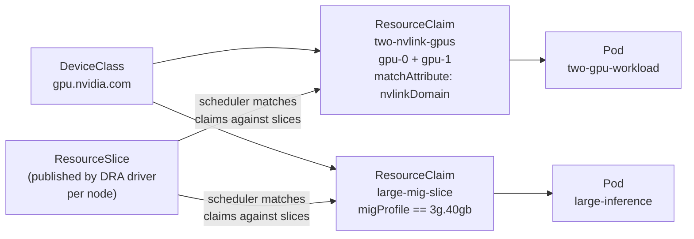

# After: DRA topology-aware placement

**Not runnable in Kind** — DRA requires Kubernetes 1.34 and a vendor DRA driver installed on GPU nodes. The YAML here is the reference for when that hardware is available. Each file includes inline notes explaining what the scheduler does differently.

> These manifests have not been verified on live hardware. If you have access to GPU nodes with a DRA driver, contributions welcome — see [issue #24](https://github.com/arun-gupta/the-pain-first-way/issues/24).

This is the same situation as MIG configuration in [Pain O.01's after example](../../08-gpu-underutilized/after/README.md): the manifests are the artefact; a simulated cluster cannot exercise them.

## What changes

With the integer model (`before/`), the scheduler fills a count. With DRA, the scheduler matches structured claims against structured device advertisements:

| Before | After |
|---|---|
| `nvidia.com/gpu: 2` — count only | `ResourceClaim` — two GPUs, same NVLink domain |
| `nvidia.com/gpu: 1` — any GPU | `ResourceClaim` — MIG profile `3g.40gb` specifically |
| Topology enforced via `nodeAffinity` labels | Topology enforced by the scheduler natively |
| Labels maintained manually per node | `ResourceSlice` published automatically by the DRA driver |

## Prerequisites (real cluster)

- Kubernetes 1.34
- NVIDIA GPU Operator with DRA support enabled, or the standalone [NVIDIA DRA driver](https://github.com/NVIDIA/k8s-dra-driver)
- Nodes with A100 or H100 GPUs (for MIG), or NVLink-connected GPU pairs (for topology)

## 0. Install the DeviceClass (cluster admin, once)

```bash
kubectl apply -f device-class.yaml
```

`device-class.yaml` tells the scheduler what a "GPU" looks like — specifically, any device advertised by the `gpu.resource.nvidia.com` driver. All `ResourceClaim` objects reference this class.

---

## Scenario 1: topology-aware placement

### 1. Create the ResourceClaim

```bash
kubectl apply -f resource-claim-topology.yaml
```

The `matchAttribute` constraint in `resource-claim-topology.yaml` tells the scheduler: both `gpu-0` and `gpu-1` must have the same value for `nvlinkDomain` in the node's `ResourceSlice`. The scheduler only places the pod on a node where this is true.

To see what the NVIDIA DRA driver published for your nodes:

```bash
kubectl get resourceslices -o yaml | grep -A10 nvlinkDomain
```

### 2. Apply the pod

```bash
kubectl apply -f pod-topology.yaml
kubectl get pod two-gpu-workload -o wide
```

Once scheduled, the pod confirms placement:

```bash
kubectl logs two-gpu-workload
```

```
GPU topology:
        GPU0    GPU1
GPU0     X      NV4
GPU1    NV4      X

NV4 = Connection traversing a bonded set of 4 NVLinks
Both GPUs confirmed on same NVLink domain — scheduler guaranteed it
```

If no node has two GPUs in the same NVLink domain, the pod stays `Pending` with a clear event:

```bash
kubectl describe pod two-gpu-workload | grep -A5 Events
```

```
Warning  FailedScheduling  ...  0/N nodes are available: no node has 2 devices
         satisfying constraints for ResourceClaim "two-nvlink-gpus"
```

A clear, actionable error — not a silent wrong placement.

### 3. Clean up

```bash
kubectl delete -f pod-topology.yaml -f resource-claim-topology.yaml
```

---

## Scenario 2: MIG profile placement

### 1. Create the ResourceClaim

```bash
kubectl apply -f resource-claim-mig.yaml
```

The CEL selector in `resource-claim-mig.yaml` matches against the `migProfile` attribute published by the NVIDIA DRA driver for each device in the node's `ResourceSlice`. The scheduler only places the pod on a node with a `3g.40gb` slice available.

To see available profiles across your nodes:

```bash
kubectl get resourceslices -o yaml | grep migProfile
```

### 2. Apply the pod

```bash
kubectl apply -f pod-mig.yaml
kubectl get pod large-inference -o wide
```

```bash
kubectl logs large-inference
```

```
MIG device info:
MIG 3g.40gb Device 0, 40960 MiB
Confirmed 3g.40gb slice — ~40 GB HBM available
```

The workload knows its memory budget before loading the model. No runtime OOM.

### 3. Clean up

```bash
kubectl delete -f pod-mig.yaml -f resource-claim-mig.yaml
kubectl delete -f device-class.yaml
```

---

## How the pieces fit together



The workload author writes `ResourceClaim` objects describing what they need. The cluster admin writes the `DeviceClass`. The DRA driver publishes `ResourceSlice` objects for each node. The scheduler does the matching — no labels, no affinity rules, no manual per-node steps.

## What this maps to in the before/ example

| `before/` | `after/` |
|---|---|
| `pod-topology.yaml` — lands anywhere | `resource-claim-topology.yaml` + `pod-topology.yaml` — guaranteed same domain |
| `pod-affinity.yaml` — fragile label workaround | constraint in `ResourceClaim` — scheduler enforces it natively |
| `pod-mig.yaml` — integer model, wrong profile possible | `resource-claim-mig.yaml` — CEL selector on `migProfile` |

---

[← Back to Pain C.03](../../pains/C03-whole-gpus-only.md) · [Landscape](../../README.md) · [Examples index](../README.md)
