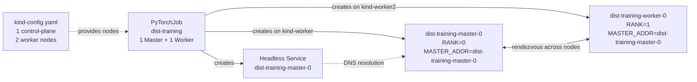

# After: the cloud native way

Same training simulation, submitted as a [PyTorchJob](https://www.kubeflow.org/docs/components/training/pytorch/)
via the [Kubernetes Training Operator](https://github.com/kubeflow/training-operator).

The operator creates all pods together, injects `MASTER_ADDR`, `RANK`, and `WORLD_SIZE`
automatically, and handles failure semantics at the distributed-job level. The
rendezvous succeeds. Training completes across two separate Kind nodes.

## What this demonstrates

| Primitive | Demonstrated here |
|---|---|
| Gang scheduling (all pods start together) | ✅ via Training Operator pod lifecycle |
| Operator-coordinated rendezvous | ✅ `MASTER_ADDR` / `RANK` / `WORLD_SIZE` injected automatically |
| Multi-node pod placement | ✅ master and worker on separate Kind nodes (`podAntiAffinity`) |
| Per-worker failure recovery (no full restart) | ✅ `restartPolicy: OnFailure` on the worker |
| High-performance networking (RDMA, GPUDirect) | ❌ Kind uses plain TCP — requires real InfiniBand/RoCE hardware |
| Topology-aware scheduling | ❌ Kind nodes share the same host — no real network fabric to schedule against |

## 0. Navigate to this directory

```bash
cd examples/05-multi-node/after
```

## Prerequisites

- [Docker](https://docs.docker.com/get-docker/) (tested with 29+)
- [kubectl](https://kubernetes.io/docs/tasks/tools/)
- [kind CLI](https://kind.sigs.k8s.io/docs/user/quick-start/#installation)

## 1. Create a multi-node Kind cluster

```bash
kind create cluster --config kind-config.yaml --name kind
```

This creates a cluster with one control-plane node and two worker nodes. The
`podAntiAffinity` rule in `pytorchjob.yaml` ensures the master and worker pods
land on separate nodes — no co-location on the same host.

Verify the nodes are ready:

```bash
kubectl get nodes
```

```
NAME                 STATUS     ROLES           AGE   VERSION
kind-control-plane   NotReady   control-plane   16s   v1.35.0
kind-worker          NotReady   <none>           2s   v1.35.0
kind-worker2         NotReady   <none>           2s   v1.35.0
```

Nodes start as `NotReady` while CNI initializes. Wait 30–60 seconds, then re-run until all show `Ready`:

```bash
kubectl get nodes
```

```
NAME                 STATUS   ROLES           AGE   VERSION
kind-control-plane   Ready    control-plane   90s   v1.35.0
kind-worker          Ready    <none>          76s   v1.35.0
kind-worker2         Ready    <none>          76s   v1.35.0
```

## 2. Install the Training Operator

```bash
kubectl apply -k "github.com/kubeflow/training-operator/manifests/overlays/standalone?ref=v1.8.1"
```

Wait for the controller to be ready:

```bash
kubectl rollout status deployment/training-operator -n kubeflow
```

```
Waiting for deployment "training-operator" rollout to finish: 0 of 1 updated replicas are available...
deployment "training-operator" successfully rolled out
```

## 3. Build and load the image

```bash
./build.sh
```

> **Already ran the before/ example?** The image is already loaded. Skip this step.

This builds `dist-training:latest` and loads it into all nodes of the Kind cluster.
No registry needed.

Verify the image is present on both worker nodes:

```bash
for node in kind-worker kind-worker2; do
  echo "==> $node"
  docker exec $node crictl images | grep dist-training
done
```

```
==> kind-worker
docker.io/library/dist-training   latest   30cedfd437114   45.7MB
==> kind-worker2
docker.io/library/dist-training   latest   30cedfd437114   45.7MB
```

## 4. Submit the PyTorchJob

```bash
kubectl apply -f pytorchjob.yaml
```

The Training Operator creates two pods simultaneously: a master (rank 0) and a
worker (rank 1), and injects the rendezvous coordinates into both.

## 5. Watch the run

Check job status:

```bash
kubectl get pytorchjob dist-training
```

```
NAME            STATE     AGE
dist-training   Running   22s
```

Confirm the pods landed on different nodes:

```bash
kubectl get pods -l training.kubeflow.org/job-name=dist-training -o wide
```

```
NAME                     READY   STATUS    RESTARTS   AGE   IP            NODE           NOMINATED NODE   READINESS GATES
dist-training-master-0   1/1     Running   0          22s   10.244.2.3    kind-worker    <none>           <none>
dist-training-worker-0   1/1     Running   0          22s   10.244.1.2    kind-worker2   <none>           <none>
```

The master and worker are on separate nodes. Traffic between them crosses Kind's
virtual network bridge — the same pod-to-pod path that NCCL uses on a real cluster
(over InfiniBand or RoCE instead of a software bridge).

Tail the master's logs:

```bash
kubectl logs -f dist-training-master-0
```

```
[rank 0] Starting. WORLD_SIZE=2 MASTER=dist-training-master-0:23456
[rank 0] Opening rendezvous on :23456. Waiting up to 60s for 1 worker(s) ...
[rank 0] Worker connected from ('10.244.1.2', 33094)
[rank 0] All 2 rank(s) ready. Starting distributed training.
[rank 0] epoch 0/10 loss=2.3000
[rank 0] epoch 1/10 loss=1.8134
[rank 0] epoch 2/10 loss=1.4344
[rank 0] epoch 3/10 loss=1.1392
[rank 0] epoch 4/10 loss=0.9093
[rank 0] epoch 5/10 loss=0.7303
[rank 0] epoch 6/10 loss=0.5909
[rank 0] epoch 7/10 loss=0.4823
[rank 0] epoch 8/10 loss=0.3977
[rank 0] epoch 9/10 loss=0.3319
[rank 0] Training complete.
```

Tail the worker's logs:

```bash
kubectl logs -f dist-training-worker-0
```

```
Defaulted container "pytorch" out of: pytorch, init-pytorch (init)
[rank 1] Starting. WORLD_SIZE=2 MASTER=dist-training-master-0:23456
[rank 1] Connecting to master at dist-training-master-0:23456 (timeout: 60s) ...
[rank 1] Rendezvous complete. Starting distributed training.
[rank 1] epoch 0/10 loss=2.3000
[rank 1] epoch 1/10 loss=1.8134
[rank 1] epoch 2/10 loss=1.4344
[rank 1] epoch 3/10 loss=1.1392
[rank 1] epoch 4/10 loss=0.9093
[rank 1] epoch 5/10 loss=0.7303
[rank 1] epoch 6/10 loss=0.5909
[rank 1] epoch 7/10 loss=0.4823
[rank 1] epoch 8/10 loss=0.3977
[rank 1] epoch 9/10 loss=0.3319
[rank 1] Training complete.
```

Once both pods finish, the job transitions to `Succeeded`:

```bash
kubectl get pytorchjob dist-training
```

```
NAME            STATE       AGE
dist-training   Succeeded   54s
```

Pods move to `Completed` status:

```bash
kubectl get pods -l training.kubeflow.org/job-name=dist-training -o wide
```

```
NAME                     READY   STATUS      RESTARTS   AGE   IP           NODE           NOMINATED NODE   READINESS GATES
dist-training-master-0   0/1     Completed   0          72s   10.244.2.3   kind-worker    <none>           <none>
dist-training-worker-0   0/1     Completed   0          72s   10.244.1.2   kind-worker2   <none>           <none>
```

## 6. Simulate a worker failure

> **Timing:** This must be done while the job is still running (STATE = Running).
> The job completes in about 30 seconds, so act quickly after `kubectl apply`.
> If the job already shows `Succeeded`, clean up and resubmit first:
> ```bash
> kubectl delete -f pytorchjob.yaml && kubectl apply -f pytorchjob.yaml
> ```

Once the job is running, kill the worker pod mid-training:

```bash
kubectl delete pod dist-training-worker-0
```

Watch the replacement pod appear:

```bash
kubectl get pods -l training.kubeflow.org/job-name=dist-training -w
```

```
NAME                     READY   STATUS    RESTARTS   AGE
dist-training-master-0   1/1     Running   0          7s
dist-training-worker-0   1/1     Running   0          4s
```

The operator recreated the worker immediately (notice the younger AGE).

Now verify the master completed normally despite the worker being killed:

```bash
kubectl logs dist-training-master-0
```

Look for three things:
- **Worker reconnected** — `Worker connected from ...` appears (new IP from the replacement pod)
- **Training completed** — all 10 epochs logged with no gap or restart
- **No master restart** — the master log is continuous from epoch 0 to Training complete

```
[rank 0] Starting. WORLD_SIZE=2 MASTER=dist-training-master-0:23456
[rank 0] Opening rendezvous on :23456. Waiting up to 60s for 1 worker(s) ...
[rank 0] Worker connected from ('10.244.1.4', 34224)
[rank 0] All 2 rank(s) ready. Starting distributed training.
[rank 0] epoch 0/10 loss=2.3000
[rank 0] epoch 1/10 loss=1.8134
[rank 0] epoch 2/10 loss=1.4344
[rank 0] epoch 3/10 loss=1.1392
[rank 0] epoch 4/10 loss=0.9093
[rank 0] epoch 5/10 loss=0.7303
[rank 0] epoch 6/10 loss=0.5909
[rank 0] epoch 7/10 loss=0.4823
[rank 0] epoch 8/10 loss=0.3977
[rank 0] epoch 9/10 loss=0.3319
[rank 0] Training complete.
```

Finally, confirm the job succeeded:

```bash
kubectl get pytorchjob dist-training
```

```
NAME            STATE       AGE
dist-training   Succeeded   108s
```

This is the contrast with `before/`: a crashed worker no longer kills the whole run.
The operator replaced it and the master never knew — it just waited at the rendezvous
socket until the new worker connected.

## 7. Clean up

Remove the PyTorchJob:

```bash
kubectl delete -f pytorchjob.yaml
```

Remove the Training Operator:

```bash
kubectl delete -k "github.com/kubeflow/training-operator/manifests/overlays/standalone?ref=v1.8.1"
```

Delete the Kind cluster when you no longer need it:

```bash
kind delete cluster --name kind
```

> **Note:** Each example creates its own cluster. Example 04 uses a 3-node cluster
> (1 control-plane + 2 workers). Other examples use a plain single-node cluster.
> They are not interchangeable — delete this cluster before starting an example
> that calls `kind create cluster` without `--config`.

## How the pieces fit together



The operator owns the lifecycle. Both pods are created atomically across separate
nodes. If either fails, `restartPolicy: OnFailure` replaces it without touching the other.

## What the manifest demonstrates

| Field | What it does |
|---|---|
| `kind-config.yaml` | Creates a 3-node Kind cluster (1 control-plane + 2 workers) |
| `Master.replicas: 1` | One coordinator pod (rank 0). Gets a stable hostname the workers can resolve. |
| `Worker.replicas: 1` | One worker pod (rank 1). Scales to N for more nodes. |
| `podAntiAffinity` | Forces master and worker onto different nodes (`topologyKey: kubernetes.io/hostname`). |
| `restartPolicy: OnFailure` | Replace a failed pod without restarting the whole job. |
| `imagePullPolicy: Never` | Use the image loaded directly into Kind — no registry needed. |

The Training Operator adds `MASTER_ADDR`, `MASTER_PORT`, `RANK`, and `WORLD_SIZE` to
every container automatically. **The training code doesn't change.**

## What this maps to on a real GPU cluster

| This demo | Real GPU job |
|---|---|
| `python:3.11-slim` base | CUDA base image (`nvcr.io/nvidia/pytorch:24.05-py3`) |
| Socket rendezvous | NCCL / `torch.distributed.init_process_group` |
| Fake loss loop | Actual model forward/backward pass |
| `Worker.replicas: 1` | `Worker.replicas: 31` (4× 8-GPU nodes = 32 ranks) |
| Kind worker node | A100 / H100 GPU node with InfiniBand or RoCE networking |
| `kubectl delete pod` | Node failure, spot-instance reclaim, GPU ECC error |
| `restartPolicy: OnFailure` | Same — one bad node restarts without losing the other 31 |

For true gang scheduling (all-or-nothing pod admission), combine PyTorchJob with
[Kueue](https://kueue.sigs.k8s.io/) — the same tool from [Pain C.02](../../pains/C02-cant-get-a-gpu.md).
PyTorchJob integrates natively with Kueue's `LocalQueue` labels.

---

[← Back to Pain C.04](../../pains/C04-multi-node-training.md) · [Landscape](../../README.md) · [Examples index](../README.md)
