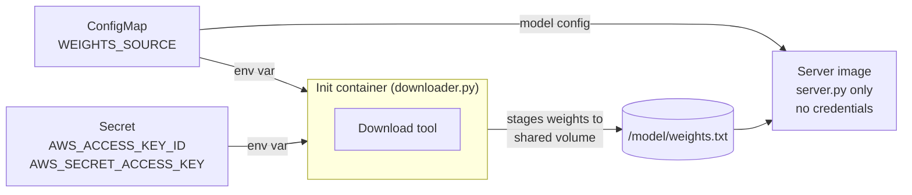

# After: source URL in a ConfigMap, credentials in a Secret

`server.py` is serving code only. `downloader.py` is the init container entrypoint: it reads `WEIGHTS_SOURCE` from a ConfigMap and `AWS_ACCESS_KEY_ID` / `AWS_SECRET_ACCESS_KEY` from a Secret, stages the weights to a shared volume, and exits before the server starts. Neither value is in the image.



## 0. Navigate to this directory

```bash
cd examples/06-image-coupling/after
```

## Prerequisites

- [Docker](https://docs.docker.com/get-docker/) (tested with 29+)
- [kubectl](https://kubernetes.io/docs/tasks/tools/)
- [kind CLI](https://kind.sigs.k8s.io/docs/user/quick-start/#installation)

## 1. Create a Kind cluster

```bash
kind create cluster --name kind 2>/dev/null || echo "Cluster already exists, reusing it."
```

## 2. Build and load the image

```bash
chmod +x build.sh && ./build.sh
```

This builds one image containing both `server.py` and `downloader.py` and loads it into Kind. The image has no credentials and no source URL — those come from the cluster at runtime, not from the build.

## 3. Apply the ConfigMap and Secret

```bash
kubectl apply -f configmap.yaml -f secret.yaml
```

This is the core of the fix. The source URL and credentials now live as independent cluster objects, not inside the image. Change either one with `kubectl apply` and the next pod picks up the new value — no rebuild needed.

Inspect what was created:

```bash
kubectl get configmap model-config -o yaml
```

```yaml
apiVersion: v1
data:
  WEIGHTS_SOURCE: s3://my-model-bucket/llm-v1/weights.txt
kind: ConfigMap
metadata:
  name: model-config
  namespace: default
```

```bash
kubectl get secret model-credentials -o yaml
```

```yaml
apiVersion: v1
data:
  AWS_ACCESS_KEY_ID: <base64-encoded-key-id>
  AWS_SECRET_ACCESS_KEY: <base64-encoded-secret-key>
kind: Secret
metadata:
  name: model-credentials
  namespace: default
type: Opaque
```

Two things to notice in the output:

- **ConfigMap** — `WEIGHTS_SOURCE` is plain text, readable directly. Non-sensitive config is expected to be readable.
- **Secret** — `AWS_ACCESS_KEY_ID` and `AWS_SECRET_ACCESS_KEY` are base64-encoded, not the raw values. Base64 is encoding, not encryption. Anyone with cluster access can decode them with `echo <value> | base64 -d`. The protection comes from RBAC restricting who can `kubectl get secret`, not from the encoding itself.

Also notice the `last-applied-configuration` annotation contains the original `stringData` values in plain text. In production, use [External Secrets Operator](https://external-secrets.io) to source values from a vault — it never writes the raw value into the annotation.

## 4. Apply the pod manifest

```bash
kubectl apply -f pod.yaml
```

The pod spec wires the ConfigMap and Secret into the init container as env vars. The server container has no `env` entries at all — it cannot read the credentials even if it tried.

## 5. Watch the init container run first

```bash
kubectl get pod inference-server -w
```

```
NAME               READY   STATUS       RESTARTS   AGE
inference-server   0/1     Init:0/1     0          2s
inference-server   0/1     PodInitializing   0     4s
inference-server   1/1     Running      0          5s
```

Press `Ctrl+C` once the pod shows `Running`.

The pod moves through `Init:0/1` before the server starts. The init container runs `downloader.py`, stages the weights, and exits — only then does the server container start.

## 6. Check the init container logs

```bash
kubectl logs inference-server -c weight-downloader
```

```
[downloader] WEIGHTS_SOURCE=s3://my-model-bucket/llm-v1/weights.txt (from ConfigMap)
[downloader] AWS_ACCESS_KEY_ID=AKIAIOS... (from Secret, not from image)
[downloader] Staging weights to /model/weights.txt ...
[downloader] Done in 0.001s (142 bytes). Weights ready at /model/weights.txt.
```

Both values arrived from the cluster. The image has no knowledge of either. Swap the ConfigMap or Secret and the next pod gets the new values automatically.

## 7. Check the server logs

```bash
kubectl logs inference-server
```

```
[startup] Weights loaded from /model/weights.txt. Preview: these are fake model weights...
[startup] (No source URL or credentials in this image.)
[ready] Inference server listening on port 8080
```

The server started with weights already on the shared volume. It never fetched anything and never saw a credential.

## 8. Test the endpoint

In one terminal, start the port-forward:

```bash
kubectl port-forward pod/inference-server 8080:8080
```

In another:

```bash
curl http://localhost:8080/health
curl http://localhost:8080/predict
```

```
ok
prediction using model: [these are fake model weights
layer_0: 0.312 0.847 0.193 0.65...]
```

## 9. Simulate a key rotation (no image rebuild)

In the `before` example, rotating a key meant editing a file, rebuilding the image, pushing it, and redeploying. Here it is one command.

Update the Secret with a new key value, then recycle the pod:

```bash
kubectl create secret generic model-credentials \
  --from-literal=AWS_ACCESS_KEY_ID=AKIAI99999NEWKEY \
  --from-literal=AWS_SECRET_ACCESS_KEY=newSecretValue/K7MDENG \
  --dry-run=client -o yaml | kubectl apply -f -

kubectl delete pod inference-server
kubectl apply -f pod.yaml
```

Check the init container logs:

```bash
kubectl logs inference-server -c weight-downloader
```

```
[downloader] AWS_ACCESS_KEY_ID=AKIAI999... (from Secret, not from image)
[downloader] /model/weights.txt already present (142 bytes). Skipping download.
```

New key, same image. The old key is gone from the cluster — it was never in the image to begin with.

## 10. Simulate a source change (no image rebuild)

In the `before` example, changing the weights bucket also meant a full rebuild. Here it is a config change.

```bash
kubectl patch configmap model-config \
  --patch '{"data":{"WEIGHTS_SOURCE":"s3://my-model-bucket-v2/llm-v2/weights.txt"}}'

kubectl delete pod inference-server
kubectl delete pvc model-weights
kubectl apply -f pod.yaml
```

```bash
kubectl logs inference-server -c weight-downloader
```

```
[downloader] WEIGHTS_SOURCE=s3://my-model-bucket-v2/llm-v2/weights.txt (from ConfigMap)
[downloader] Staging weights to /model/weights.txt ...
```

New source, same image. The server image has not changed since step 2.

## 11. Clean up

Press `Ctrl+C` in the port-forward terminal first, then:

```bash
kubectl delete pod inference-server
kubectl delete pvc model-weights
kubectl delete configmap model-config
kubectl delete secret model-credentials
```

## What the manifest demonstrates

| Concern | Lives in |
|---|---|
| Serving logic | Server image -- built once, never changes for operational reasons |
| Download tool | Same image, run as init container via `command` override |
| Source URL | ConfigMap `model-config` -- change with `kubectl apply`, no rebuild |
| Credentials | Secret `model-credentials` -- rotate without touching the image |

The server container spec has no `env` entries at all. It cannot read the credentials even if it tried.

## What this maps to on a real GPU cluster

| This demo | Real inference server |
|---|---|
| `python:3.11-slim` base | vLLM or TGI base image |
| `weights.txt` (142 bytes) | 70B FP16 weights (~140 GB) |
| `shutil.copy2` | `aws s3 sync`, `gsutil cp`, or HuggingFace hub download |
| `stringData` in `secret.yaml` | Values sourced from AWS Secrets Manager or GCP Secret Manager via External Secrets Operator |
| Manual `kubectl patch` for source change | GitOps PR updating the ConfigMap, applied by Argo CD or Flux |

---

[← Back to Pain 6](../../pains/06-server-image-coupling.md) · [Landscape](../../README.md) · [Examples index](../README.md)
