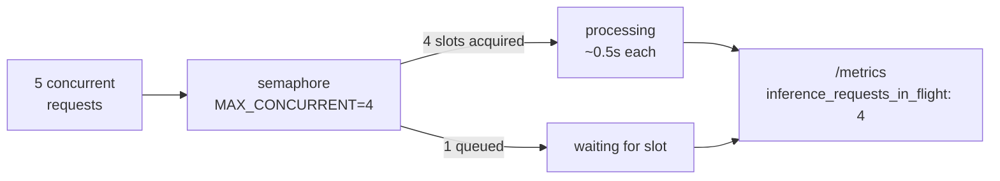
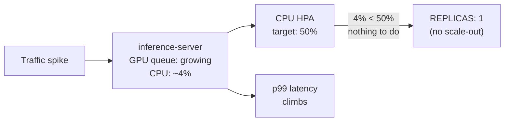
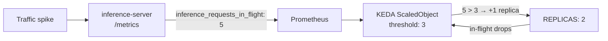
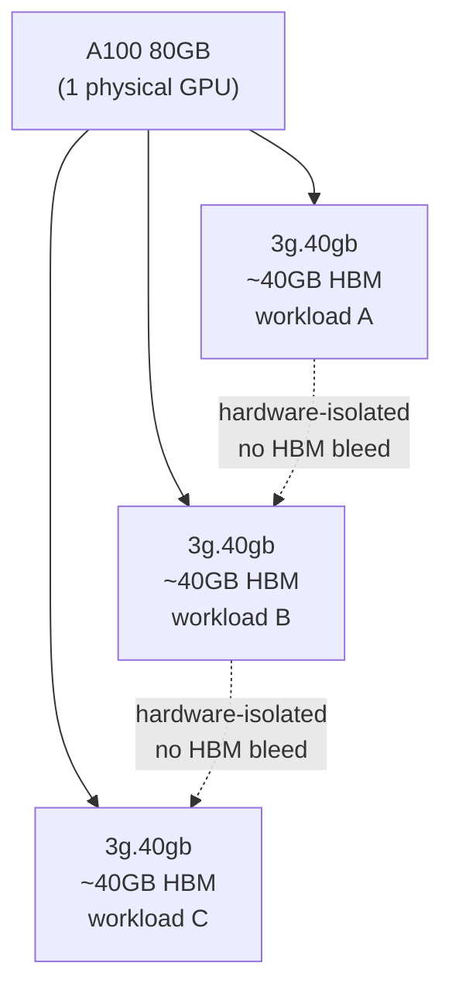

# After: two cloud-native layers on top of a batching server

The CN steps here (KEDA autoscaling, GPU partitioning) require a batching-aware server as their foundation. `server.py` is that foundation: it handles concurrent requests and exposes a `/metrics` endpoint in Prometheus format. The serving engine work — continuous batching, quantization, prefix caching — is covered in [`before/optimization-steps.md`](../before/optimization-steps.md). `server.py` simulates the result of that work so the CN layers can be demonstrated without a real GPU.

## Setup — Run the batching server

```bash
cd examples/07-gpu-underutilized/after
python3 server.py
```

No dependencies beyond the standard library.

Send five concurrent requests to populate the counters:

```bash
for i in $(seq 1 5); do curl -s localhost:8080/predict & done; wait
```

Expected output (order is non-deterministic — four requests acquire the semaphore immediately, the fifth waits for a slot):

```
prediction: total=4 elapsed=0.501s
prediction: total=3 elapsed=0.501s
prediction: total=2 elapsed=0.501s
prediction: total=1 elapsed=0.505s
prediction: total=5 elapsed=1.006s
```

`elapsed` is measured from when the request arrived, including any queue wait. Then check the metrics endpoint:

```bash
curl localhost:8080/metrics
```

Expected output (on a fresh server start after five requests):

```
# HELP inference_requests_in_flight Current concurrent inference requests
# TYPE inference_requests_in_flight gauge
inference_requests_in_flight 0
# HELP inference_requests_total Total inference requests served
# TYPE inference_requests_total counter
inference_requests_total 5
# HELP inference_tokens_per_second Estimated tokens per second
# TYPE inference_tokens_per_second gauge
inference_tokens_per_second 0
```

`inference_requests_in_flight` is 0 because all five finished before you checked. This gauge is what the autoscaler in Step 1 reads — it reflects actual GPU saturation, not CPU load:



**Measurable now** — `curl localhost:8080/metrics` while requests are in flight shows `inference_requests_in_flight` above 0.

To see it climb, lower the concurrency limit and send requests while they are still in flight:

```bash
MAX_CONCURRENT=2 python3 server.py
```

Send the same five concurrent requests. With only 2 slots, they batch into groups of 2, 2, 1:

```
prediction: total=1 elapsed=0.501s
prediction: total=2 elapsed=0.503s
prediction: total=3 elapsed=1.002s
prediction: total=4 elapsed=1.008s
prediction: total=5 elapsed=1.503s
```

The queue backing up — `inference_requests_in_flight` rising above 3 — is the signal Step 1 (KEDA) reacts to.

## Step 1 — Scale on the right signal

The instinct is to let Kubernetes HPA handle scaling. The problem: an inference server's CPU stays near 5% regardless of load — the GPU does the work, not the CPU. Apply a CPU-based HPA and send load to see it miss the signal entirely.

Requires a Kind cluster. Install metrics-server (required for CPU HPA — not included in Kind by default):

```bash
kubectl apply -f https://github.com/kubernetes-sigs/metrics-server/releases/latest/download/components.yaml
kubectl patch deployment metrics-server -n kube-system \
  --type='json' \
  -p='[{"op":"add","path":"/spec/template/spec/containers/0/args/-","value":"--kubelet-insecure-tls"}]'
kubectl rollout status deployment/metrics-server -n kube-system
```

Apply the deployment:

```bash
kubectl apply -f deployment.yaml
```

### The naive approach: CPU HPA misses the signal



**Measurable** — `kubectl get hpa inference-server-cpu-hpa` shows `4%/50%` under load. Replicas stay at 1.

Apply a CPU-based HPA:

```bash
kubectl apply -f hpa-cpu.yaml
```

Send sustained load (run this for ~30 seconds):

```bash
for i in $(seq 1 50); do curl -s localhost:8080/predict & done; wait
```

Check whether HPA reacts:

```bash
kubectl get hpa inference-server-cpu-hpa
```

Expected output (give it ~60s for metrics-server to collect the first sample):

```
NAME                       REFERENCE                     TARGETS      MINPODS   MAXPODS   REPLICAS   AGE
inference-server-cpu-hpa   Deployment/inference-server   4%/50%       1         5         1          60s
```

CPU sits at ~4% — well below the 50% threshold. HPA never adds a replica. Meanwhile the GPU queue is backed up and latency is climbing. This is the failure mode: Kubernetes is watching the wrong signal.

Delete the CPU HPA before proceeding:

```bash
kubectl delete -f hpa-cpu.yaml
```

### The right approach: KEDA scales on GPU saturation



**Measurable with Prometheus** — `kubectl get hpa keda-hpa-inference-server-scaledobject` shows `TARGETS` rising above threshold and `REPLICAS` incrementing. Without Prometheus the wiring is still visible (`kubectl get scaledobject`) but `TARGETS` shows `<unknown>`.

Install KEDA:

```bash
kubectl apply --server-side -f https://github.com/kedacore/keda/releases/download/v2.16.0/keda-2.16.0.yaml
kubectl rollout status deployment/keda-operator -n keda
```

Apply the ScaledObject:

```bash
kubectl apply -f scaledobject.yaml
```

KEDA watches `inference_requests_in_flight` from Prometheus. When in-flight requests on any replica exceed 3, KEDA adds a replica — up to 5. When traffic drops, it scales back to 1.

```bash
kubectl get scaledobject inference-server-scaledobject
kubectl get hpa
```

Expected output:

```
NAME                            SCALETARGETKIND      SCALETARGETNAME    MIN   MAX   READY   ACTIVE   FALLBACK   PAUSED    TRIGGERS
inference-server-scaledobject   apps/v1.Deployment   inference-server   1     5     False   False    Unknown    Unknown   prometheus

NAME                                     REFERENCE                     TARGETS             MINPODS   MAXPODS   REPLICAS   AGE
keda-hpa-inference-server-scaledobject   Deployment/inference-server   <unknown>/3 (avg)   1         5         0          5s
```

`READY: False` and `<unknown>/3 (avg)` are expected without a Prometheus stack — KEDA created the HPA but cannot yet read the metric. In a cluster with Prometheus scraping the deployment, `TARGETS` would show the live `inference_requests_in_flight` value and KEDA would add replicas when it exceeds 3 — the condition the CPU HPA never saw. Step 2 (MIG) is independent and can be applied alongside this.

## Step 2 — Share the GPU (informational)



**Not measurable without real hardware** — requires an A100 or H100 node with the NVIDIA GPU Operator installed. The YAML is provided as a reference for when that hardware is available.

`mig-config.yaml` is a ConfigMap that the NVIDIA GPU Operator reads to configure MIG profiles on GPU nodes. It divides one A100 80GB into three `3g.40gb` partitions. Three inference services share one physical GPU with hardware-enforced memory isolation.

This step requires a real GPU node (A100 or H100) with the NVIDIA GPU Operator installed. Apply it by labeling the node and creating the ConfigMap:

```bash
kubectl label node <your-gpu-node> nvidia.com/mig.config=all-3g.40gb
kubectl apply -f mig-config.yaml
```

Note: claiming a specific MIG slice from a pod requires DRA (Dynamic Resource Allocation). The default `nvidia.com/gpu: 1` counter cannot express slice type. See [issue #21](https://github.com/arun-gupta/the-pain-first-way/issues/21) for the full DRA pain.

---

[← Back to Pain 7](../../pains/07-gpu-underutilized.md) · [Landscape](../../README.md) · [Examples index](../README.md)
