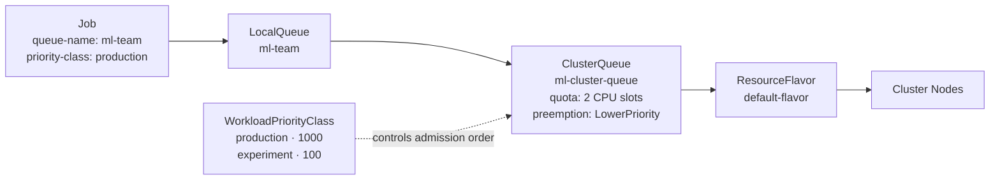

# After: the cloud native way

Same training job, submitted through [Kueue](https://kueue.sigs.k8s.io/). The queue admits two jobs at a time. A third waits with a visible position. A high-priority production job preempts a waiting experiment so it can start immediately.

## 0. Navigate to this directory

```bash
cd examples/C02-queueing/after
```

## Prerequisites

- [Docker](https://docs.docker.com/get-docker/) (tested with 29+)
- [kubectl](https://kubernetes.io/docs/tasks/tools/)
- [kind CLI](https://kind.sigs.k8s.io/docs/user/quick-start/#installation)

## 1. Create a Kind cluster

```bash
kind create cluster --name kind
```

## 2. Install Kueue

```bash
kubectl apply --server-side \
  -f https://github.com/kubernetes-sigs/kueue/releases/download/v0.17.3/manifests.yaml
```

Wait for the controller to be ready:

```bash
kubectl rollout status deployment/kueue-controller-manager -n kueue-system
```

## 3. Build and load the image

```bash
./build.sh
```

This builds `training-job:latest` and loads it into your Kind cluster. No registry needed.

> **Already did Pain C.01?** The same image is used. Skip this step if `training-job:latest` is already loaded.

## 4. Apply the queue resources

```bash
kubectl apply -f priority-classes.yaml
kubectl apply -f resource-flavor.yaml
kubectl apply -f cluster-queue.yaml
kubectl apply -f local-queue.yaml
```

Verify the ClusterQueue is active:

```bash
kubectl get clusterqueue ml-cluster-queue
```

```
NAME               COHORT   PENDING WORKLOADS
ml-cluster-queue            0
```

## 5. Submit three experiment jobs

```bash
kubectl apply -f job-experiment.yaml
```

Watch what happens:

```bash
kubectl get workloads
```

```
NAME                    QUEUE     RESERVED IN        ADMITTED   FINISHED   AGE
job-experiment-a-9838c  ml-team   ml-cluster-queue   True                  5s
job-experiment-b-efc63  ml-team   ml-cluster-queue   True                  5s
job-experiment-c-6233e  ml-team                                            5s
```

Two jobs are `ADMITTED` (running). The third is waiting in the queue. You can see exactly who is where.

Check the ClusterQueue status:

```bash
kubectl get clusterqueue ml-cluster-queue -o yaml | grep -A10 'pendingWorkloads\|admittedWorkloads'
```

```
  admittedWorkloads: 2
  ...
  pendingWorkloads: 1
  reservingWorkloads: 2
```

## 6. Submit a high-priority production job

While all three experiment jobs are in the queue:

```bash
kubectl apply -f job-production.yaml
```

Check the workloads again:

```bash
kubectl get workloads
```

```
NAME                           QUEUE     RESERVED IN        ADMITTED   FINISHED   AGE
job-experiment-a-9838c         ml-team                      False                 36s
job-experiment-b-efc63         ml-team   ml-cluster-queue   True                  36s
job-experiment-c-6233e         ml-team                                            36s
job-production-finetune-316af  ml-team   ml-cluster-queue   True                  5s
```

The production job was admitted immediately by preempting a lower-priority experiment. The preempted job re-queues automatically and will be admitted when the production job finishes and frees its quota.

Watch the pods to confirm:

```bash
kubectl get pods -w
```

```
NAME                        READY   STATUS        RESTARTS   AGE
experiment-a-zckg9          1/1     Terminating   0          43s
experiment-b-l55zd          1/1     Running       0          43s
production-finetune-lwqf5   1/1     Running       0          12s
```

`experiment-a` is terminated to free its slot. `production-finetune` is running immediately.

## 7. Clean up

```bash
kubectl delete -f job-production.yaml
kubectl delete -f job-experiment.yaml
kubectl delete -f local-queue.yaml
kubectl delete -f cluster-queue.yaml
kubectl delete -f resource-flavor.yaml
kubectl delete -f priority-classes.yaml
```

To remove Kueue itself:

```bash
kubectl delete -f \
  https://github.com/kubernetes-sigs/kueue/releases/download/v0.17.3/manifests.yaml
```

To delete the Kind cluster:

```bash
kind delete cluster --name kind
```

## How the pieces fit together



The job carries two labels. Everything else is cluster-side configuration your training code never sees.

## What the manifest demonstrates

| Manifest | What it does |
|---|---|
| `priority-classes.yaml` | Names two priority tiers: `production` (1000) and `experiment` (100) |
| `resource-flavor.yaml` | Describes the available hardware (no-label = any node in Kind; GPU label on a real cluster) |
| `cluster-queue.yaml` | Sets the quota (2 CPU slots), the scheduling strategy, and the preemption policy |
| `local-queue.yaml` | The per-team submission target; maps `ml-team` → `ml-cluster-queue` |
| `job-experiment.yaml` | Three experiment jobs tagged with `queue-name: ml-team` and `priority-class: experiment` |
| `job-production.yaml` | One production job tagged with `priority-class: production` |

The only additions to your existing Job manifest are two lines:

```yaml
labels:
  kueue.x-k8s.io/queue-name: ml-team
  kueue.x-k8s.io/priority-class: production
```

**The training code doesn't change.**

## What this maps to on a real GPU cluster

| This demo | Real GPU cluster |
|---|---|
| `cpu: 1` quota | `nvidia.com/gpu: 1` quota |
| Kind node | A100 / H100 GPU node pool |
| `default-flavor` (any node) | ResourceFlavor with `nvidia.com/gpu.product: A100-SXM4-80GB` |
| 2-slot quota | Team GPU allocation (e.g., 8 GPUs per team) |
| Preempted experiment re-queues | Same: Kueue unsuspends the job; your code resumes from checkpoint |

---

[← Back to Pain C.02](../../../pains/C02-cant-get-a-gpu.md) · [Landscape](../../../README.md) · [Examples index](../../README.md)
