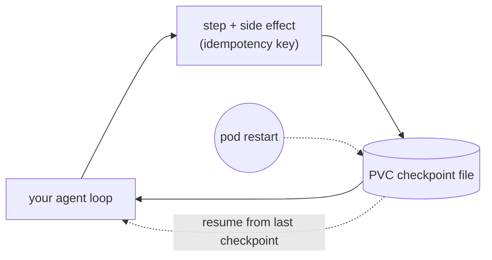
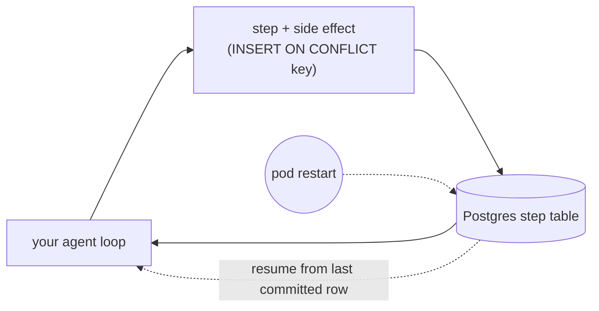
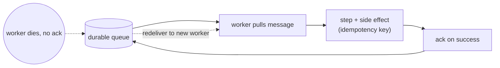
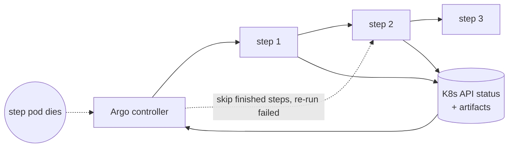
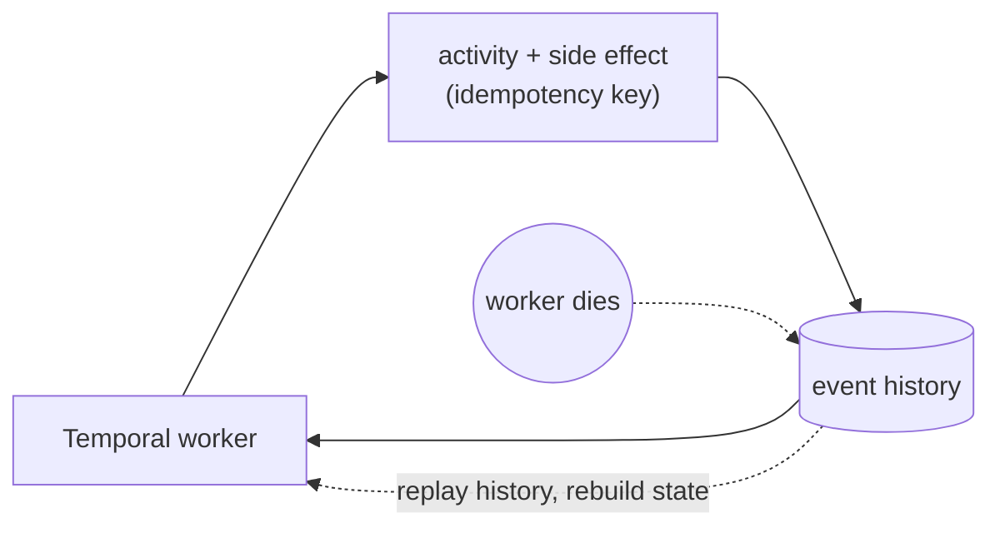

# Pain A.01 example: my agent died halfway through a user task

A working demonstration of [Pain A.01: My agent died halfway through a user
task](../../../pains/agents/A01-durable-agents.md). An agent runs a multi-step task
with real side effects (reserve, charge, email, confirm). `before/` holds the plan in
process memory, so killing the pod mid-task loses state and a retry duplicates the
side effects. `after/` makes the run durable, so killing the pod mid-task resumes from
the last completed step with no duplicate.

> **Status: design in progress.** This README captures the durability options under
> consideration. `before/` and `after/` are not built yet, so this example is not
> listed as Available in the catalog.

## The three swappable parts

Durability is not one tool. As the pain describes, it is three parts you can assemble
independently:

1. **A state store** so a fresh process can read what the dead one had done.
2. **Idempotent side effects** so resuming cannot duplicate a charge or an email.
3. **A resume point** that reads the state and continues from the last completed step.

The options below all provide the same three parts. They differ in what you build by
hand versus what an engine supplies, and in how finely they resume.

## The options

### Option A: PVC + hand-rolled loop

Your loop checkpoints step state to a PersistentVolumeClaim and resumes from it on
restart. Zero extra infrastructure; the whole mechanism is readable in one file.

### Option B: Postgres + checkpointer

State lives in a Postgres table; idempotency becomes a visible unique constraint
(`INSERT ... ON CONFLICT DO NOTHING`) instead of a hand-coded check. This is how most
real durable agents persist, and the closest honest fit to LangGraph-style savers.

### Option C: durable queue + worker

The queue holds the work item (part 1) and redelivers it if the worker dies before
acking (part 3). You still supply idempotency (part 2). Coarsest resume: the whole
work item is reprocessed.

### Option D: Argo Workflows

The engine owns part 3: Argo records which DAG steps finished (in the `Workflow` CRD
status, large outputs offloaded to an artifact repo) and skips them on retry. It
re-runs the *whole* failed step, so idempotency carries more weight.

### Option E: Temporal

The engine owns part 3 at the finest granularity: Temporal replays an event history
to rebuild in-process state, so a restart resumes close to the instruction it died on.
Idempotency is still wanted, but the window for duplication is smallest.

## Comparison

| Option | State store (part 1) | Idempotency (part 2) | Resume (part 3) | Resume granularity |
|---|---|---|---|---|
| **A** PVC + hand-rolled loop | PVC file | hand-coded key check | your checkpoint-and-resume loop | wherever you checkpoint |
| **B** Postgres + checkpointer | Postgres table | `INSERT ... ON CONFLICT` (visible) | your loop / saver reads last committed step | per committed step |
| **C** durable queue + worker | the queue message *is* the state | hand-coded key check | queue redelivers the unacked message | whole work item (coarsest) |
| **D** Argo Workflows | K8s API status + artifact repo | your keys; engine re-runs whole step | Argo skips finished DAG steps on retry | per step |
| **E** Temporal | Temporal's event history datastore | wanted; replay shrinks the window | Temporal replays history to rebuild state | per instruction (finest) |

A, B, and C are "you assemble all three parts." D and E are "the engine owns part 3
and brings its own part 1." Part 2 effort scales inversely with resume granularity:
the coarser the resume, the harder idempotency has to work.

## Leaning

Build **B (Postgres + checkpointer)** as the core `after/`: it is the most honest
representation of how real agents are made durable, it makes idempotency a visible
unique constraint rather than a toy check, and it runs on a plain Kind cluster with no
CNI requirement. `before/` is the identical loop holding state in process memory.
Reference D, E, C, and LangGraph savers in a "Beyond this" section rather than building
each one.

---

[← Back to Pain A.01](../../../pains/agents/A01-durable-agents.md) · [Landscape](../../../README.md) · [Examples index](../../README.md)
