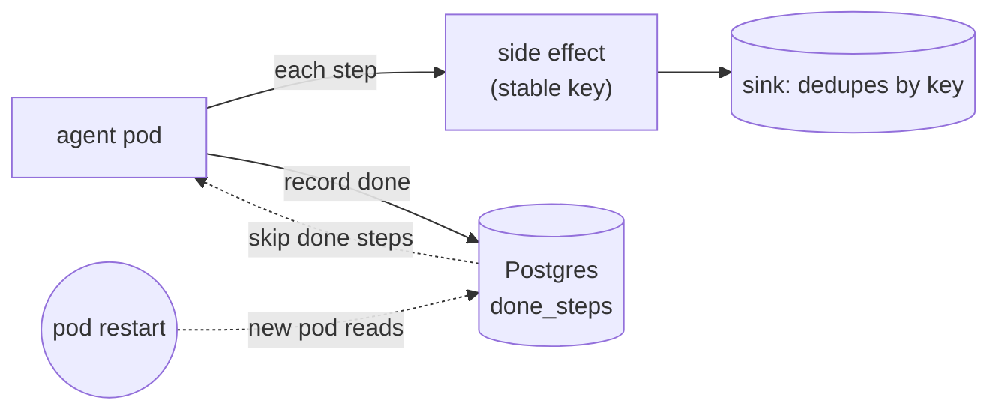

# after-postgres/ -- step state in Postgres survives the restart (option B)

*[A.01 durable-agents](../README.md) series:* [before](../before/README.md) -> **Postgres (B)** -> [queue (C)](../after-queue/README.md) -> Argo (D, soon).

Readable on its own. The scenario: an agent runs a multi-step task with real side
effects (reserve, charge, email, confirm). If its process dies mid-task and restarts,
naive code repeats the charge. [`before/`](../before/README.md) shows that failure,
where a restart charges the customer twice; every durable variant survives the same
crash and charges once. A small [sink](../shared/README.md) records each side effect and
deduplicates by idempotency key, so the charge count (1 versus 2) is how the outcome is
read.

The same agent, the same task, the same crash. The only change here is the store: step
state lives in a Postgres table instead of process memory, and the idempotency key is
derived from the durable task id. Kill the pod mid-task and the new pod reloads what is
done, resumes, and the customer is charged once. You assemble all three parts yourself,
and Postgres makes part 1 (state) and part 2 (idempotency) visible as plain SQL. The
[overview](../README.md) explains the three parts and compares all five options.

## How it works



## Prerequisites

Do the [`before/`](../before/README.md) walkthrough first. It creates the Kind
cluster and the sink, which this variant reuses. If you skipped it, create the
cluster and deploy the sink now (from this directory):

```bash
kind create cluster --name kind 2>/dev/null || echo "reusing cluster"
kubectl create configmap sink-code --from-file=../shared/sink/sink.py \
  --dry-run=client -o yaml | kubectl apply -f -
kubectl apply -f ../shared/sink/sink.yaml
kubectl rollout status deploy/sink
```

## Reset the sink

Do this whether or not you ran `before/`: the sink still holds `before/`'s
charges, so reset it to zero before this run, or the count will mix the two
variants.

```bash
kubectl rollout restart deploy/sink && kubectl rollout status deploy/sink
```

Confirm it is empty before going on:

```bash
../shared/check-charges.sh        # total effects: 0 | charges: 0
```

## Deploy Postgres

```bash
kubectl apply -f postgres.yaml
kubectl rollout status deploy/postgres
```

## Deploy the agent

Like `before/`, the whole walkthrough runs in **one terminal**, one command at a time.
Mount the agent's code and start it:

```bash
kubectl create configmap agent-code \
  --from-file=main.py --from-file=../shared/agent_task.py \
  --dry-run=client -o yaml | kubectl apply -f -
kubectl apply -f agent.yaml
```

## Step 1: let the task finish, confirm one charge

Wait for the pod to be running, then follow the log to completion. The container
pip-installs the `pg8000` driver on start, so the first lines take a few seconds:

```bash
kubectl rollout status deploy/payments-agent
kubectl logs -f deploy/payments-agent
```

```
[agent] task user-task-1: resuming, already done = nothing
[agent]   reserve: side effect sent (key=user-task-1:reserve) -> sink: recorded
[agent]   reserve: recorded done
[agent]   charge: side effect sent (key=user-task-1:charge) -> sink: recorded
[agent]   charge: recorded done
[agent]   email: side effect sent (key=user-task-1:email) -> sink: recorded
[agent]   email: recorded done
[agent]   confirm: side effect sent (key=user-task-1:confirm) -> sink: recorded
[agent]   confirm: recorded done
[agent] task user-task-1: complete
```

The keys have no random suffix: they are stable, derived from the task id. Ctrl-C, then
check the sink:

```bash
../shared/check-charges.sh        # charges: 1
```

> If `kubectl logs` prints `... waiting to start: ContainerCreating`, the pod is still
> starting; the `rollout status` line waits for that. After the `kubectl delete pod`
> below, re-run `kubectl get pods -l app=payments-agent` until the new pod shows Running
> before tailing logs.

## Step 2: restart the agent, watch it resume

Delete the pod, the same crash `before/` could not survive:

```bash
kubectl delete pod -l app=payments-agent
kubectl get pods -l app=payments-agent   # re-run until the new pod shows Running
kubectl logs -f deploy/payments-agent
```

The brand-new process reloads its progress from Postgres and skips everything already
done, instead of starting over:

```
[agent] task user-task-1: resuming, already done = ['charge', 'confirm', 'email', 'reserve']
[agent]   reserve: skip (already done)
[agent]   charge: skip (already done)
[agent]   email: skip (already done)
[agent]   confirm: skip (already done)
[agent] task user-task-1: complete
```

Ctrl-C, then check the sink once more:

```bash
../shared/check-charges.sh        # charges: 1 (unchanged)
```

## What to verify

| After | `check-charges.sh` shows | meaning |
|---|---|---|
| Step 1 | `charges: 1` | the task ran once |
| Step 2 | `charges: 1` (unchanged) | the restart resumed instead of recharging |

`before/` jumped to 2 on the same restart; `after-postgres/` holds at 1. The state
survived the process death.

## Look at the durable state

```bash
kubectl exec deploy/postgres -- psql -U postgres -d agent \
  -c "SELECT task_id, step FROM done_steps ORDER BY step;"
```

```
   task_id    |  step
--------------+---------
 user-task-1  | charge
 user-task-1  | confirm
 user-task-1  | email
 user-task-1  | reserve
```

That table is part 1 (state outside the process). The `ON CONFLICT` on its primary key
is part 2 (recording is idempotent too). `load_done` reading it on startup is part 3
(resume from the last completed step).

## Go deeper: crash mid-task (optional)

Step 2 crashed *after* the task finished, so the resume simply skipped every step. Crash
it *during* the `charge` step instead and you exercise the other recovery path: the
resume re-sends `charge`, but the stable key makes the sink dedupe it. This one needs a
second terminal to delete the pod while the first tails the log.

Reset both stores and start a fresh run:

```bash
kubectl delete -f postgres.yaml && kubectl apply -f postgres.yaml && kubectl rollout status deploy/postgres
kubectl rollout restart deploy/sink && kubectl rollout status deploy/sink
kubectl delete pod -l app=payments-agent
kubectl get pods -l app=payments-agent   # until Running
kubectl logs -f deploy/payments-agent
```

While the log sits on the `charge` step (before `charge: recorded done`), delete the
pod from a second terminal: `kubectl delete pod -l app=payments-agent`. The resume then
shows:

```
[agent] task user-task-1: resuming, already done = ['reserve']
[agent]   reserve: skip (already done)
[agent]   charge: side effect sent (key=user-task-1:charge) -> sink: duplicate-ignored
[agent]   charge: recorded done
...
[agent] task user-task-1: complete
```

It skipped `reserve`, re-sent `charge` (the crash landed before that step was recorded
done), and the stable key let the sink reply `duplicate-ignored`, so `check-charges.sh`
still shows `charges: 1`. With `STEP_DELAY=5` the window is about five seconds; miss it
and the resume just skips `charge` like Step 2, which also charges once.

## Re-run cleanly

The agent resumes a task by its id, so a second run finds every step already
done and charges nothing. To run the demo again from scratch, reset both
stores:

```bash
kubectl delete -f postgres.yaml && kubectl apply -f postgres.yaml
kubectl rollout restart deploy/sink
```

## Clean up

```bash
kubectl delete -f agent.yaml -f postgres.yaml
kubectl delete configmap agent-code
```

The sink and cluster stay up for the other variants. Next is
[`after-queue/`](../after-queue/README.md), which runs the identical crash test with a
queue instead of a database as the durable store (`after-argo/` follows once built).

---

[← Example overview](../README.md) · [before/](../before/README.md) · [after-queue/ →](../after-queue/README.md)
