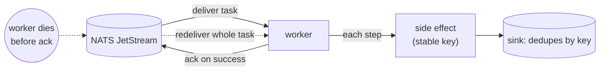

# after-queue/ -- a durable queue redelivers the task on crash (option C)

*[A.01 durable-agents](../README.md) series:* [before](../before/README.md) -> [Postgres (B)](../after-postgres/README.md) -> **queue (C)** -> Argo (D, soon).

Readable on its own. The scenario: an agent runs a multi-step task with real side
effects (reserve, charge, email, confirm). If its process dies mid-task and restarts,
naive code repeats the charge. [`before/`](../before/README.md) shows that failure,
where a restart charges the customer twice; every durable variant survives the same
crash and charges once. A small [sink](../shared/README.md) records each side effect and
deduplicates by idempotency key, so the charge count (1 versus 2) is how the outcome is
read. The [overview](../README.md) explains the three parts and compares all five
options.

The same agent, the same task, the same crash. This time the durability comes from a
queue: a [NATS JetStream](https://docs.nats.io/nats-concepts/jetstream) stream holds the
task as a work item, a worker pulls it, runs it, and acks only on success. Kill the worker mid-task and the message is never acked,
so JetStream redelivers it to a new worker, which runs the task again.

Unlike [`after-postgres/`](../after-postgres/README.md), there is **no per-step
checkpoint**: the queue knows only "acked or not", so a redelivery reprocesses the
*whole* task from the top. The stable idempotency key is the only thing keeping the
charge at one, which is exactly why the matrix says the coarsest resume leans hardest on
part 2.

## How it works



## Prerequisites

Do the [`before/`](../before/README.md) walkthrough first; it creates the Kind cluster
and the sink this variant reuses. If you skipped it, create the cluster and deploy the
sink now (from this directory):

```bash
kind create cluster --name kind 2>/dev/null || echo "reusing cluster"
kubectl create configmap sink-code --from-file=../shared/sink/sink.py \
  --dry-run=client -o yaml | kubectl apply -f -
kubectl apply -f ../shared/sink/sink.yaml
kubectl rollout status deploy/sink
```

## Reset the sink

Do this whether or not you ran another variant: the sink still holds earlier charges,
so reset it to zero or the count will mix runs.

```bash
kubectl rollout restart deploy/sink && kubectl rollout status deploy/sink
```

## Deploy NATS

```bash
kubectl apply -f nats.yaml
kubectl rollout status deploy/nats
```

## Deploy the worker

The worker code includes `enqueue.py` (used below) alongside `main.py` and the shared
task. The whole walkthrough runs in **one terminal**, one command at a time.

```bash
kubectl create configmap agent-code \
  --from-file=main.py --from-file=enqueue.py --from-file=../shared/agent_task.py \
  --dry-run=client -o yaml | kubectl apply -f -
kubectl apply -f agent.yaml
kubectl rollout status deploy/payments-agent
```

> The container pip-installs the `nats-py` client on start, so the worker takes a few
> seconds to connect. If `kubectl logs` prints `... ContainerCreating`, the pod is
> still starting; the `rollout status` line waits for that.

## Step 1: enqueue a task, confirm one charge

Clear any leftover messages and reset the sink so the count starts clean, then drop one
task on the queue (enqueue runs inside the worker pod, which has the nats client) and
follow the worker:

```bash
kubectl exec deploy/payments-agent -- python /app/enqueue.py purge
kubectl rollout restart deploy/sink && kubectl rollout status deploy/sink
kubectl exec deploy/payments-agent -- python /app/enqueue.py
kubectl logs -f deploy/payments-agent
```

```
[worker] connected to nats://nats:4222; waiting for tasks on tasks.run
[worker] received 'user-task-1' (delivery #1)
[agent] task user-task-1: resuming, already done = nothing
[agent]   reserve: side effect sent (key=user-task-1:reserve) -> sink: recorded
[agent]   charge: side effect sent (key=user-task-1:charge) -> sink: recorded
[agent]   email: side effect sent (key=user-task-1:email) -> sink: recorded
[agent]   confirm: side effect sent (key=user-task-1:confirm) -> sink: recorded
[agent] task user-task-1: complete
[worker] acked 'user-task-1'
```

Ctrl-C, then check the sink:

```bash
../shared/check-charges.sh        # charges: 1
```

## Step 2: crash before the ack, watch the redelivery

Turn on the simulated crash, then clear and re-enqueue. `CRASH_FIRST_ATTEMPT` makes the
worker kill itself partway through a task's *first* delivery, a deterministic stand-in
for a node failure or OOM kill, so you do not have to race a `kubectl delete` against
the roughly 20-second task.

```bash
kubectl set env deploy/payments-agent CRASH_FIRST_ATTEMPT=true
kubectl rollout status deploy/payments-agent
kubectl exec deploy/payments-agent -- python /app/enqueue.py purge
kubectl rollout restart deploy/sink && kubectl rollout status deploy/sink
kubectl exec deploy/payments-agent -- python /app/enqueue.py
kubectl logs -f deploy/payments-agent
```

The worker takes delivery #1, sends a couple of side effects, then exits before acking.
The log stops abruptly:

```
[worker] received 'user-task-1' (delivery #1)
[worker] CRASH_FIRST_ATTEMPT set: this worker will die mid-task before acking
[agent] task user-task-1: resuming, already done = nothing
[agent]   reserve: side effect sent (key=user-task-1:reserve) -> sink: recorded
[agent]   charge: side effect sent (key=user-task-1:charge) -> sink: recorded
```

The message was never acked, so after the ack-wait window (about 30 seconds by default)
JetStream redelivers it to the replacement pod. Follow the new pod (it may sit idle for
that window before the redelivery arrives):

```bash
kubectl get pods -l app=payments-agent     # re-run until the new pod shows Running
kubectl logs -f deploy/payments-agent
```

```
[worker] received 'user-task-1' (delivery #2)
[agent] task user-task-1: resuming, already done = nothing
[agent]   reserve: side effect sent (key=user-task-1:reserve) -> sink: duplicate-ignored
[agent]   charge: side effect sent (key=user-task-1:charge) -> sink: duplicate-ignored
[agent]   email: side effect sent (key=user-task-1:email) -> sink: recorded
[agent]   confirm: side effect sent (key=user-task-1:confirm) -> sink: recorded
[agent] task user-task-1: complete
[worker] acked 'user-task-1'
```

`delivery #2`: the whole task ran again. The steps the first attempt completed before
crashing (`reserve`, `charge`) were re-sent with the same stable keys and the sink
replied `duplicate-ignored`; only the steps that had not run yet were recorded. Check
the sink:

```bash
../shared/check-charges.sh        # charges: 1 (unchanged)
```

Turn the simulated crash back off when you are done:

```bash
kubectl set env deploy/payments-agent CRASH_FIRST_ATTEMPT-
```

## What to verify

| After | `check-charges.sh` shows | meaning |
|---|---|---|
| Step 1 | `charges: 1` | the task ran once |
| Step 2 | `charges: 1` (unchanged), worker logs `delivery #2` | the crash redelivered the whole task, but the stable key blocked the duplicate charge |

`before/` jumped to 2 on the same crash. `after-queue/` reprocessed the entire task,
yet charged once.

## How this differs from after-postgres (option B)

B keeps a per-step record, so its resume *skips* finished steps (`skip (already done)`).
C keeps no per-step record: the queue redelivers the whole work item, so the worker
reprocesses every step and the idempotency key is what prevents the duplicate. Same
outcome, coarser resume, more weight on part 2, which is the trade the matrix describes.

## Re-run cleanly

A second enqueue with the same task id will re-send the same keys, which the sink
deduplicates, so reset the sink first to see a clean count:

```bash
kubectl rollout restart deploy/sink
```

## Clean up

```bash
kubectl delete -f agent.yaml -f nats.yaml
kubectl delete configmap agent-code
```

The sink and cluster stay up for the other variants.

---

[← Example overview](../README.md) · [before/](../before/README.md) · [after-postgres/](../after-postgres/README.md)
