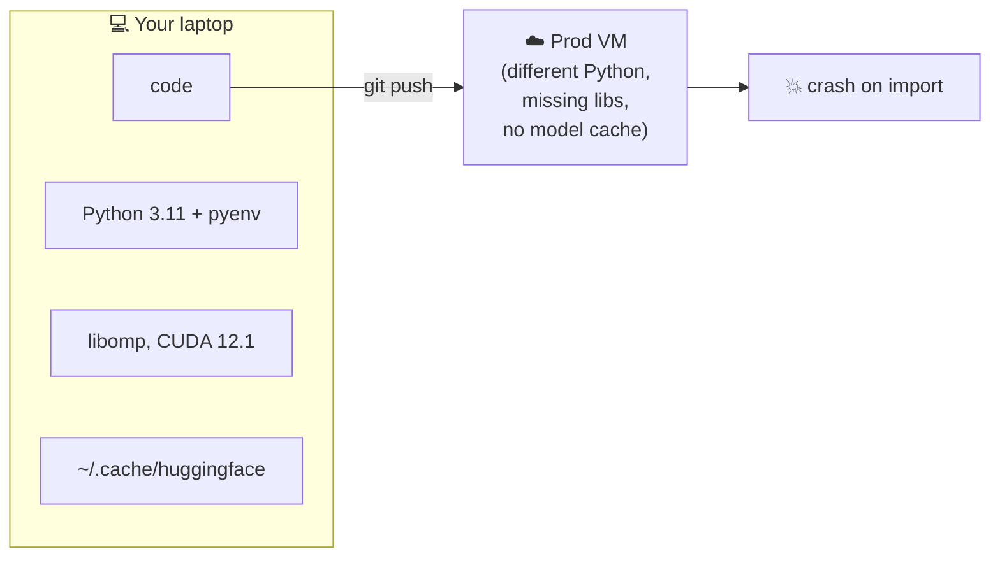
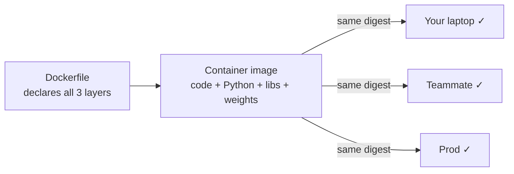

# Pain 1: Model works locally, breaks in prod

> *Your model serves perfectly on your laptop. On the prod VM, it crashes on import. Different Python, different CUDA, missing system lib, drift in `transformers` minor version. Nobody can reproduce your environment because nobody captured it.*

## The pattern

**Without a container image**

Three layers that don't travel with `git push`: runtime, system libs, and cached state.

**With a container image**

One artifact, identical everywhere.

The unit of deployment is not your code, it's your code plus everything it depends on. You declare that whole thing once, freeze it, sign it, and ship the frozen artifact to every environment.

Three layers of your environment don't travel with `git push`:

- **Your Python is plural.** Multiple installs (system, brew, pyenv, conda), multiple env managers (venv, conda, poetry, uv), packages from different sources (PyPI vs conda-forge). `pip freeze` records names and versions but not which index they came from or which Python they're attached to.
- **Python isn't all of it.** System libs (`libomp`, `ffmpeg`, CUDA toolkit, BLAS) get linked at install time against whatever your machine happens to have. None of this lives in your requirements file.
- **State lives outside your code.** Model weights in `~/.cache/huggingface`, tokens in `~/.huggingface/token`, env vars in `~/.zshrc` (`CUDA_HOME`, `HF_HOME`), data at hardcoded paths. None of it ships with `git push`.

## The primitives

- **Layer 1 → one Python, declared.** `FROM python:3.11-slim` pins the runtime version and base image. There's one interpreter inside the container, no env managers. `pip install -r requirements.txt` runs against that one Python, from a pinned index (and `--index-url` if you need a specific PyTorch wheel).
- **Layer 2 → system libs, declared.** `RUN apt-get install -y libomp1 ffmpeg` makes the native layer part of the artifact. Same for CUDA: the base image either ships it or doesn't, and the answer is in the Dockerfile.
- **Layer 3 → state, inside the image.** Model weights baked in via `COPY` or downloaded at build. Env vars set with `ENV`. Tokens passed at build via `--secret` so they aren't committed. The state that lived across your dotfiles now lives in one declared place.

The primitives that make this work:

- **Container image**: your code, runtime, system libs, model weights (optionally), built from a Dockerfile, stored in a registry, addressable by digest
- **Dockerfile**: the declarative recipe for how that image gets built
- **Image registry** (GHCR, ECR, Harbor): the place every environment pulls from

## Trade-offs

**What you keep**:

When the Dockerfile pattern is applied to a model server:

- **Same artifact, every environment.** The image that ran on your laptop runs identically on a teammate's machine, on CI, on staging, and on prod.
- **No host-state inheritance.** What's on the host (Python versions, system libs, env vars, cached models) doesn't affect the runtime.
- **The model travels with the code.** Inference doesn't depend on whether `~/.cache/huggingface` is populated or whether the host has internet access for the first call.
- **Reproducible at a digest.** "What was running in prod on August 12?" answers as `ghcr.io/.../embedder@sha256:abc123` rather than "a venv on a box that may have been updated since."

**What you give up**: "it works on my machine" as a defense. The image either runs or doesn't, identically, everywhere.

## Try it

A working demonstration lives in [`examples/01-image/`](../examples/01-image/). Same Python code shipped two ways (with and without a Dockerfile), plus a diagnostic command that surfaces your own laptop's accumulated state before you read the Dockerfile section.

---

[Landscape](../README.md) · [Pain 2: GPU job crashed →](02-gpu-job-crashed.md)
