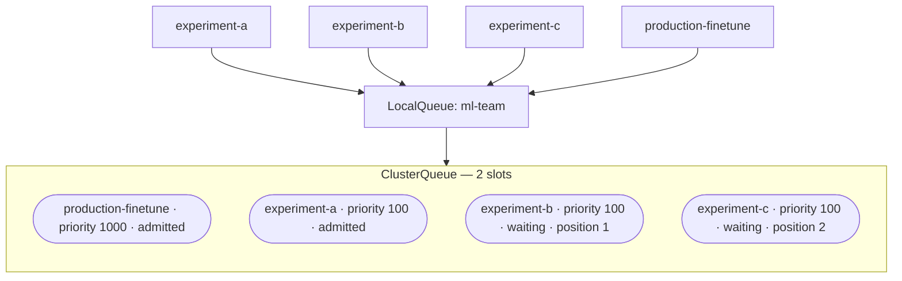

# Pain 3: I can't get a GPU when I need one

> *You submit a training job. It sits `Pending` for hours. The cluster has GPUs but they're all claimed. You don't know who's using them, when they'll free up, or whether your job will ever schedule.*

## The pattern

GPUs aren't always scarce. They're often just invisible. You can't see who has them, when they'll free up, or whether your job would start if you waited five minutes. The scheduler knows, but it isn't telling you.

A queue makes allocation declared, ordered, and observable. It doesn't conjure more GPUs; it gives every job a visible position, a priority, and a clear answer to "when will mine run?"

A queue makes allocation visible and ordered. It doesn't conjure more GPUs; it gives every job a position and a priority.

The production job jumped the queue. The waiting jobs have a known position. Everyone can see the state with `kubectl get workloads`.

## The primitives

- **[Kueue](https://kueue.sigs.k8s.io/)**: native Kubernetes job queueing with quotas, priorities, and fair sharing per team
- **[PriorityClasses](https://kubernetes.io/docs/concepts/scheduling-eviction/pod-priority-preemption/)**: production inference outranks experiments; high-priority jobs preempt lower ones if needed
- **GPU sharing** ([MIG](https://docs.nvidia.com/datacenter/tesla/mig-user-guide/), time-slicing, MPS): one A100 or H100 split across multiple smaller workloads when you don't need a whole one
- **[Cluster autoscaler](https://github.com/kubernetes/autoscaler/tree/master/cluster-autoscaler) with GPU node pools**: capacity comes online when the queue grows, scales down when idle

## Try it

A working demonstration lives in [`examples/03-queueing/`](../examples/03-queueing/). Three experiment jobs compete for two slots; a fourth production job preempts one and is admitted immediately. Runnable on a Mac with a local Kind cluster and no GPU required. The only change to a Job manifest is two lines.

## Trade-offs

**What you keep**: your training and inference code.

**What you give up**: walking up to a box and grabbing it. Allocation becomes declared, queued, and visible.

---

[← Pain 2: GPU job crashed](02-gpu-job-crashed.md) · [Landscape](../README.md) · [Pain 4: Multi-node training →](04-multi-node-training.md)
