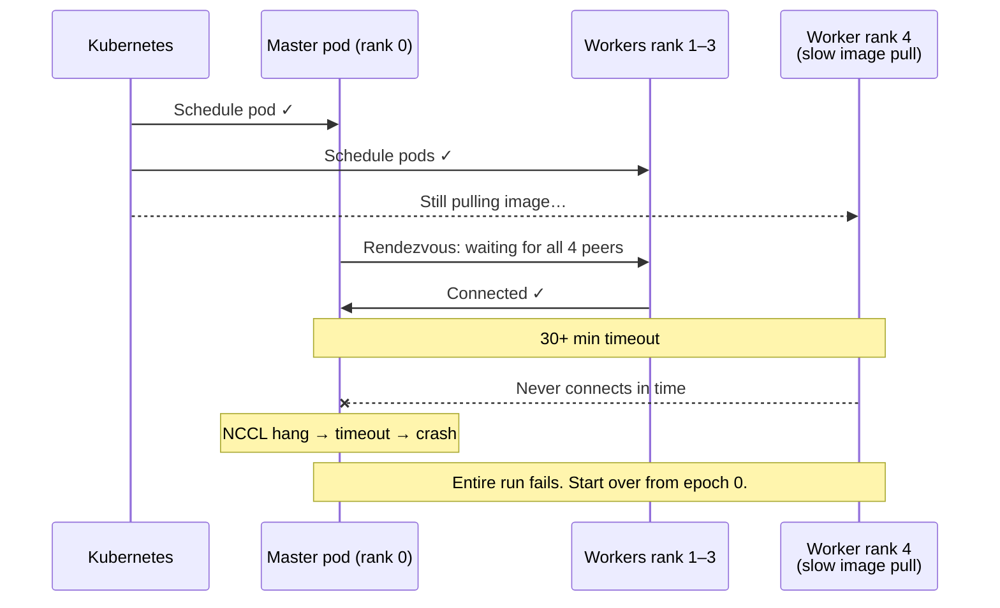
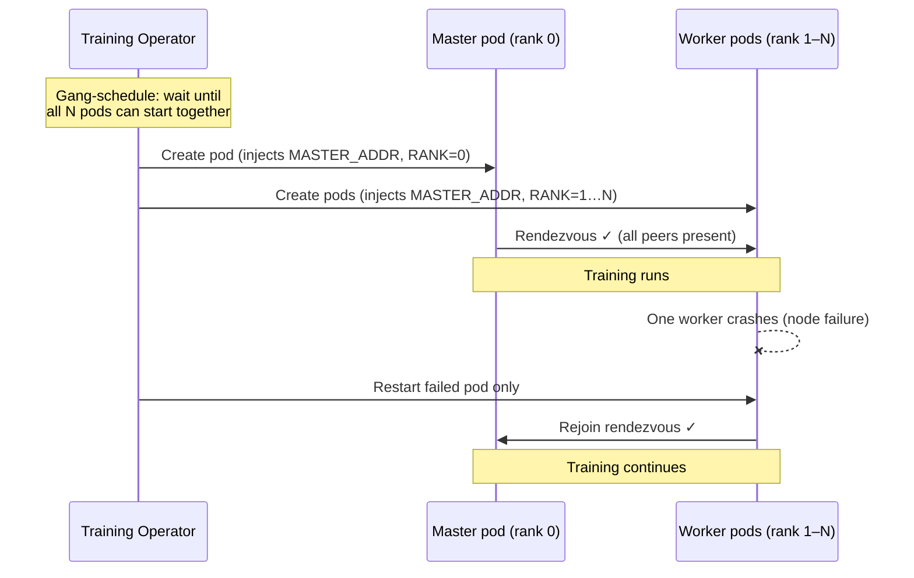

# Pain 4: Multi-node training keeps falling over

> *Your distributed training job needs 32 GPUs across 4 nodes. One node hiccups at hour 6, NCCL hangs, the whole run dies. Or three workers come up, the fourth is still pulling the image, and the others time out waiting.*

## The pattern

Distributed training is all-or-nothing. The platform either gives you every node you asked for at the same time, with the right network and the ability to recover, or it doesn't start the job at all.

**Without gang scheduling — the failure mode:**

**With a training operator — the fix:**

## Try it

A working demonstration lives in [`examples/04-multi-node/`](../examples/04-multi-node/). Same distributed training simulation submitted two ways (bare Jobs vs PyTorchJob), runnable on a Mac with a local Kind cluster and no GPU required. The before case shows the rendezvous timeout and hang; the after case shows the operator coordinating all pods together and recovering a crashed worker without restarting the master.

## The primitives

- **Gang scheduling** (Volcano, Kueue): the job starts when all N pods can run together, not pod-by-pod. The scheduler holds every pod in a pending state until the full set can be admitted simultaneously. If the cluster doesn't have room for all N pods right now, none start. This eliminates the partial-start race where some ranks are running while others are still waiting to be scheduled.
- **Training operators** (KubeRay, PyTorchJob, MPIJob, TorchX): primitives that understand distributed training semantics, including elastic recovery. PyTorchJob is demonstrated in the example; KubeRay serves Ray-based workloads, MPIJob covers MPI-based training (Horovod), and TorchX is a launcher abstraction that can target any of them.
- **High-performance networking**: RDMA, GPUDirect, configured at the node and CNI layer so NCCL isn't going over a slow path
- **Topology-aware scheduling**: pods land on nodes connected to the same fast switch, not scattered across the rack

## Trade-offs

**What you keep**: your PyTorch or JAX training code.

**What you give up**: the assumption that you can just `torchrun` 32 ranks and it'll work. The platform has to know this is a distributed job and treat it as one.

---

[← Pain 3: Can't get a GPU](03-cant-get-a-gpu.md) · [Landscape](../README.md) · [Pain 5: Cold start →](05-cold-start.md)
