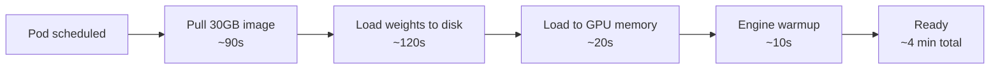

# Pain 5: Cold start for my 70B model takes 4 minutes

> *A new replica needs to scale up. It pulls a 30GB image, downloads model weights from object storage, loads them into GPU memory, and warms the inference engine. Your users wait 4 minutes for the first response after a scale event.*

## The pattern

Each step in the startup sequence is sequential and slow. On a cold node with no cache, pulling a 30 GB image is slow even on high-speed networks; pull-through registries and node-local image caches reduce this, but without pre-warming, a new node still pays the full pull cost at the worst possible time: during a scale event under load. Downloading 140 GB of FP16 weights from S3 or GCS adds another 2-3 minutes. Loading those weights into GPU memory is another 20-30 seconds. Engine warmup (JIT compilation, KV cache allocation) adds more on top. None of these steps overlap by default.

Cold start hurts most in three situations: bursty traffic where new replicas must come up fast, scale-to-zero deployments where there are no warm replicas at all, and rolling updates where old pods terminate before new ones are ready.

There are two axes of attack. On the model side: smaller models, quantized weights (INT8/INT4), and distilled variants all load faster because there is simply less data to move. A 7B INT4 model fits in ~4 GB; a 70B FP16 model needs ~140 GB. That is a 35x difference in load time before you change a single line of infra config. On the infrastructure side: keep ready capacity pre-warmed, split weight loading from image loading, and cache aggressively at every layer so subsequent scale events pay much less.

## The primitives

- **Pre-pulled images on nodes**: A [DaemonSet](https://kubernetes.io/docs/concepts/workloads/controllers/daemonset/) that references your model server image forces the kubelet to cache its layers on every GPU node before a pod is scheduled there. The next scale event finds the image already local and skips the 30 GB pull entirely.
- **PVCs and node-local caches**: Store model weights on a [PersistentVolume](https://kubernetes.io/docs/concepts/storage/persistent-volumes/) backed by fast local NVMe, or a shared ReadWriteMany volume (EFS, Filestore, Weka). Pods mount the volume instead of downloading weights at startup. The first pod on a node pays the download cost; every subsequent pod reads from local disk.
- **Init containers for weight staging**: An [init container](https://kubernetes.io/docs/concepts/workloads/pods/init-containers/) runs before the main inference container starts and downloads weights into a shared volume. This decouples weight fetching from model serving, so you can swap downloaders (aws-cli, gcsfuse, HuggingFace hub) without rebuilding the server image.
- **Warm pools and minimum replicas**: Setting [HPA](https://kubernetes.io/docs/tasks/run-application/horizontal-pod-autoscale/) `minReplicas` above zero keeps at least one ready replica alive at all times. For predictable traffic patterns, pair it with [KEDA's CronScaler](https://keda.sh/docs/2.13/scalers/cron/) to pre-scale before known peak hours. The key is headroom: keep `minReplicas` one or two above your steady-state need so a traffic spike is absorbed while a cold pod is still initializing.
- **[KServe](https://kserve.github.io/website/) and serving-aware autoscalers** ([KEDA HTTP](https://github.com/kedacore/http-add-on), [Knative](https://knative.dev/docs/serving/)): these frameworks understand load-once, serve-many semantics. KServe's `InferenceService` supports a warm floor via `minReplicas` alongside optional scale-to-zero for cheaper models. It also holds incoming requests in a queue while a new pod initializes, so callers see latency rather than errors during a scale event.

## Trade-offs

**What you keep**: your model and your model server.

**What you give up**: scale-to-zero as a default. For big models, a 4-minute cold start is long enough to break SLAs and lose users; the math usually favors a warm floor. For small or quantized models (7B INT4 loads in under 30 seconds on NVMe), scale-to-zero is still viable and worth considering.

---

[← Pain 4: Multi-node training](04-multi-node-training.md) · [Landscape](../README.md) · [Pain 6: GPU underutilization →](06-gpu-underutilized.md)
