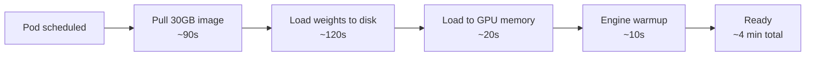

# Pain 5: Cold start for my 70B model takes 4 minutes

> *A new replica needs to scale up. It pulls a 30GB image, downloads model weights from object storage, loads them into GPU memory, and warms the inference engine. Your users wait 4 minutes for the first response after a scale event.*



## The pattern

Each step in the startup sequence is sequential and slow. A 30 GB image pull over a typical cluster network takes 60-120 seconds. Downloading 140 GB of FP16 weights from S3 or GCS adds another 2-3 minutes. Loading those weights into GPU memory is another 20-30 seconds. Engine warmup (JIT compilation, KV cache allocation) adds more on top. None of these steps overlap by default.

Cold start hurts most in three situations: bursty traffic where new replicas must come up fast, scale-to-zero deployments where there are no warm replicas at all, and rolling updates where old pods terminate before new ones are ready.

There are two axes of attack. On the model side: smaller models, quantized weights (INT8/INT4), and distilled variants all load faster because there is simply less data to move. A 7B INT4 model fits in ~4 GB; a 70B FP16 model needs ~140 GB. That is a 35x difference in load time before you change a single line of infra config. On the infrastructure side: keep ready capacity pre-warmed, split weight loading from image loading, and cache aggressively at every layer so subsequent scale events pay much less.

## The primitives

- **Pre-pulled images on nodes**: Cache the container image on every GPU node so that a scale event never waits for a 30 GB pull. A DaemonSet that references the image and exits immediately forces the kubelet to cache the layers on every target node.

  ```yaml
  # image-prepuller-ds.yaml
  apiVersion: apps/v1
  kind: DaemonSet
  metadata:
    name: model-image-prepuller
  spec:
    selector:
      matchLabels:
        app: model-image-prepuller
    template:
      metadata:
        labels:
          app: model-image-prepuller
      spec:
        nodeSelector:
          accelerator: nvidia-gpu
        initContainers:
        - name: prepull
          image: your-registry/llm-server:v1.2
          command: ["sh", "-c", "echo image cached"]
          resources:
            requests:
              memory: "64Mi"
        containers:
        - name: pause
          image: gcr.io/google_containers/pause:3.9
  ```

- **PVCs and node-local caches**: Store model weights on a PersistentVolume backed by fast local NVMe (or a ReadWriteMany shared volume like EFS or Filestore). Pods mount the PVC instead of downloading weights at startup. The first pod on a node pays the download cost; every subsequent pod on the same node reads from local disk at NVMe speed.

  ```yaml
  # model-weights-pvc.yaml
  apiVersion: v1
  kind: PersistentVolumeClaim
  metadata:
    name: model-weights
  spec:
    accessModes:
    - ReadWriteOnce
    storageClassName: local-nvme   # node-local fast storage
    resources:
      requests:
        storage: 200Gi
  ---
  # In your inference Deployment, mount it:
  volumes:
  - name: weights
    persistentVolumeClaim:
      claimName: model-weights
  containers:
  - name: inference-server
    volumeMounts:
    - name: weights
      mountPath: /models
  ```

- **Init containers for weight staging**: Use an init container to download weights into a shared `emptyDir` before the main inference container starts. This decouples weight fetching from model serving and lets you swap downloader implementations (aws-cli, gcsfuse, HuggingFace hub) without modifying the server image.

  ```yaml
  initContainers:
  - name: weight-downloader
    image: amazon/aws-cli:latest
    command:
    - aws
    - s3
    - sync
    - s3://my-model-bucket/llama3-70b/
    - /models/llama3-70b/
    volumeMounts:
    - name: model-storage
      mountPath: /models
  volumes:
  - name: model-storage
    emptyDir: {}
  ```

- **Warm pools and minimum replicas**: Set HPA `minReplicas` above zero so there is always at least one ready replica. For predictable traffic patterns, combine with a scheduled scaler (KEDA `CronScaler`) to pre-scale before peak hours. The key is headroom: if your steady state is 2 replicas, keep `minReplicas: 3` so a traffic spike can be absorbed while a cold pod is still initializing.

  ```yaml
  apiVersion: autoscaling/v2
  kind: HorizontalPodAutoscaler
  metadata:
    name: inference-hpa
  spec:
    scaleTargetRef:
      apiVersion: apps/v1
      kind: Deployment
      name: inference-server
    minReplicas: 2     # never drop to zero
    maxReplicas: 10
    metrics:
    - type: Pods
      pods:
        metric:
          name: requests_per_second
        target:
          type: AverageValue
          averageValue: "10"
  ```

- **KServe and serving-aware autoscalers** (KEDA HTTP, Knative): KServe's `InferenceService` supports a warm floor via `minReplicas: 1` alongside Knative scale-to-zero semantics for cheaper models. It also integrates a request-holding queue so traffic is buffered while a new pod initializes, rather than returning errors.

  ```yaml
  apiVersion: serving.kserve.io/v1beta1
  kind: InferenceService
  metadata:
    name: llama3-70b
  spec:
    predictor:
      minReplicas: 1       # keep one warm
      maxReplicas: 5
      scaleTarget: 10      # concurrent requests per replica before scaling
      scaleMetric: concurrency
      model:
        modelFormat:
          name: pytorch
        storageUri: pvc://model-weights/llama3-70b
        runtime: vllm-runtime
        resources:
          limits:
            nvidia.com/gpu: "1"
  ```

## Trade-offs

**Cost of warm pools vs scale-to-zero savings.** A single A100 costs roughly $3/hour on major clouds. Keeping two replicas warm 24/7 adds around $4,400/month per GPU tier. That is the real cost of eliminating cold start. For high-traffic production endpoints the math usually works out: 4-minute cold starts cause SLA breaches that cost more than the idle GPU hours. For low-traffic internal tools or batch-only workloads the calculus is different.

**When scale-to-zero is still viable.** Small and quantized models change the math. A 7B model quantized to INT4 fits in ~4 GB of VRAM and loads in under 30 seconds on a modern NVMe-backed node. That is an acceptable cold start for many internal tools and dev environments. Scale-to-zero with fast cold start is a real option when: the model is 7B parameters or smaller, weights are already cached on the node, and the use case tolerates a 30-60 second first-request delay. Knative Serving and KEDA HTTP are both designed for exactly this pattern.

**Latency vs cost math.** Work through the numbers for your specific traffic shape. If you serve 10,000 requests/day with a p99 arrival rate that can spike 5x, you need at least one spare replica for headroom. One spare A100 at $3/hour is $72/day. If a cold start drives even 0.1% of users to abandon or retry, and each retry costs you in SLA credits or user trust, the warm replica pays for itself quickly. Run the numbers with your actual traffic shape before defaulting to either extreme.

**Weight streaming and lazy loading (emerging).** Several projects are exploring streaming model weights into GPU memory page-by-page, so the model can begin serving before all weights are fully loaded. Safetensors' mmap-based loading and tiered cache systems like AIStore work in this direction. This is not production-standard for most teams yet; it is the direction the field is moving for models where full pre-load is too slow to be practical.

---

[← Pain 4: Multi-node training](04-multi-node-training.md) · [Landscape](../README.md) · [Pain 6: GPU underutilization →](06-gpu-underutilized.md)
