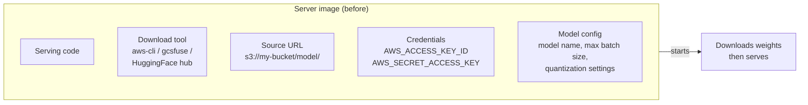
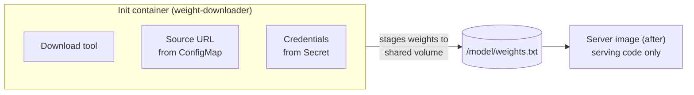

# Pain 6: My server image bakes in config and secrets

> *Every time the weights bucket changes, the team rebuilds the server image. The image carries the S3 URL, the download tool, and the credentials. Change any one of those -- a new bucket, a new region, a rotation of the access key -- and the server image version bumps. The same thing happens when the model name changes, when a downstream API key rotates, or when staging needs different parameters than prod. None of that is a code change, but the image rebuilds anyway.*

## The pattern

The serving code (vLLM, TGI, a custom FastAPI app) and everything it needs to start -- where weights come from, which model to load, which credentials to use, what parameters to apply -- are bundled in one image. Any change to any of those forces an image rebuild and redeploy even when the serving code is unchanged. The same image ends up carrying dev settings, staging settings, and prod settings as separate tags, or credentials live in environment variables baked into the Dockerfile itself.

The coupling shows up as pain in two ways:

- **Operationally**: you want to move weights to a new bucket, rotate an access key, switch from S3 to GCS, change the model name, or tune a server parameter for a specific environment. None of that is a code change, but you rebuild the image anyway. Dev, staging, and prod end up as separate image tags that differ only in config values.
- **As a security smell**: credentials inside an image get cached in your registry, your CI system, and on every node that ever pulled the image.

## The primitives

The fix is to break the single image into two responsibilities: one image that serves, one that fetches. The serving image stays frozen across every weight source change. The fetch logic -- the download tool, the bucket URL, the credentials -- moves into a separate setup step that runs once at startup, stages weights to a shared location, and exits before the server starts. Credentials never touch the server image. The bucket URL is stored as a separate config object, so switching sources is a config change, not a code change.

- **[Init containers](https://kubernetes.io/docs/concepts/workloads/pods/init-containers/)** (setup steps that must complete before your model server starts): move the download tool, source URL, and credentials out of the server image into a separate container. The server image becomes serving code only. Swap the init container to change the weight source; the server image never changes and never carries credentials. An init container that fails stops the pod before it serves a single request -- a fast-fail that prevents a server with missing or partial weights from ever becoming live.

- **[Secrets](https://kubernetes.io/docs/concepts/configuration/secret/)** (Kubernetes objects that store sensitive data as key-value pairs, scoped to a namespace, and mountable into containers without embedding values in the image): store bucket credentials as a Secret and mount it into the init container only. The server image never sees the credentials. Rotate the Secret and the next pod picks up the new value without any image rebuild. The Secret API is the same on any cluster; what backs it -- AWS Secrets Manager, GCP Secret Manager, HashiCorp Vault -- is a separate concern that [External Secrets Operator](https://external-secrets.io) can abstract.

- **[ConfigMaps](https://kubernetes.io/docs/concepts/configuration/configmap/)** (Kubernetes objects that store non-sensitive configuration, also mountable as environment variables or files): store any config that changes independently of serving logic -- the weights source URL, the model name, max batch size, quantization settings, environment-specific endpoints -- as a ConfigMap. Each environment gets its own ConfigMap; the image is identical across all of them. Changing a value is a `kubectl apply` on one YAML object, not a code change.

The resulting split:

| Concern | Lives in |
|---|---|
| Serving logic | Server image (built once, identical across all environments) |
| Download tool | Init container image |
| Source URL | ConfigMap |
| Model name, server parameters | ConfigMap |
| Credentials, API tokens | Secret |

## Trade-offs

**What you keep**: your model and your model server. The server image is now a stable artifact -- identical across dev, staging, and prod, and across weight source, model name, and credential changes.

**What you give up**: the simplicity of one image. You now build and maintain two images (server and init container), and coordinate their versions when the download interface changes. Init container failures are also highly visible: a bad Secret or wrong bucket URL blocks the pod from starting, which surfaces problems early but means the pod never reaches `Running` until credentials and source are correct.

## Try it

A working demonstration lives in [`examples/06-image-coupling/`](../examples/06-image-coupling/). The before case runs without Docker or Kubernetes and shows the hardcoded source URL and credentials printed on every startup. The after case uses an init container, a ConfigMap, and a Secret to decouple them from the image; the walkthrough includes steps to simulate a key rotation and a source change without rebuilding. Runnable on a Mac with a local Kind cluster and no GPU required.

---

[← Pain 5: Cold start](05-cold-start.md) · [Landscape](../README.md) · [Pain 7: GPU underutilization →](07-gpu-underutilized.md)
