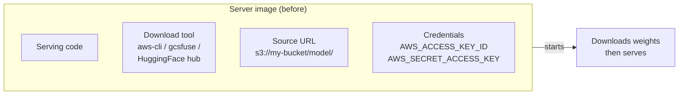
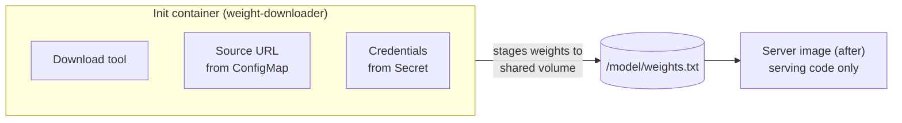

# Pain 6: My server image bakes in the weights source

> *Every time the weights bucket changes, the team rebuilds the server image. The image carries the S3 URL, the download tool, and the credentials. Change any one of those -- a new bucket, a new region, a rotation of the access key -- and the server image version bumps. For something that has nothing to do with serving logic.*

## The pattern

The serving code (vLLM, TGI, a custom FastAPI app) and the delivery mechanism (where weights come from, how to fetch them, which credentials to use) are bundled in one image. Any change to the delivery mechanism forces an image rebuild and redeploy even when the serving code is unchanged. In the worst case, credentials live in environment variables baked into the Dockerfile or the server script itself.

The coupling shows up as pain in two ways. First, operationally: you want to move weights to a new bucket, rotate an access key, or switch from S3 to GCS. None of that is a code change, but you rebuild the image anyway. Second, as a security smell: credentials inside an image get cached in your registry, your CI system, and on every node that ever pulled the image.

## The primitives

- **[Init containers](https://kubernetes.io/docs/concepts/workloads/pods/init-containers/)** (setup steps that must complete before your model server starts): move the download tool, source URL, and credentials out of the server image into a separate container. The server image becomes serving code only. Swap the init container to change the weight source; the server image never changes and never carries credentials. An init container that fails stops the pod before it serves a single request -- a fast-fail that prevents a server with missing or partial weights from ever becoming live.

- **[Secrets](https://kubernetes.io/docs/concepts/configuration/secret/)** (Kubernetes objects that store sensitive data as key-value pairs, scoped to a namespace, and mountable into containers without embedding values in the image): store bucket credentials as a Secret and mount it into the init container only. The server image never sees the credentials. Rotate the Secret and the next pod picks up the new value without any image rebuild.

- **[ConfigMaps](https://kubernetes.io/docs/concepts/configuration/configmap/)** (Kubernetes objects that store non-sensitive configuration, also mountable as environment variables or files): store the weights source URL -- the bucket name, prefix, or HuggingFace repo ID -- as a ConfigMap. Changing the source is a `kubectl apply` on one YAML object, not a code change.

The resulting split:

| Concern | Lives in |
|---|---|
| Serving logic | Server image (built once, reused everywhere) |
| Download tool | Init container image |
| Source URL | ConfigMap |
| Credentials | Secret |

## Trade-offs

**What you keep**: your model and your model server. The server image is now a stable artifact -- same image across dev, staging, and prod, and across weight source changes.

**What you give up**: the simplicity of one image. You now build and maintain two images (server and init container), and coordinate their versions when the download interface changes. Init container failures are also highly visible: a bad Secret or wrong bucket URL blocks the pod from starting, which surfaces problems early but means the pod never reaches `Running` until credentials and source are correct.

## Try it

Coming soon in `examples/06-image-coupling/`.

---

[← Pain 5: Cold start](05-cold-start.md) · [Landscape](../README.md) · [Pain 7: GPU underutilization →](07-gpu-underutilized.md)
