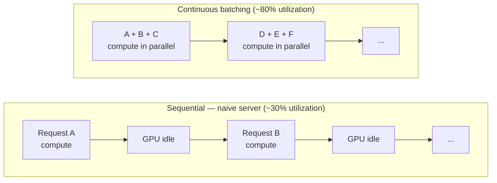

# Pain 7: My GPU sits at 30% but my bill says 100%

> *Your inference server runs on an H100. `nvidia-smi` shows 30% utilization at p50 load. You're paying for the whole GPU every hour. Latency is fine, efficiency is awful.*
>
> *Requests arrive one at a time. The server processes each one sequentially and idles between them. A traffic spike hits — but Kubernetes doesn't scale because CPU is at 5%. By the time queue depth rises enough to notice, latency has already spiked. You add more replicas manually. Now each one runs at 15%. The bill doubles.*

## The pattern

LLM inference is memory-bandwidth-bound. During the decode phase (token generation), the GPU reads the entire model and KV cache from HBM for every generated token — those reads happen regardless of how many sequences are in flight. A batch of 16 requests costs roughly the same GPU bandwidth as a batch of 1, because the weights are loaded once and applied to all sequences in parallel.

That property means **batching is the primary lever for utilization**. Without it, requests are processed one at a time and the GPU idles between them:



Three problems compound into the underutilization you see on the dashboard:

1. **No batching, or static batching**: A static-batch server waits for the current batch to drain before starting the next one. A naive sequential server processes one request at a time. Either way, new arrivals wait in a queue while the GPU idles. With continuous batching, new requests join batches already in flight — a request that arrives mid-decode slots into the next decode step rather than queuing behind it.

2. **Autoscaling on the wrong signal**: Kubernetes HPA defaults to CPU utilization. An inference server barely uses CPU — all the compute is on the GPU. CPU at 5% tells Kubernetes there is nothing to scale. Queue depth is rising, KV cache is filling, latency is climbing — none of that is visible to HPA unless you tell it what metric to watch.

3. **One GPU per workload by default**: A 7B INT4 model fit into ~4 GB of HBM assigned to an 80 GB H100 leaves 76 GB idle. No other workload can use those resources by default, so you pay for the whole card at all times.

## The primitives

**Continuous batching** is the prerequisite — without it, the cloud native primitives below cannot help. vLLM, TGI, and SGLang all implement it. Switching from a naive serving loop to one of these engines typically moves GPU utilization from ~30% to ~70–80% at the same throughput level, before any infrastructure change. New requests join in-flight batches rather than queuing behind them; the GPU stays busy across the full decode stream.

With continuous batching in place, the remaining problems are scheduling, scaling, and sharing problems — and those are where cloud native primitives apply:

- **[Custom-metric HPA](https://kubernetes.io/docs/tasks/run-application/horizontal-pod-autoscale/#scaling-on-custom-metrics)** (Kubernetes' built-in scale-out controller, extended to scale on any metric you can expose): scale your inference deployment on tokens-per-second, requests-in-flight, or KV-cache fill rate rather than CPU. vLLM ships a `/metrics` Prometheus endpoint by default. Scrape it with Prometheus, expose it through the custom metrics adapter, and configure HPA to use it. The result: Kubernetes adds replicas when the GPU is actually saturated, not when CPU happens to tick upward.

  ```mermaid
  flowchart LR
      vLLM["vLLM /metrics\ntokens_per_second\nkv_cache_fill_rate"] --> Prom[Prometheus]
      Prom --> Adapter["Custom metrics adapter\ncustom.metrics.k8s.io"]
      Adapter --> HPA["HPA\nscaleOn: tokens_per_second > 500"]
      HPA -->|"+1 replica"| Deploy[Inference deployment]
  ```

- **[KEDA](https://keda.sh/) (Kubernetes Event-Driven Autoscaler)**: a simpler path to custom-metric autoscaling than manually wiring up the HPA adapter. KEDA ships ready-made scalers for Prometheus, HTTP queue depth, Kafka, and others. Write a `ScaledObject` that points at your Prometheus metric; KEDA handles the adapter and scaling rules. KEDA's HTTP add-on can scale on pending request count, which is often the right signal for inference endpoints that serve bursty traffic.

- **Service mesh request routing** ([Envoy](https://www.envoyproxy.io/), [Istio](https://istio.io/), or a simple proxy with concurrency limits): without a proxy in front, a spike of 200 concurrent requests hits your server simultaneously — the GPU tries to batch all 200 at once, memory overflows, requests fail. With a proxy queue, requests arrive at the server at a controlled rate: each replica gets as many concurrent requests as it can handle (sized to your target batch), and the rest wait at the proxy. Each replica runs near full utilization without OOM errors.

- **[MIG (Multi-Instance GPU)](https://docs.nvidia.com/datacenter/tesla/mig-user-guide/)** (NVIDIA hardware partitioning for A100 and H100): when a workload genuinely can't fill the card — a small model, a low-traffic endpoint, a fine-tuned classification head — MIG divides one physical GPU into up to seven isolated partitions, each with its own HBM slice and compute fraction. Two or three inference services share one H100 without memory interference. MIG is hardware-enforced: one partition cannot access another's memory.

- **[GPU time-slicing](https://docs.nvidia.com/datacenter/cloud-native/gpu-operator/gpu-sharing.html)** and **[MPS](https://docs.nvidia.com/deploy/mps/index.html)**: for GPUs that predate MIG (V100 and earlier), NVIDIA time-slicing lets multiple containers share one GPU in time slices. Less isolation than MIG — one container can affect another's latency — but works on older hardware. MPS provides spatial sharing with lower overhead for trusted workloads.

## Trade-offs

**What you keep**: your model. The wins come from how you serve it.

**What you give up**: the simplicity of one GPU, one process. Continuous batching requires a supported engine (vLLM, TGI, SGLang) rather than a plain FastAPI loop. Custom-metric HPA requires a Prometheus stack and a custom-metrics adapter. GPU sharing (MIG, time-slicing) adds scheduling complexity and changes how pods must request GPU resources from the cluster. The leverage is real — a well-batched, correctly-scaled server on one GPU can serve the same traffic as three or four underutilized replicas — but each layer adds operational surface.

---

[← Pain 6: Server image coupling](06-server-image-coupling.md) · [Landscape](../README.md) · [Pain 8: Can't roll back →](08-cant-roll-back.md)
