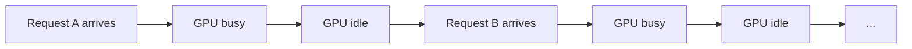
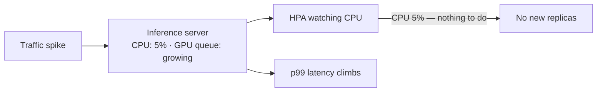
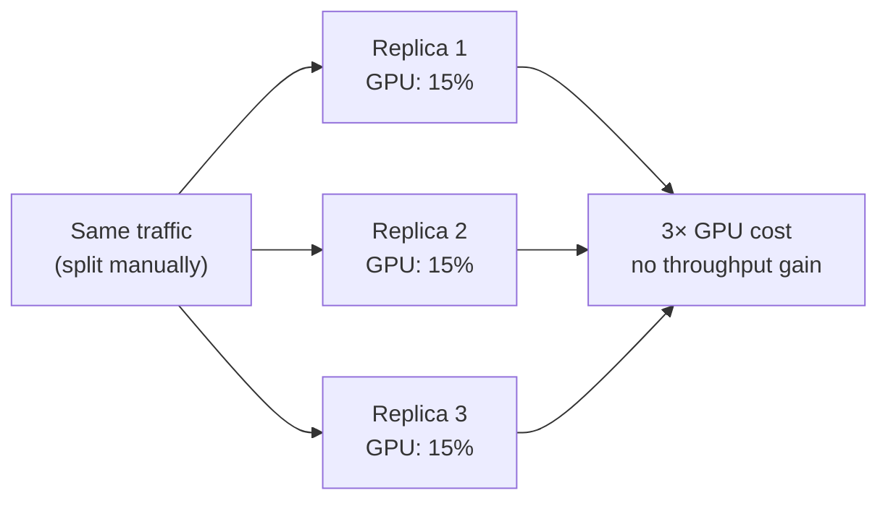
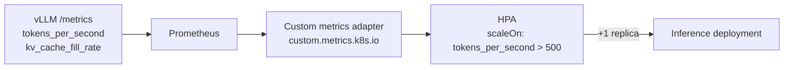

# Pain 7: My GPU sits at 30% but my bill says 100%

> *Your inference server runs on an H100. `nvidia-smi` shows 30% utilization at p50 load. You're paying for the whole GPU every hour. Latency is fine, efficiency is awful.*
>
> *Requests arrive one at a time. The server processes each one sequentially and idles between them. A traffic spike hits — but Kubernetes doesn't scale because CPU is at 5%. By the time queue depth rises enough to notice, latency has already spiked. You add more replicas manually. Now each one runs at 15%. The bill doubles.*

## The pattern

Without a batching-aware server, requests are processed one at a time and the GPU idles between them:

The first instinct is to optimize the model and serving engine. ML practitioners reach for:

- **Continuous batching**: replace the naive serving loop with an engine (vLLM, TGI, SGLang) that processes multiple requests in parallel. Instead of waiting for one request to finish before starting the next, the engine runs a batch of sequences through each token step together — requests join and leave mid-flight as they finish. This alone typically moves utilization from ~30% to ~70–80% on the same hardware, before any infrastructure change.
- **Quantization** (INT8, INT4, FP8): shrinks model weights so less HBM bandwidth is consumed per token step — a 70B FP16 model at ~140 GB becomes ~35 GB in INT4, reducing memory reads proportionally.
- **Speculative decoding**: a small draft model proposes N tokens; the large model verifies them in one forward pass. Fewer full model reads per output token at the cost of occasional wasted draft work.
- **KV cache management** (PagedAttention, prefix caching): avoids recomputing attention for repeated prefixes such as system prompts. vLLM's PagedAttention removes KV cache fragmentation that wastes HBM capacity.
- **Sequence packing**: bin-packs multiple short sequences into one context window to eliminate padding waste at the edges of each request.
- **Prefill/decode disaggregation**: routes the prompt-processing phase (prefill — compute-bound) and the token-generation phase (decode — memory-bandwidth-bound) to separate hardware, since their resource profiles differ enough that mixing them on one GPU underserves both.

These reduce what the GPU has to do per request and how efficiently it processes them. The problem re-emerges at the infrastructure layer when traffic grows and more capacity is needed.

## The primitives

The instinct when traffic increases is to let Kubernetes scale out. But HPA's built-in resource metrics — CPU and memory — are both blind to this workload. An inference server barely uses CPU, and system RAM is stable regardless of load because the model weights are resident in GPU HBM from startup, not in system memory. CPU stays at 5%, system memory stays flat, while the queue grows, the KV cache fills, and latency climbs:

Adding replicas manually doesn't fix the root cause. Each new replica runs the same underutilized loop — a 7B INT4 model occupies ~4 GB of an H100's 80 GB HBM, so spreading traffic across three replicas means each runs at ~15% while you pay for three full cards:

The right approach has two parts: scale on GPU-side signals rather than CPU, and share the card when one workload can't fill it.

**[Custom-metric HPA](https://kubernetes.io/docs/tasks/run-application/horizontal-pod-autoscale/#scaling-on-custom-metrics)** (Kubernetes' built-in scale-out controller, extended to scale on any metric you can expose): scale your inference deployment on tokens-per-second, requests-in-flight, or KV-cache fill rate rather than CPU. vLLM ships a `/metrics` Prometheus endpoint by default. Scrape it with Prometheus, expose it through the custom metrics adapter, and configure HPA to use it. The result: Kubernetes adds replicas when the GPU is actually saturated, not when CPU happens to tick upward.

**[KEDA](https://keda.sh/) (Kubernetes Event-Driven Autoscaler)**: a simpler path to custom-metric autoscaling than manually wiring up the HPA adapter. KEDA ships ready-made scalers for Prometheus, HTTP queue depth, Kafka, and others. Write a `ScaledObject` that points at your Prometheus metric; KEDA handles the adapter and scaling rules. KEDA's HTTP add-on can scale on pending request count, which is often the right signal for inference endpoints that serve bursty traffic.

**Service mesh request routing** ([Envoy](https://www.envoyproxy.io/), [Istio](https://istio.io/), or a simple proxy with concurrency limits): without a proxy in front, a spike of 200 concurrent requests hits your server simultaneously — the GPU tries to batch all 200 at once, memory overflows, requests fail. With a proxy queue, requests arrive at the server at a controlled rate: each replica gets as many concurrent requests as it can handle, and the rest wait at the proxy. Each replica runs near full utilization without OOM errors.

**[MIG (Multi-Instance GPU)](https://docs.nvidia.com/datacenter/tesla/mig-user-guide/)** (NVIDIA hardware partitioning for A100 and H100): when a workload genuinely can't fill the card — a small model, a low-traffic endpoint, a fine-tuned classification head — MIG divides one physical GPU into up to seven isolated partitions, each with its own HBM slice and compute fraction. Two or three inference services share one H100 without memory interference. MIG is hardware-enforced: one partition cannot access another's memory. Note: Kubernetes' default count-based GPU resource model (`nvidia.com/gpu: 1`) cannot express which MIG slice a pod needs — that requires Dynamic Resource Allocation (DRA); see [issue #21](https://github.com/arun-gupta/the-pain-first-way/issues/21).

**[GPU time-slicing](https://docs.nvidia.com/datacenter/cloud-native/gpu-operator/gpu-sharing.html)** and **[MPS](https://docs.nvidia.com/deploy/mps/index.html)**: for GPUs that predate MIG (V100 and earlier), NVIDIA time-slicing lets multiple containers share one GPU in time slices. Less isolation than MIG — one container can affect another's latency — but works on older hardware. MPS provides spatial sharing with lower overhead for trusted workloads.

With these in place, Kubernetes scales at the right time and shares the GPU. But each replica is still processing requests one at a time — the GPU idles between them. You're scaling an inefficient unit: more replicas absorb the load, but the utilization per replica stays low.

**Continuous batching** closes that gap. Already covered in the pattern above as a serving-engine optimization, it also compounds with CN infrastructure: once each replica processes requests in parallel rather than sequentially, the GPU never idles between requests and the right-signal autoscaling above is scaling an efficient unit rather than an inefficient one.

With both layers in place — CN infrastructure scaling on the right signal and sharing the GPU, continuous batching keeping each replica efficient — a single well-configured server can serve the traffic that previously required three or four underutilized replicas.

## Trade-offs

**What you keep**: your model. The wins come from how you serve it.

**What you give up**: the simplicity of one GPU, one process. Continuous batching requires a supported engine (vLLM, TGI, SGLang) rather than a plain FastAPI loop. Custom-metric HPA requires a Prometheus stack and a custom-metrics adapter. GPU sharing (MIG, time-slicing) adds scheduling complexity and changes how pods must request GPU resources from the cluster. The leverage is real — a well-batched, correctly-scaled server on one GPU can serve the same traffic as three or four underutilized replicas — but each layer adds operational surface.

---

[← Pain 6: Server image coupling](06-server-image-coupling.md) · [Landscape](../README.md) · [Pain 8: Can't roll back →](08-cant-roll-back.md)
