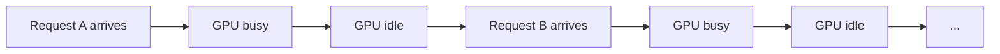
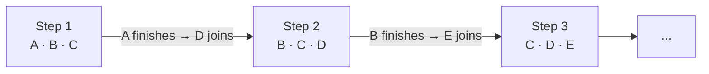
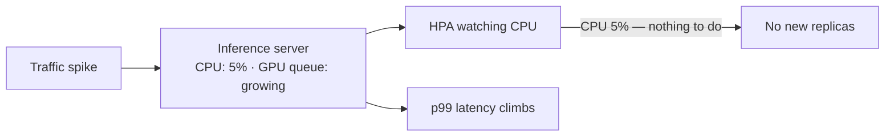
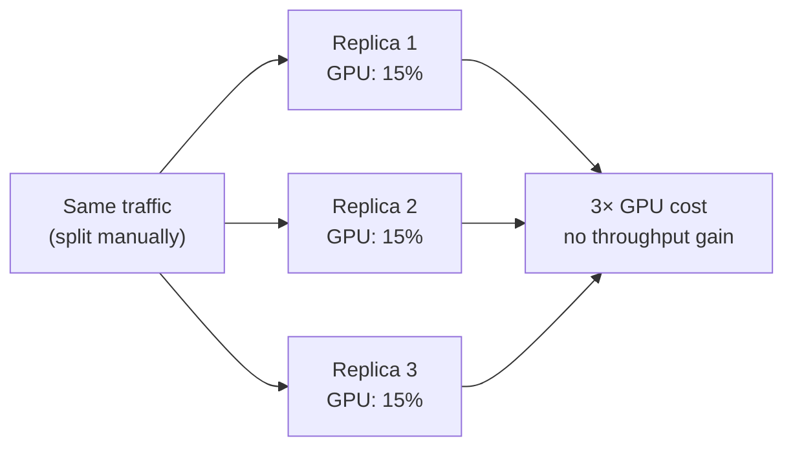
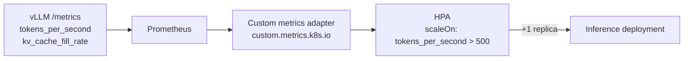

# Pain 8: My GPU sits at 30% but my bill says 100%

> *Your inference server runs on an H100. `nvidia-smi` shows 30% utilization at p50 load. You're paying for the whole GPU every hour. Latency is fine, efficiency is awful.*
>
> *Requests arrive one at a time. The server processes each one sequentially and idles between them. A traffic spike hits — but Kubernetes doesn't scale because CPU is at 5%. By the time queue depth rises enough to notice, latency has already spiked. You add more replicas manually. Now each one runs at 15%. The bill doubles.*

## The pattern

Without a batching-aware server, requests are processed one at a time and the GPU idles between them:

The first instinct is to optimize the model and serving engine. The biggest single lever is **continuous batching**: replacing the naive serving loop with an engine (vLLM, TGI, SGLang) that processes multiple requests in parallel. Instead of waiting for one request to finish before starting the next, the engine runs a batch of sequences through each token step together — requests join and leave mid-flight as they finish:

This alone typically moves utilization from ~30% to ~70–80% on the same hardware, before any infrastructure change. ML practitioners follow this with quantization, prefix caching, speculative decoding, sequence packing, and prefill/decode disaggregation — each reducing what the GPU has to do per request or how efficiently it does it. The runnable walkthrough for both Mac (ollama) and GPU (vLLM) paths is in [`examples/08-gpu-underutilized/before/`](../examples/08-gpu-underutilized/before/).

The problem re-emerges at the infrastructure layer when traffic grows and more capacity is needed.

## The primitives

The instinct when traffic increases is to let Kubernetes scale out. But HPA's built-in resource metrics — CPU and memory — are both blind to this workload. An inference server barely uses CPU, and system RAM is stable regardless of load because the model weights are resident in GPU HBM from startup, not in system memory. CPU stays at 5%, system memory stays flat, while the queue grows, the KV cache fills, and latency climbs:

Adding replicas manually doesn't fix the root cause. Each new replica runs the same underutilized loop — a 7B INT4 model occupies ~4 GB of an H100's 80 GB HBM, so spreading traffic across three replicas means each runs at ~15% while you pay for three full cards:

The right approach has two parts: scale on GPU-side signals rather than CPU, and share the card when one workload can't fill it.

**[Custom-metric HPA](https://kubernetes.io/docs/tasks/run-application/horizontal-pod-autoscale/#scaling-on-custom-metrics)** (Kubernetes' built-in scale-out controller, extended to scale on any metric you can expose): scale your inference deployment on tokens-per-second, requests-in-flight, or KV-cache fill rate rather than CPU. vLLM ships a `/metrics` Prometheus endpoint by default. Scrape it with Prometheus, expose it through the custom metrics adapter, and configure HPA to use it. The result: Kubernetes adds replicas when the GPU is actually saturated, not when CPU happens to tick upward.

**[KEDA](https://keda.sh/) (Kubernetes Event-Driven Autoscaler)**: a simpler path to custom-metric autoscaling than manually wiring up the HPA adapter. KEDA ships ready-made scalers for Prometheus, HTTP queue depth, Kafka, and others. Write a `ScaledObject` that points at your Prometheus metric; KEDA handles the adapter and scaling rules. KEDA's HTTP add-on can scale on pending request count, which is often the right signal for inference endpoints that serve bursty traffic.

**Node autoscaler** ([Cluster Autoscaler](https://github.com/kubernetes/autoscaler/tree/master/cluster-autoscaler) or [Karpenter](https://karpenter.sh/)): HPA or KEDA can request more replicas, but if the cluster has no free GPUs those pods stay Pending. A node autoscaler closes that gap by adding GPU nodes when unschedulable pods appear, then removing them when demand drops.

**Scheduling and placement controls** ([node affinity](https://kubernetes.io/docs/concepts/scheduling-eviction/assign-pod-node/), [topology spread constraints](https://kubernetes.io/docs/concepts/scheduling-eviction/topology-spread-constraints/), and [PriorityClass](https://kubernetes.io/docs/concepts/scheduling-eviction/pod-priority-preemption/)): these decide where inference replicas land under contention. Used well, they prevent low-priority jobs from fragmenting GPU capacity and help keep latency-critical replicas on the right nodes.

**Service mesh request routing** ([Envoy](https://www.envoyproxy.io/), [Istio](https://istio.io/), or a simple proxy with concurrency limits): without a proxy in front, a spike of 200 concurrent requests hits your server simultaneously — the GPU tries to batch all 200 at once, memory overflows, requests fail. With a proxy queue, requests arrive at the server at a controlled rate: each replica gets as many concurrent requests as it can handle, and the rest wait at the proxy. Each replica runs near full utilization without OOM errors.

**[NVIDIA GPU Operator](https://docs.nvidia.com/datacenter/cloud-native/gpu-operator/overview.html)**: configures MIG partitions and time-slicing across all GPU nodes in the cluster and exposes the resulting slices as Kubernetes resources via the device plugin. Without it, MIG and time-slicing are NVIDIA driver features that Kubernetes cannot see or schedule. With it, a pod can request `nvidia.com/mig-3g.40gb: 1` and the scheduler places it on a node with that partition available.

**[Dynamic Resource Allocation (DRA)](https://kubernetes.io/docs/concepts/scheduling-eviction/dynamic-resource-allocation/)**: Kubernetes' default count-based model (`nvidia.com/gpu: 1`) can only say how many GPUs a pod needs, not which kind. DRA replaces this with structured `ResourceClaim` objects that can express MIG slice type, NVLink topology, or RDMA NIC co-location. A pod that needs a specific partition gets scheduled precisely rather than landing on whatever node happens to have a free GPU counter. See [issue #21](https://github.com/arun-gupta/the-pain-first-way/issues/21) for the full DRA pain.

With these in place, Kubernetes scales at the right time and shares the GPU. But each replica is still processing requests one at a time — the GPU idles between them. You're scaling an inefficient unit: more replicas absorb the load, but the utilization per replica stays low.

**Continuous batching** closes that gap. Already covered in the pattern above as a serving-engine optimization, it also compounds with CN infrastructure: once each replica processes requests in parallel rather than sequentially, the GPU never idles between requests and the right-signal autoscaling above is scaling an efficient unit rather than an inefficient one.

With both layers in place — CN infrastructure scaling on the right signal and sharing the GPU, continuous batching keeping each replica efficient — a single well-configured server can serve the traffic that previously required three or four underutilized replicas.

## Trade-offs

**What you keep**: your model. The wins come from how you serve it.

**What you give up**: the simplicity of one GPU, one process. Continuous batching requires a supported engine (vLLM, TGI, SGLang) rather than a plain FastAPI loop. Custom-metric HPA requires a Prometheus stack and a custom-metrics adapter. GPU sharing (MIG, time-slicing) adds scheduling complexity and changes how pods must request GPU resources from the cluster.

The complexity is real, but two things keep it manageable. First, the ecosystem has absorbed most of it: vLLM, KEDA, and the NVIDIA GPU Operator are production-hardened and widely deployed — you are not wiring this from scratch. Second, each layer is independent and can be adopted incrementally: continuous batching is a single engine swap with no infrastructure change; custom-metric autoscaling follows when you need to scale out; GPU sharing only when you are running multiple workloads on the same card.

The alternative — running three or four underutilized replicas — is also complexity. It just shows up on your bill instead of your config.

## Try it

A working demonstration lives in [`examples/08-gpu-underutilized/`](../examples/08-gpu-underutilized/). [`before/`](../examples/08-gpu-underutilized/before/) shows the sequential server and the full pre-CN optimization path — continuous batching, quantization, prefix caching, and the vLLM production flags — with a Mac (ollama) track runnable without a GPU. [`after/`](../examples/08-gpu-underutilized/after/) covers the CN layers: observe the CPU HPA miss the signal under load, then apply KEDA to scale on `inference_requests_in_flight` instead (Step 1); review the GPU Operator MIG config for GPU sharing (Step 2, informational — requires a real GPU node). No GPU required for Step 1.

---

[← Pain 7: Server image coupling](07-server-image-coupling.md) · [Landscape](../README.md) · [Pain 9: Can't roll back →](09-cant-roll-back.md)
