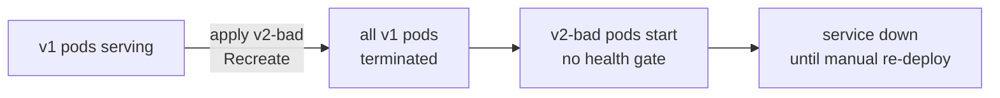
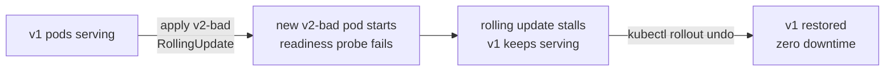

# Pain 9: I can't roll back a bad model without downtime

> *You pushed v3 of your model. p99 doubled and accuracy on your top intent dropped 4 points. Reverting means SSHing into N boxes, hoping the previous binary is still there, and praying nothing is half-deployed.*

## The pattern

Without a managed rollout, deployment is an imperative script: terminate the old process, start the new one. Every replica is a manual step. A bad push leaves some replicas on v2, some still on v1, none of them recoverable without knowing the exact previous artifact and re-running the whole procedure.

With a Deployment and a readiness probe, the controller manages the transition. New pods must pass a health check before old ones are replaced. A bad push stalls — the old pods keep serving — and rollback is a single command against tracked history.

Without a readiness probe, a `Recreate` strategy terminates all old pods before starting new ones:

With `RollingUpdate` and a readiness probe, the bad version never becomes live:

## The primitives

**[Deployment](https://kubernetes.io/docs/concepts/workloads/controllers/deployment/)**: declares the desired state — N replicas of this image with these resources. The controller converges reality to match. Rollout history is tracked automatically.

**[Rolling update strategy](https://kubernetes.io/docs/concepts/workloads/controllers/deployment/#rolling-update-deployment)**: replaces pods in batches. `maxUnavailable: 0` means no old pod is removed until a new one is ready. `maxSurge: 1` allows one extra pod during the transition.

**[Readiness probe](https://kubernetes.io/docs/tasks/configure-pod-container/configure-liveness-readiness-startup-probes/)**: a health check the kubelet runs before marking a pod Ready. A pod that fails its readiness probe is never added to Service endpoints and is never counted as a successful rollout step. This is the gate that prevents a bad push from becoming live.

**`kubectl rollout undo`**: reverts the Deployment to the previous revision in its history. No manifest required — the controller applies the tracked previous spec.

**[Argo Rollouts](https://argoproj.github.io/rollouts/) / [Flagger](https://flagger.app/)**: extend the rollout primitive with canary and blue-green strategies. Route 5% of traffic to v3, watch p99, ramp or revert automatically based on metrics.

## Trade-offs

**What you keep**: your model server. The Deployment is a YAML manifest wrapping it.

**What you give up**: deploying as a verb you do. Deployment becomes a state you declare, and the platform converges to it. Health checks must reflect actual readiness — a probe that always passes gives no protection.

## Try it

A working demonstration lives in [`examples/09-cant-roll-back/`](../examples/09-cant-roll-back/). [`before/`](../examples/09-cant-roll-back/before/README.md) uses a `Recreate` strategy with no readiness probe — observe the service go down during the update and the deployment falsely report success while pods are broken. [`after/`](../examples/09-cant-roll-back/after/README.md) adds a `RollingUpdate` strategy and a readiness probe — the bad push stalls, v1 keeps serving, and `kubectl rollout undo` restores the previous version in one command. Both run on a local Kind cluster with no GPU required.

---

[← Pain 8: GPU underutilization](08-gpu-underutilized.md) · [Landscape](../README.md) · [Pain 10: Latency spiked →](10-latency-spiked.md)
