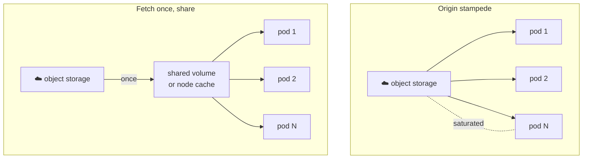

# Pain 18: Every new replica re-downloads 140GB of weights

> *You scale from two replicas to ten. Each new pod independently pulls the model weights from object storage. Ten pods hammer the same bucket, saturate the network, and every one of them waits minutes before it can serve a single request. The more you scale, the worse the stampede gets.*

## The pattern

[Pain 6](06-cold-start.md) is about one replica's startup time. This is the fan-out version: what happens when N replicas start at once and each fetches the full weights from the origin. There is no sharing, so the work is multiplied by N and the shared dependency, the bucket and the network path to it, becomes the bottleneck. The fix is to fetch once and share many, by moving the weights closer to the pods or letting pods get them from each other.

**Every pod hits the origin vs fetch once, share many:**

## The primitives

- **ReadWriteMany PersistentVolume**: download the weights once to a shared filesystem and mount it read-only into every pod. One fetch, many readers. See [Pain 6](06-cold-start.md) for the single-replica view of the same storage.
- **Node-local cache or a warmer DaemonSet**: pre-stage weights on each node's local disk so pods mount from local SSD instead of crossing the network on every start.
- **OCI artifacts and Image Volumes** (Kubernetes 1.31+): ship weights as an image or OCI artifact and get registry caching, layer de-duplication, and node-level reuse for free. Connects to the bake-it-in trade-off in [Pain 1](01-model-works-locally.md).
- **Peer-to-peer distribution** (Spegel, Dragonfly): replicas pull layers and blobs from each other on the local network rather than all hitting the origin.

## Trade-offs

**What you keep**: object storage as the source of truth for your weights.

**What you give up**: the simplicity of each pod fetching exactly what it needs on its own. You add a caching or sharing layer, in exchange for cold starts that stay fast as you scale and a bucket that does not melt under a scale-up event.

---

[← Pain 17: Serving many models](17-serving-many-models.md) · [Landscape](../README.md)
