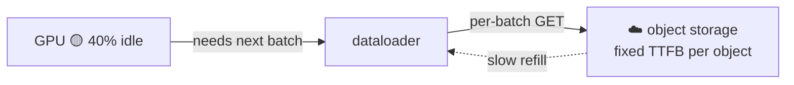
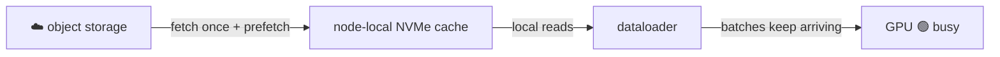

# Pain 19: My GPUs sit idle waiting for data

> *Your training job got every GPU it asked for, but utilization hovers around 40%. The bottleneck isn't compute, it's the dataloader. Every batch round-trips to object storage, and the GPU waits. You're paying H100 prices for a machine that spends half its time blocked on a network read.*

## The pattern

Object storage is cheap, durable, and far away. Training reads the same dataset many times, once per epoch, sample by sample. A naive mount turns each read into a remote GET with a fixed per-request latency that no object size amortizes away. The GPU drains its current batch faster than storage can refill the next one, so it stalls. The fix is to move the data closer and reuse it: cache it on node-local NVMe, prefetch ahead of the training loop, and stream shards instead of fetching millions of tiny objects.

**Without data locality, the GPU starves:**

**With a cache and prefetch, the GPU stays fed:**

## The primitives

- **Data orchestration and caching** (CNCF Fluid, Alluxio, JuiceFS): a dataset abstraction that caches hot data on node-local NVMe and prefetches it, so the second epoch and every replica read locally instead of from the origin.
- **Parallel and RWX filesystems** (Lustre, managed shared filesystems): high-throughput shared storage sized for many concurrent readers, instead of object storage behind a FUSE mount.
- **Streaming dataloaders** (WebDataset, MosaicML Streaming, Mountpoint for S3): read large sequential shards and overlap fetch with compute, instead of random small-object GETs.
- **The metric to watch**: MLPerf Storage measures accelerator utilization (AU%). A low AU% means storage, not the GPU, is your bottleneck.

This is distinct from [Pain 18](18-weight-stampede.md), the one-time weight-download stampede when serving replicas start. This is the continuous, every-epoch read path of training. Same lesson, fetch once and keep it close, different workload.

## Trade-offs

**What you keep**: your dataset in object storage as the durable source of truth, and your training code.

**What you give up**: the assumption that mounting remote storage makes it local. Throughput, locality, and caching become things you design for, not defaults you inherit.

---

[← Pain 18: Weight-download stampede](18-weight-stampede.md) · [Landscape](../README.md) · [Pain 20: Untrusted model supply chain →](20-model-supply-chain.md)
