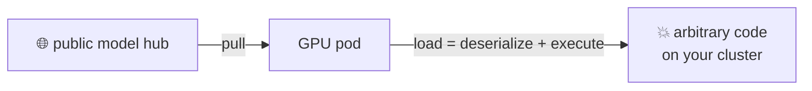
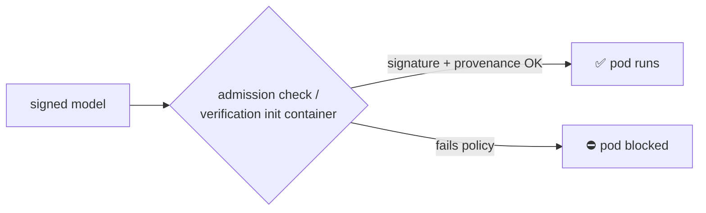

# Pain 20: Loading a model off the internet can run code on my cluster

> *You pull a model from a public hub and load it. If it's a pickle-based artifact, deserializing it can execute arbitrary code, on your cluster, with your credentials. Nobody checked who published it or whether it was tampered with in transit. By the time the weights touch a GPU pod, it's already too late.*

## The pattern

A model artifact is not inert data. Common formats run code on load by design, so "download model, load model" is really "download code, run code" from a source you don't control. The reproducible-image discipline from [Pain 1](01-model-works-locally.md) got the artifact to ship identically everywhere, but identical-everywhere is no help when the artifact is malicious. The fix is to verify provenance and integrity before the artifact is allowed to run, and to enforce that at the platform, not as a step a human has to remember.

**Without verification, loading is the exploit:**

**With a verify-before-run gate:**

## The primitives

- **Artifact signing** (Sigstore, model-transparency): sign the model at publish time and verify the signature before use, so a swapped or tampered artifact fails the check.
- **Admission-time enforcement** (Sigstore Policy Controller, Kyverno or OPA, the Model Validation Operator): a webhook or init container that blocks pod startup unless the model's signature and provenance pass policy. Verification becomes a platform gate, not a manual deploy step.
- **Safer formats**: prefer formats that are pure data (Safetensors) over pickle-based ones that execute on load.
- **Scanning**: pre-pull scanners that flag known-malicious artifacts, as a backstop rather than the primary control.

Honest note: the Kubernetes-native pieces here are young. The Model Validation Operator is early-stage, and admission tooling for models is still hardening. The pain is real today; treat the enforcement primitives as the direction of travel.

This is artifact integrity and trust, not model quality. Cloud native can prove the artifact is what it claims to be. It can't tell you the model is any good, see [where cloud native doesn't help](../reference/where-cn-doesnt-help.md).

## Trade-offs

**What you keep**: the ability to use public models.

**What you give up**: blind trust in "download and load." You add a verify-before-run gate, in exchange for not handing arbitrary publishers a shell on your cluster.

---

[← Pain 19: GPUs sit idle waiting for data](19-data-starvation.md) · [Landscape](../README.md) · [Pain 21: GPU degrades mid-job →](21-device-health.md)
