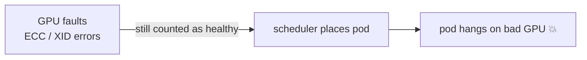

# Pain 21: A GPU degrades mid-job and Kubernetes doesn't notice

> *One GPU on a node throws ECC errors and slows to a crawl, or falls off the bus entirely. Your pod keeps running on a half-dead device, because to Kubernetes a GPU is either present or absent, with nothing in between. The job limps or hangs. At fleet scale this isn't rare, it's a daily occurrence.*

## The pattern

Kubernetes models a GPU as a countable resource: a node advertises N, the scheduler hands them out, done. There's no notion of "present but unhealthy." A device that develops a fault keeps getting scheduled, and the workload, not the platform, is what discovers the problem, usually as a mysterious hang or a throughput cliff. The fix is to make device health a first-class signal: detect faults from the hardware, mark the device or node unschedulable, and move work off it.

**Without health signals, bad devices keep getting work:**

**With health detection and remediation:**

## The primitives

- **GPU health telemetry** (DCGM, device-plugin health checks): surface XID errors, ECC failures, and row-remap events as machine-readable signals, not just dmesg noise.
- **Node-level remediation** (node-problem-detector, health-based cordon and drain): turn a detected fault into an unschedulable node and evict the affected pods.
- **Device health in the scheduler** (Dynamic Resource Allocation plus ResourceHealthStatus): emerging Kubernetes support for reporting per-device health so the scheduler can avoid degraded devices. This is alpha and moving fast, so treat it as the direction, not a finished primitive.

This is distinct from [Pain 2](02-gpu-job-crashed.md), recovering a crashed job by checkpoint and restart. This pain is the cluster noticing the hardware is bad in the first place, so the job isn't rescheduled straight back onto the same failing device. It also surfaces faults that inference latency metrics ([Pain 10](10-latency-spiked.md)) never explain.

## Trade-offs

**What you keep**: the simple "request N GPUs" interface for the common case.

**What you give up**: the assumption that an allocated GPU is a healthy GPU. At scale you wire up health detection and remediation, because failures are routine and the platform won't infer them for you.

---

[← Pain 20: Untrusted model supply chain](20-model-supply-chain.md) · [Landscape](../README.md)
