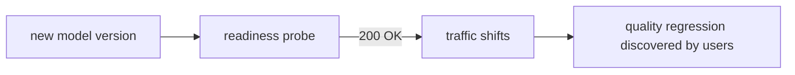
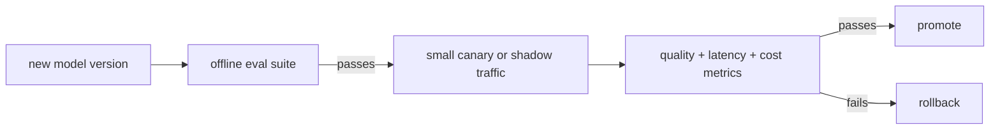

# Pain 22: My model passed health checks but failed quality

> *The rollout was green. Pods were Ready, HTTP checks returned 200, and latency stayed inside the SLO. Then users started reporting worse answers. The model was alive, but it was wrong.*

## The pattern

Kubernetes can tell whether a pod is running and whether an endpoint responds. It cannot tell whether the model's answers are better than the previous version. A readiness probe protects against broken servers; it does not protect against semantic regressions. In AI systems, "healthy" has two layers: infrastructure health and model quality.

**Without quality gates, a bad model looks deployable:**

**With quality gates, promotion depends on behavior:**

## The primitives

- **Evaluation gates in CI/CD**: run a fixed eval set before the model or prompt can be promoted. The gate checks task quality, safety constraints, regressions on known hard cases, and cost or latency budgets.
- **Canary and shadow traffic**: send a small slice of real traffic to the candidate model, or mirror traffic without serving its response to users. Compare behavior before broad rollout.
- **Metric-gated rollout** (Argo Rollouts, Flagger): promote or roll back based on Prometheus queries. For AI workloads those queries need quality signals, not only HTTP and latency signals.
- **Golden datasets and regression suites**: versioned examples that represent the behavior you cannot afford to lose.
- **Human review gates**: for subjective tasks, sample candidate outputs and require review before full promotion.

This extends [Pain 9](09-cant-roll-back.md). Pain 9 makes rollback fast and safe. This pain decides whether the rollout should advance in the first place.

Where it stops: cloud native runs the eval and enforces the verdict, but it doesn't score the eval. Defining what "good" means stays with you, see [where cloud native doesn't help](../reference/where-cn-doesnt-help.md).

## Trade-offs

**What you keep**: the same Deployment, rollout controller, and serving path.

**What you give up**: treating "pod is Ready" as equivalent to "model is good." Promotion becomes a product-quality decision expressed as deployment policy.

---

[← Pain 21: GPU device health](21-device-health.md) · [Landscape](../README.md) · [Pain 23: Reproduce shipped model →](23-model-reproducibility.md)
