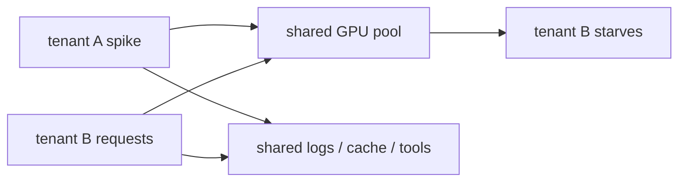
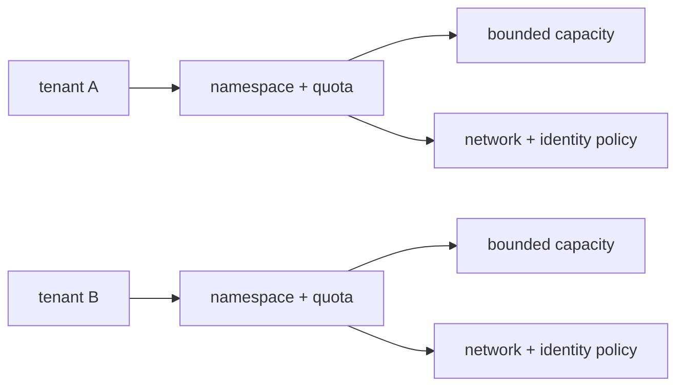

# Pain 25: One customer's workload can starve or leak into another

> *Two enterprise customers share the same inference platform. One sends a traffic spike and consumes the GPU pool. Another requires strict separation of prompts, embeddings, adapters, logs, and credentials. You have namespaces, but nobody can explain whether that is enough.*

## The pattern

Multi-tenancy is not one thing. It is resource fairness, data isolation, identity isolation, network isolation, and operational blast-radius control. AI workloads make this harder because tenants may bring their own data, adapters, prompts, tools, and compliance requirements while sharing expensive GPU capacity. The fix is to define the tenant boundary explicitly and enforce it at every layer.

**Without tenant boundaries, sharing is accidental:**

**With enforced boundaries, sharing is intentional:**

## The primitives

- **Namespaces, RBAC, and workload identity**: tenant workloads get bounded permissions and separate identities for accessing data and tools.
- **ResourceQuota, LimitRange, Kueue cohorts, and priority policy**: one tenant cannot consume the entire shared GPU pool unless policy allows it.
- **NetworkPolicies and service mesh policy**: tenants can only talk to approved services and data stores.
- **Node pools, taints, and runtime isolation**: high-sensitivity tenants can run on dedicated nodes or stronger isolation boundaries.
- **Secret separation and per-tenant keys**: credentials, adapters, prompts, and customer data are scoped to the tenant.

This is different from [Pain 13](13-data-residency.md). Residency says where data may live. Tenant isolation says who can share what, and under which enforced boundaries, even inside one region.

## Trade-offs

**What you keep**: shared infrastructure and GPU efficiency where sharing is acceptable.

**What you give up**: informal trust between tenants. Every shared layer needs an explicit policy or a deliberate decision to dedicate capacity.

---

[← Pain 24: Durable agents](24-durable-agents.md) · [Landscape](../README.md) · [Pain 26: Model drift →](26-model-drift.md)
