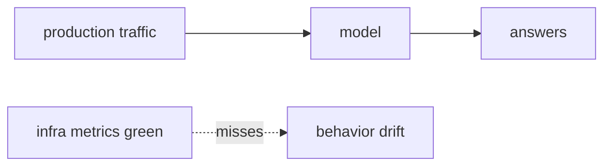
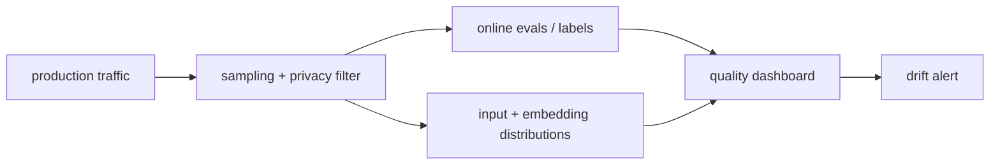

# Pain 26: I don't know if my model is drifting in production

> *Latency is fine, error rates are flat, and GPUs are healthy. But users say answers are getting worse. Maybe the input distribution changed, maybe a retrieval corpus shifted, maybe a fine-tune is stale. Your dashboards say the service is up. They do not say the model is still good.*

## The pattern

Infrastructure observability answers whether the system is running. Model observability answers whether behavior is changing. Drift is what happens when production inputs, retrieved context, tool outputs, labels, or user expectations move away from the data the model was evaluated on. You need signals that watch the model's behavior over time, not just the server's resource use.

**Without model signals, drift hides behind green dashboards:**

**With model observability, behavior gets a time series:**

## The primitives

- **Production sampling with privacy controls**: capture representative prompts, retrieved context, outputs, and metadata without violating data policy.
- **Online evaluation**: score sampled outputs with human labels, reference answers, task-specific checks, or judge models where appropriate.
- **Distribution monitoring**: watch input features, embedding clusters, retrieval hit rates, tool-call patterns, and output classes for shifts.
- **Feedback loops**: connect user ratings, support tickets, and correction workflows to model/version dashboards.
- **Version-aware dashboards**: every metric is grouped by model, prompt, adapter, retrieval index, and deployment revision.

This complements [Pain 10](10-latency-spiked.md). Pain 10 asks why the service is slow. This pain asks whether the model's behavior is still inside the envelope you intended.

Where it stops: cloud native carries the signal through sampling, metrics, scheduled scoring, and alerts. It doesn't decide what counts as drift, that judgment lives in your eval layer, see [where cloud native doesn't help](../reference/where-cn-doesnt-help.md).

## Trade-offs

**What you keep**: your existing metrics, logs, and traces.

**What you give up**: assuming uptime is enough. Model behavior becomes something you monitor, alert on, and feed back into evaluation and retraining.

---

[← Pain 25: Tenant isolation](25-tenant-isolation.md) · [Landscape](../README.md) · [Pain 27: Sandboxed code execution →](27-agent-sandbox.md)
