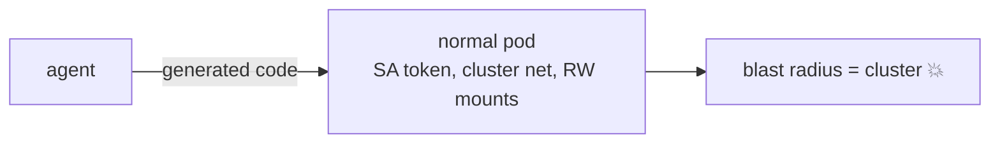
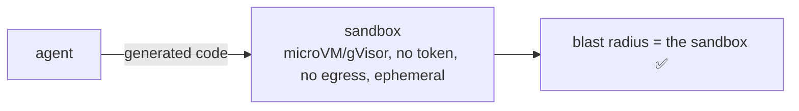

# Pain 27: My agent runs model-generated code and one bad call could own the cluster

> *Your agent writes and runs code to answer questions, call tools, and transform data. That code is generated by a model from user input. If it runs in your normal pod, with your service account, your network, and your mounts, a single malicious or buggy generation can read secrets, reach internal services, or wipe a volume.*

## The pattern

A normal container is a weak boundary for code you didn't write. It shares the host kernel, usually carries a real service account token, has cluster network access, and writable mounts. Code an agent generates on the fly should run in something stronger and disposable: an isolated sandbox with no standing credentials, no network by default, and a short life. The fix is to treat every execution as untrusted and contain it, so a bad generation blasts the sandbox and nothing else.

**Without isolation, generated code runs as you:**

**With a disposable sandbox, the blast radius is the box:**

## The primitives

- **Stronger isolation** (gVisor, Kata Containers, Firecracker microVMs): a real kernel boundary between executed code and the host, not just a shared-kernel container.
- **Ephemeral execution pods**: one pod per execution, created on demand and destroyed after, so nothing persists between runs.
- **Least privilege**: no service account token mounted, read-only root filesystem, dropped capabilities, seccomp and AppArmor profiles.
- **Default-deny network**: the sandbox gets no egress unless explicitly granted, which is [Pain 29](29-agent-egress.md).

This is the execution-isolation companion to [Pain 20](20-model-supply-chain.md). Pain 20 is "the model you load is untrusted." This pain is "the code the model writes is untrusted."

## Trade-offs

**What you keep**: the agent's ability to run code.

**What you give up**: running that code with your own identity and access. Each execution gets its own disposable, locked-down box.

---

[← Pain 26: Model drift](26-model-drift.md) · [Landscape](../README.md) · [Pain 28: Tool and MCP fleet →](28-tool-fleet.md)
