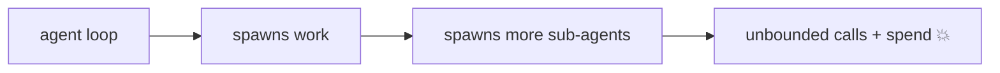
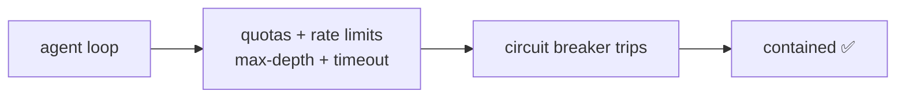

# Pain 30: My agent looped overnight and burned the budget

> *An agent got into a retry or planning loop. By morning it had made tens of thousands of model and tool calls, spawned sub-agents that spawned sub-agents, and run up a bill, or starved every other tenant on the cluster. Nothing stopped it, because nothing was watching for "too much."*

## The pattern

Agents can generate their own work, recursively. Without bounds, a single bad run consumes unbounded tokens, compute, and downstream API calls. The platform can't decide the right budget for a task, but it can enforce ceilings: caps on concurrency, spend, depth, and time, with a circuit breaker that trips before the damage is done. The fix is to put hard limits around a workload that can otherwise grow without end.

**Without ceilings, one run consumes everything:**

**With ceilings, the runaway trips a breaker:**

## The primitives

- **ResourceQuota and LimitRange**: cap the compute and the number of concurrent agent and worker pods per namespace or tenant.
- **Rate limits at the gateway**: bound model and tool call volume per agent and per tenant.
- **Workflow guardrails**: max steps, max depth, deadlines, and budgets enforced by the durable workflow engine, which builds on [Pain 24](24-durable-agents.md).
- **Circuit breakers and kill switches**: trip on spend or call-rate thresholds and stop the run, rather than discovering it on the invoice.

This is the enforcement side of cost. Cloud native can't pick the cost and quality trade-off, but it can refuse to let spend grow without bound, see [where cloud native doesn't help](../reference/where-cn-doesnt-help.md). It specializes [Pain 11](11-costs-out-of-control.md) and [Pain 25](25-tenant-isolation.md) to agent loops.

## Trade-offs

**What you keep**: the agent's ability to plan, retry, and fan out.

**What you give up**: unbounded autonomy. The workload runs inside explicit ceilings on concurrency, depth, time, and spend.

---

[← Pain 29: Agent egress control](29-agent-egress.md) · [Landscape](../README.md) · [Pain 31: Deploy guardrails →](31-deploy-guardrails.md)
