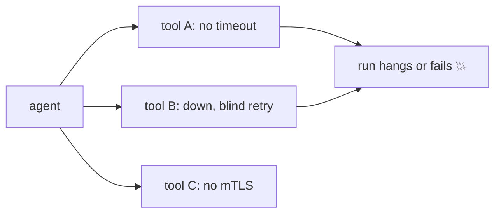
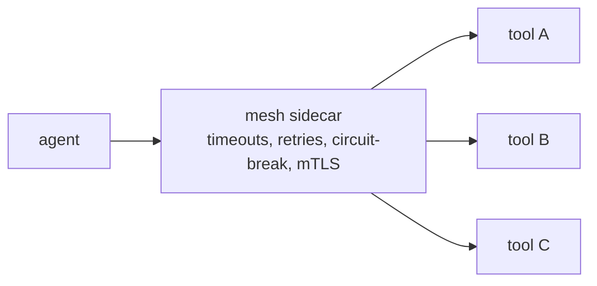

# Pain A.03: My agent calls a dozen tool servers and any one of them breaks the run

> *Your agent depends on a fleet of tool and MCP servers: search, code execution, a database tool, a few internal APIs, a vendor or two. Each is a separate service. When one is slow, down, or unauthenticated, the agent hangs, retries blindly, or fails the whole task. There are no consistent timeouts, retries, or auth across them.*

## The pattern

An agent is a client to many services, and the reliability of a run is the product of all of them. Hand-rolling timeouts, retries, and auth inside agent code is inconsistent and invisible, and it drifts per tool. The platform already knows how to make service-to-service calls reliable and secure. The fix is to put the tool fleet behind that machinery instead of reinventing it in every tool wrapper.

**Without shared reliability, one weak tool fails the run:**

**With a mesh in front, failures are contained:**

## The primitives

- **Service mesh** (Istio, Linkerd): consistent timeouts, retries, circuit breaking, and mTLS for every tool call, configured outside agent code.
- **Service discovery**: tools are addressable by stable name, not hardcoded URLs, so they can move and scale.
- **Rate limiting and quotas**: protect both the tools and the agent from runaway call volume, which is [Pain A.05](A05-runaway-agents.md).
- **Health checks and readiness**: a flaky tool is taken out of rotation instead of failing live requests.

This is the cloud-native half of "tool call reliability." Cloud native makes the tool service reliable. Whether the model emits a valid call is still the model's job, see [where cloud native doesn't help](../reference/where-cn-doesnt-help.md).

## Trade-offs

**What you keep**: your tools and the agent's calls to them.

**What you give up**: per-tool, in-code reliability logic. Timeouts, retries, and auth become platform policy, uniform across the fleet.

---

[← Pain A.02: Sandboxed code exec](A02-agent-sandbox.md) · [Landscape](../README.md) · [Pain A.04: Agent egress control →](A04-agent-egress.md)
