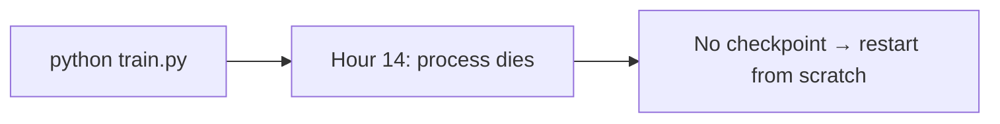
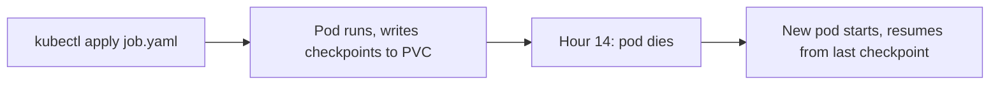

# Pain C.01: My GPU job crashed at hour 14 and I lost everything

> *You ran `python train.py` on a rented GPU box. Process died. No checkpoint policy, no auto-restart, no record of which step you were on. The box is fine. Your run isn't.*

## The pattern

**Without cloud native (bare script)**

The process owns its own lifecycle. When it dies, so does your progress.

**With cloud native (Job + PVC)**

The platform owns the lifecycle. Checkpoints survive pod death; the next run picks up where the last one stopped.

In cloud native, long-running compute is declared rather than invoked. You describe what you want (image, command, resources, retry policy, where state lives) and the platform owns running it to completion.

## The primitives

- **Job**: a workload that runs to completion with retry-on-failure built in
- **PersistentVolumeClaim**: durable storage that outlives the pod, so checkpoints survive process death
- **Checkpoint hooks**: your code writes state on a cadence; on restart, it resumes from the last good one

## Trade-offs

**What you keep**: your training code, mostly unchanged. The diff is a YAML manifest and a `--resume-from` flag.

**What you give up**: `htop` and `ls -la`. Logs come from `kubectl logs`. State lives on a volume you don't see directly. Worth it the first time hour 14 doesn't cost you a day.

## Try it

A working demonstration lives in [`examples/C01-jobs/`](../examples/C01-jobs/). Same Python training loop shipped two ways (bare script vs Kubernetes Job + PVC), runnable on a Mac with a local Kind cluster and no GPU required. Kill the pod mid-run, watch the replacement resume from the last checkpoint.

---

[← Pain H.02: SLURM bridge](H02-slurm-bridge.md) · [Landscape](../README.md) · [Pain C.02: Can't get a GPU →](C02-cant-get-a-gpu.md)
