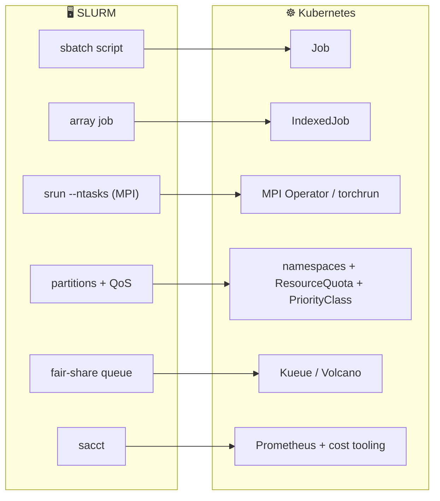

# Pain H.01: I run training jobs on SLURM and Kubernetes feels like a rewrite

> *Your training lives in `sbatch` scripts. `squeue` to watch, `sacct` to account, `#SBATCH --gres=gpu:8` to ask for hardware. The team wants the cloud native upside, autoscaling, multi-cloud portability, cost visibility, but every concept you rely on has no obvious equivalent, so the migration stalls before it starts.*

## The pattern

SLURM and Kubernetes solve the same problem, putting batch work on shared hardware, with different mental models. SLURM is imperative: you submit a script and a central controller queues it. Kubernetes is declarative: you describe an object and a control loop makes it real. The migration stalls when you look for a one-to-one command swap. There isn't one. There is a concept-to-concept mapping, and once you see it the rewrite shrinks to a translation.

**The translation:**

## The primitives

- **`Job` and `IndexedJob`**: a single `sbatch` run becomes a Job. A `--array` job becomes an IndexedJob, where each pod gets a `JOB_COMPLETION_INDEX` that plays the role of `SLURM_ARRAY_TASK_ID`.
- **MPI Operator, PyTorchJob, `torchrun`**: `srun --ntasks` multi-node runs map to a training operator that gang-schedules ranks and wires up the rendezvous. See [Pain C.04](C04-multi-node-training.md).
- **Namespaces, ResourceQuota, PriorityClass**: SLURM partitions and QoS classes become namespaces with quotas and priority classes that decide who preempts whom.
- **Kueue and Volcano**: fair-share, queueing, and preemption that SLURM gave you for free are added back by a batch scheduler on top of Kubernetes.
- **Prometheus and cost tooling**: `sacct`-style accounting becomes workload metrics and a cost layer (Kubecost, OpenCost) reading the same data.

## Trade-offs

**What you keep**: your training code, the idea of a queued batch job, and fair-share scheduling once Kueue or Volcano is in place.

**What you give up**: `sbatch` muscle memory and a single controller that owns the queue. You now think in declared objects reconciled by control loops, not scripts submitted to a daemon. For teams that want the bridge instead of the rewrite, see [Pain H.02](H02-slurm-bridge.md).

---

[← Pain F.02: Model supply chain](F02-model-supply-chain.md) · [Landscape](../README.md) · [Pain H.02: SLURM bridge →](H02-slurm-bridge.md)
