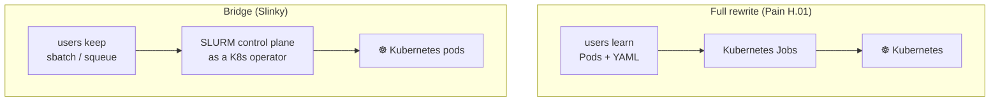

# Pain H.02: My team knows SLURM and won't relearn everything to run one job

> *Two hundred `sbatch` scripts and a deadline. Your HPC operators know `squeue`, your ML engineers know `sbatch`. Telling them to learn Pods, Deployments, and YAML before they can get any work done is, in practice, a migration blocker. The infrastructure team wants Kubernetes. The users want their jobs to run today.*

## The pattern

The full rewrite ([Pain H.01](H01-slurm-migration.md)) is correct and also slow, because it asks every user to change at once. There is an incremental path: keep the SLURM interface, swap the engine underneath. Slinky runs a SLURM control plane as a Kubernetes operator. Users still type `sbatch`, `squeue`, and `scancel`. The jobs run as Kubernetes pods. The infrastructure migrates without retraining the people on top of it.

**Rewrite path vs bridge path:**

## The primitives

- **Slinky**: the SLURM operator for Kubernetes (from NVIDIA and CoreWeave). It runs a SLURM control plane inside the cluster and routes submitted jobs to pods instead of bare-metal nodes.
- **What stays the same**: `sbatch` scripts, partition names, `--gres=gpu:N`, and `sacct` accounting all keep working. The user-facing contract does not change.
- **What changes underneath**: the backing scheduler is Kubernetes. GPUs are managed by device plugins or [DRA](C03-whole-gpus-only.md). Capacity grows with HPA and Karpenter instead of static node pools.
- **The incremental path**: run Slinky alongside your existing SLURM cluster and migrate workloads job-type by job-type, rather than flipping everyone at once.

## Trade-offs

**What you keep**: `sbatch`, `squeue`, `scancel`, your job scripts, and your users' muscle memory. The migration becomes invisible to the people doing the science.

**What you give up**: a pure cloud native model. You are running SLURM semantics on Kubernetes, which means two control planes to operate and rough edges where SLURM features do not map cleanly, license management, cgroups v1 quirks, and certain MPI transports. When the team is ready, [Pain H.01](H01-slurm-migration.md) is the destination.

---

[← Pain H.01: SLURM rewrite](H01-slurm-migration.md) · [Landscape](../README.md) · [Pain C.01: GPU job crashed →](C01-gpu-job-crashed.md)
