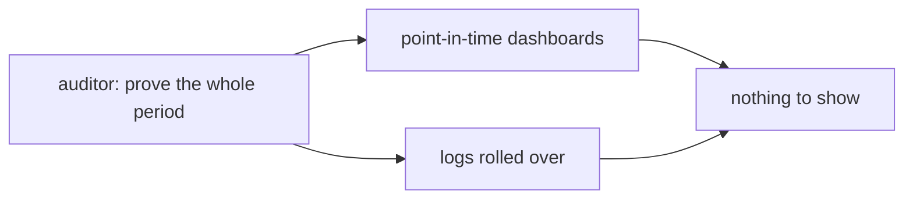
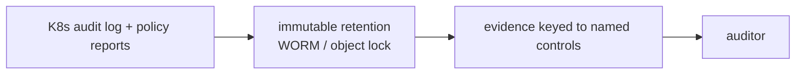

# Pain R.03: An auditor wants proof of what ran all year, and I have point-in-time logs

> *The auditor doesn't want a screenshot of today. They want evidence that, across the entire period, only approved models ran, access was controlled, and policy held, with who did what and when. Your dashboards show now. Your logs rolled over a month ago. You have nothing that spans the period.*

## The pattern

Compliance evidence is a time series, not a snapshot. A SOC 2 Type II or FedRAMP audit asks you to prove controls operated continuously across months, not that they pass at the moment of inspection. The cluster already emits the raw material: every API action and every policy decision. The fix is to capture it, keep it tamper-evident for the retention window, and be able to export it keyed to the controls the auditor names.

**Without retained evidence, the period is a blank:**

**With a retained, exportable record:**

## The primitives

- **Kubernetes audit logs**: a structured record of who did what, when, and to which object, at the API server. This is the spine of the evidence.
- **Runtime and policy audit** (Falco `k8saudit`, Kyverno Audit `PolicyReports`): record policy violations and runtime events continuously, not only at block time.
- **Tamper-evident retention**: ship logs off-cluster to immutable storage (object lock, WORM) for the full retention window, so the record can't be quietly edited.
- **Compliance posture management** (KSPM, scanners mapped to CIS, SOC 2, FedRAMP): produce signed, exportable reports keyed to named controls.

This pairs with [Pain G.03](G03-deploy-guardrails.md). Pain G.03 enforces and approves at deploy time; this pain keeps the continuous record that proves it held over the period. It is distinct from [Pain O.03](O03-model-drift.md), which watches model behavior, and [Pain G.02](G02-model-reproducibility.md), which reconstructs what shipped. This is the audit trail of cluster actions for an external reviewer.

Where it stops: cloud native records who, what, and when, and exports it. Whether that evidence satisfies a given regulation, and which controls apply, is a legal and auditor judgment, see [where cloud native doesn't help](../reference/where-cn-doesnt-help.md). The AI angle is current: auditors are beginning to ask for proof that only approved models served traffic across the period, which the EU AI Act formalizes from August 2026.

## Trade-offs

**What you keep**: your running workloads.

**What you give up**: assuming "it's compliant now" is provable later. Evidence becomes something you capture and retain continuously, not reconstruct at audit time.

---

[← Pain R.02: Tenant isolation](R02-tenant-isolation.md) · [Landscape](../README.md) · [Pain A.01: Durable agents →](A01-durable-agents.md)
