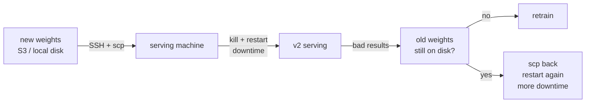
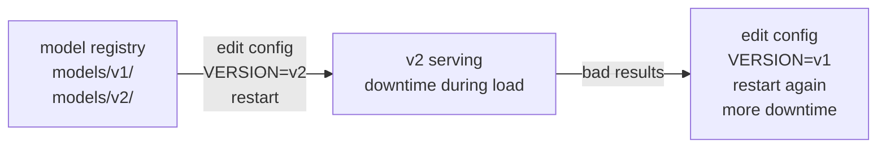
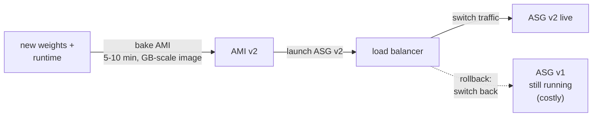
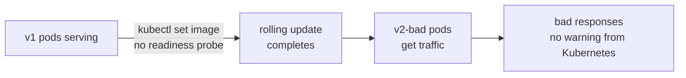
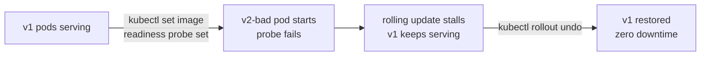

# Pain S.03: I can't roll back a bad model without downtime

> *You pushed v3 of your model with `kubectl set image`. The rollout completed. p99 doubled and accuracy on your top intent dropped 4 points. You dig through CI logs trying to find the previous image tag. You didn't know `kubectl rollout undo` existed.*

## The pattern

Model deployment has evolved through several distinct stages, each solving the previous problem while introducing a new one. The cloud-native solution is not just "better SSH" — it is a different model of what deployment means.

### Stage 1: Bare-bones — SSH, scp, restart

A model is trained in a notebook or on a training VM. Weights are saved to a shared filesystem or object store. "Deployment" is SSHing into the serving machine, pulling the new weights, and restarting the process.

**What it solves**: nothing — this is the starting point.
**What it can't do**: no deployment record, no revision history, no atomic switchover. Rollback depends on whether the old file still exists on disk.

---

### Stage 2: Model registry — versioned storage, config swap

More mature teams version weights on shared storage (`models/v1/`, `models/v2/`) and point the serving process at the current version via a config file or environment variable. Rollback is editing the config path and restarting.

**What it solves**: the old version is always available; rollback is deterministic.
**What it can't do**: still manual, still requires a process restart, still has a downtime window. No health gate — the process coming up does not mean the model is producing valid predictions.

---

### Stage 3: VM/AMI bake — atomic switchover, coupled infrastructure

Some teams bake model weights into a machine image (AMI, VM snapshot) and use a load balancer to switch between autoscaling groups. This gives atomic traffic switchover and clean rollback — point the load balancer back at the old ASG.

**What it solves**: atomic traffic switchover; rollback does not require a restart.
**What it can't do**: multi-minute bake times per model version, enormous image sizes, and model version coupled to infrastructure version. Updating a dependency means rebaking the whole image. Keeping both ASGs running doubles cost during the switchover window.

---

### Stage 4: Kubernetes without health gates

A Deployment with the default `RollingUpdate` strategy. The rollout replaces pods in batches. But without a readiness probe, Kubernetes has no signal to distinguish a healthy pod from a broken one — any pod that starts counts as a successful rollout step. A bad push completes silently.

**What it solves**: no bake step, no manual SSH, rollout history tracked automatically, `kubectl rollout undo` exists.
**What it can't do**: without a readiness probe, the platform cannot detect a bad rollout. The rollout reports success regardless of whether the pods serve correct responses.

---

### Stage 5: Kubernetes with a readiness probe

A readiness probe gives the platform the signal it was missing. A pod that fails its health check is never added to Service endpoints and never counted as a successful rollout step. A bad push stalls — old pods keep serving — and rollback is a single command.

**What it solves**: health-gated rollout, zero downtime, single-command rollback against tracked history.
**What it can't do**: a readiness probe that always passes gives no protection — the probe must reflect actual model readiness, not just process liveness.

---

## The primitives

**[Deployment](https://kubernetes.io/docs/concepts/workloads/controllers/deployment/)**: declares the desired state — N replicas of this image with these resources. The controller converges reality to match. Rollout history is tracked automatically.

**[Rolling update strategy](https://kubernetes.io/docs/concepts/workloads/controllers/deployment/#rolling-update-deployment)**: replaces pods in batches. `maxUnavailable: 0` means no old pod is removed until a new one is ready. `maxSurge: 1` allows one extra pod during the transition.

**[Readiness probe](https://kubernetes.io/docs/tasks/configure-pod-container/configure-liveness-readiness-startup-probes/)**: a health check the kubelet runs before marking a pod Ready. A pod that fails its readiness probe is never added to Service endpoints and is never counted as a successful rollout step. This is the gate that prevents a bad push from becoming live.

**`kubectl rollout undo`**: reverts the Deployment to the previous revision in its history. No manifest required — the controller applies the tracked previous spec.

**[Argo Rollouts](https://argoproj.github.io/rollouts/) / [Flagger](https://flagger.app/)**: extend the rollout primitive with canary and blue-green strategies. Route 5% of traffic to v3, watch p99, ramp or revert automatically based on metrics.

## Trade-offs

**What you keep**: your model server. The Deployment is a YAML manifest wrapping it.

**What you give up**: deploying as a verb you do. Deployment becomes a state you declare, and the platform converges to it. Health checks must reflect actual readiness — a probe that always passes gives no protection.

## Try it

A working demonstration lives in [`examples/S03-cant-roll-back/`](../examples/S03-cant-roll-back/). [`before/`](../examples/S03-cant-roll-back/before/README.md) is Stage 4 — a `RollingUpdate` Deployment with no readiness probe: observe the rollout complete successfully while the new pods serve nothing, with no warning from Kubernetes. [`after/`](../examples/S03-cant-roll-back/after/README.md) is Stage 5 — the same Deployment with a readiness probe: the bad push stalls, v1 keeps serving, and `kubectl rollout undo` restores the previous version in one command. Both run on a local Kind cluster with no GPU required.

---

[← Pain S.02: Server image coupling](S02-server-image-coupling.md) · [Landscape](../README.md) · [Pain S.04: Quality gates →](S04-quality-gates.md)
