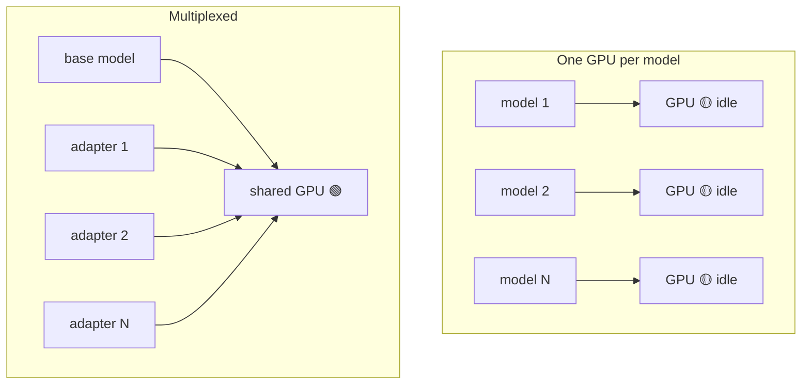

# Pain S.06: I have 200 fine-tunes and a GPU each would bankrupt me

> *You serve a fine-tune per customer, or a variant per use case. Two hundred of them. Giving each its own GPU replica is unaffordable, and most sit idle most of the time. But every model still has to be reachable, with low latency, the moment a request for it arrives.*

## The pattern

The default serving shape is one model, one Deployment, one GPU. It is simple and it does not scale to a catalog of models, because cost grows linearly with model count while utilization falls. The fix is to multiplex: put many models on shared GPUs and load them on demand. Two techniques cover most cases, depending on whether your models share a base.

**One GPU per model vs multiplexed:**

## The primitives

- **Multi-LoRA serving** (vLLM, LoRAX): keep one base model resident in GPU memory and load lightweight LoRA adapters per request. Dozens of fine-tunes that share a base run on a single GPU, with adapters swapped in microseconds.
- **KServe ModelMesh**: a density-optimized serving runtime that loads models on demand and evicts cold ones, so total GPU memory bounds how many are warm, not how many exist.
- **Scale-from-zero for the long tail**: rarely used models can scale to zero and cold-start on demand. Note the warning in [what not to translate](../reference/what-not-to-translate.md): scale-to-zero is wrong for hot models, right for the long tail.
- **Adapter-aware routing**: requests must reach a replica that already has the right model or adapter loaded, which ties directly to [Pain S.05](S05-inference-routing.md).

## Trade-offs

**What you keep**: your fine-tunes as artifacts, served behind one endpoint.

**What you give up**: the one-model-one-server simplicity. Multiplexing adds a loading and eviction layer plus adapter-aware routing, in exchange for not paying for a GPU per model. Models that do not share a base get less benefit from the LoRA path and lean on on-demand loading instead.

---

[← Pain S.05: Inference routing](S05-inference-routing.md) · [Landscape](../README.md) · [Pain S.07: Weight stampede →](S07-weight-stampede.md)
