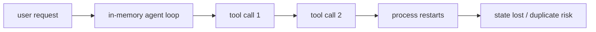
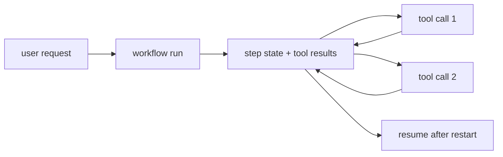

# Pain A.01: My agent died halfway through a user task

> *The agent had already called three tools, written partial state, and asked an external API to do work. Then the process restarted. The chat UI says "try again," but retrying from the beginning might duplicate a payment, send the same email twice, or lose the user's context.*

## The pattern

Agents are not a single request-response call. They are workflows with memory, side effects, retries, timeouts, and human-visible progress. A notebook or web handler can hold the whole plan in process memory, but production cannot. Processes restart, tools fail, users disconnect, and external systems respond late. The fix is to make the agent's execution durable: every step records state, every side effect is idempotent, and recovery resumes from the last known point.

**Without durability, process death loses the task:**

**With durable execution, the workflow resumes:**

## The primitives

- **Durable workflow engine** (Temporal, Argo Workflows, cloud workflow services): records each step so execution can resume after process or node failure.
- **Queues and workers**: decouple user requests from long-running work; workers can crash and be replaced without losing the task.
- **Idempotency keys**: every external side effect can be retried safely without duplicating work.
- **State store**: conversation state, tool outputs, approvals, and checkpoints live outside the process.
- **Timeouts, retries, and compensation steps**: failures are modeled as part of the workflow, not as surprises in a stack trace.

This is related to [Pain C.01](../compute/C01-gpu-job-crashed.md), but the state is not only a training checkpoint. It is a sequence of tool calls and side effects that must remain coherent for the user.

## Trade-offs

**What you keep**: the agent's reasoning loop and tools.

**What you give up**: assuming one process owns the whole task. The agent becomes a resumable workflow with explicit state and side-effect boundaries.

---

[← Pain R.03: Audit evidence](../compliance/R03-audit-evidence.md) · [Landscape](../../README.md) · [Pain A.02: Sandboxed code exec →](A02-agent-sandbox.md)
