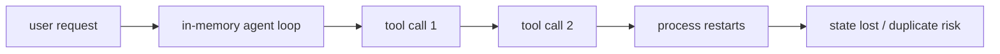
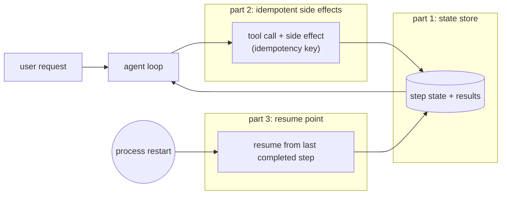

# Pain A.01: My agent died halfway through a user task

> *The agent had already called three tools, written partial state, and asked an external API to do work. Then the process restarted. The chat UI says "try again," but retrying from the beginning might duplicate a payment, send the same email twice, or lose the user's context.*

## The pattern

Agents are not a single request-response call. They are workflows with memory, side effects, retries, timeouts, and human-visible progress. A notebook or web handler can hold the whole plan in process memory, but production cannot: processes restart, tools fail, users disconnect, and external systems answer late. Making an agent durable comes down to three parts, and the useful thing is that each one can be swapped independently:

1. **State kept outside the process**, so a fresh process can see what the dead one had already done.
2. **Side effects that are safe to retry**, so resuming cannot duplicate a charge or an email.
3. **A resume point**, something that reads the recorded state and continues from the last completed step instead of starting over.

Get all three and the agent survives losing its process. Miss any one and you are back to "try again from the top," carrying the duplicate-side-effect risk that comes with it.

**Without durability, process death loses the task:**

**With durable execution, the workflow resumes:**

## The primitives

Each of the three parts has a range of implementations, from hand-rolled to a managed engine. They are independent: you can pick any state store, any way of making side effects safe, and any resume mechanism, and mix them.

- **A state store (part 1).** The conversation, tool outputs, approvals, and per-step checkpoints have to live somewhere a fresh process can read: a PVC, a database, object storage, or the payload of a durable queue message. The choice is about sharing and transactionality, not about whether it counts as durable.
- **Idempotency keys (part 2).** Every external action carries a key, so a retry after a crash is a no-op instead of a second charge or a duplicate email. This is the one part no engine can supply for you: an engine can re-run a step, but only your code can make re-running safe. The coarser the resume granularity, the more this part has to carry.
- **A resume mechanism (part 3).** On restart, something has to read the recorded state and continue from the last completed step. You can hand-roll a checkpoint-and-resume loop; use a durable-execution engine like Temporal that replays an event history to rebuild in-process state; use a step-level workflow engine like Argo Workflows that records which steps in a DAG finished and skips them on retry; let a durable queue (NATS JetStream, Kafka via Strimzi, RabbitMQ, Pulsar, Redis Streams) redeliver an unacknowledged message to a new worker; or use an agent framework's checkpointer, such as LangGraph's Postgres or SQLite savers. These differ mainly in how finely they resume: Temporal to the instruction, Argo to the step, a queue to the whole work item, which is why coarser engines lean harder on part 2.

Whichever mechanism you pick, timeouts, retries, and compensation steps become part of the workflow definition rather than surprises in a stack trace. Queues and workers are worth calling out as a packaging: the queue holds part 1 (the work item) and provides part 3 (redelivery), leaving you to supply part 2.

This is related to [Pain C.01](../compute/C01-gpu-job-crashed.md), but the state is not only a training checkpoint. It is a sequence of tool calls and side effects that must remain coherent for the user.

## Trade-offs

**What you keep**: the agent's reasoning loop and tools.

**What you give up**: assuming one process owns the whole task. The agent becomes a resumable workflow with explicit state and side-effect boundaries.

---

[← Pain R.03: Audit evidence](../compliance/R03-audit-evidence.md) · [Landscape](../../README.md) · [Pain A.02: Sandboxed code exec →](A02-agent-sandbox.md)
