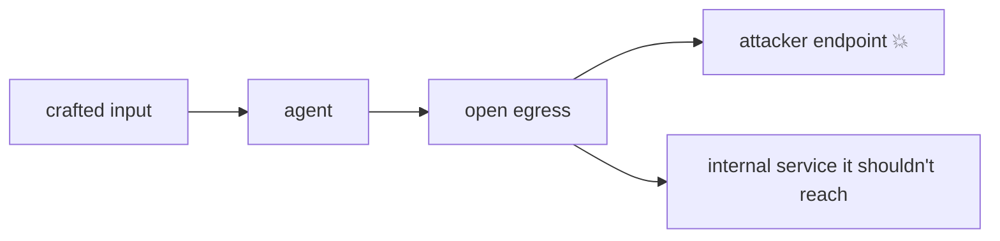
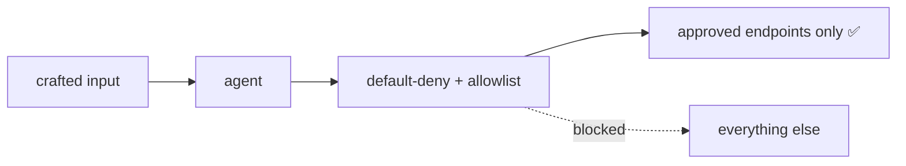

# Pain A.04: A prompt-injected agent can call any endpoint and walk my data out

> *Your agent has tools and network access. A crafted input, typed directly or smuggled through a retrieved document, convinces it to POST your data to an attacker's endpoint, or to hit an internal service it should never reach. By default a pod can talk to the whole cluster and the open internet, so the agent can too.*

## The pattern

Agents turn input into actions, and one of those actions is network calls. Combine that with prompt injection and a default-open network, and you have a data-exfiltration and SSRF path that needs no breakout. Cloud native can't stop the model from being fooled, but it can bound what a fooled agent is able to reach. The fix is default-deny egress with an explicit allowlist of the endpoints the agent legitimately needs.

**Without egress control, injection reaches anything:**

**With default-deny egress, the reachable set is declared:**

## The primitives

- **Network policy, default-deny egress**: the agent pod gets no outbound access except an explicit allowlist.
- **Egress gateway or proxy**: route outbound calls through a chokepoint that logs and enforces allowed destinations.
- **L7 egress policy** (Cilium, service mesh): allow by hostname and path, not just IP, since model-driven calls are URL-shaped.
- **Per-tenant and per-agent scoping**: different agents get different allowlists, so a compromised one can't reach another's targets, which connects to [Pain R.02](../compliance/R02-tenant-isolation.md).

This bounds the blast radius that [Pain A.02](A02-agent-sandbox.md) contains locally. Together they limit what a misbehaving agent can do. Cloud native can't prevent the injection itself, that's the AI layer, only what it can reach.

## Trade-offs

**What you keep**: the agent's legitimate tool and API calls.

**What you give up**: open, implicit network access. Every destination the agent may reach is now declared.

---

[← Pain A.03: Tool/MCP fleet](A03-tool-fleet.md) · [Landscape](../../README.md) · [Pain A.05: Runaway-loop governance →](A05-runaway-agents.md)
