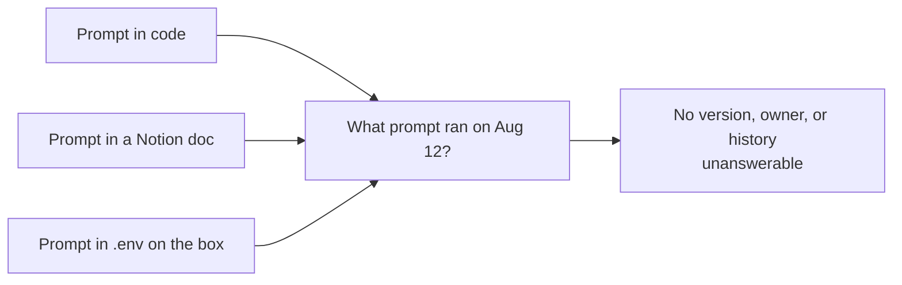
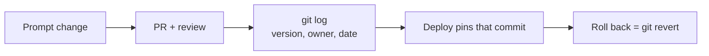

# Pain G.01: I can't tell which prompt version is in prod

> *A customer reports a regression on a specific kind of query. You suspect a prompt change from two weeks ago. The prompt lives partly in code, partly in a Notion doc, partly in a `.env` file on the prod box. Nobody can answer "what prompt was running on August 12th."*

## The pattern

**Without cloud native (scattered config)**

The prompt is hidden state spread across places that don't agree and aren't tracked. When a regression shows up, nobody can say what was actually running that day, let alone roll back to the version that worked.

**With cloud native (versioned config)**

The prompt becomes config with a version, an owner, and a history. What's running is whatever commit the environment is synced to, so any past state is reproducible and a bad change is one revert away.

This is a different problem from decoupling config from the image, which is [Pain S.02: server image coupling](../serving/S02-server-image-coupling.md). You can do all of S.02 and still hit this pain: a ConfigMap edited in place with `kubectl edit` has the same amnesia as the `.env` on the box. The point here is not the ConfigMap, it is committing it to git so every change carries a version, an owner, and a history. Any value that affects behavior is config, and config belongs in git.

## The primitives

- **Git as the source of truth**: the prompt lives as a file in your environment repo, not in a console or on a box. Every change is a commit with an author, a timestamp, and a diff, so "what ran on Aug 12, and who changed it" is a `git log` away.
- **GitOps sync and rollback**: a controller ([Argo CD](https://argo-cd.readthedocs.io/), [Flux](https://fluxcd.io/)) keeps the cluster synced to a known commit, so what's running is never a guess and there is no "edit in prod" path to drift from. Rollback is `git revert`.
- **Pinned versions**: each deploy references a specific image digest and ConfigMap revision, so any past state is reproducible exactly, not approximated. Externalizing the prompt into that ConfigMap in the first place is the job of S.02.

## Trade-offs

**What you keep**: your prompts and your prompt-engineering process. They move from scattered storage into a tracked file.

**What you give up**: editing a prompt in prod via the web UI. Prompt changes become PRs, which is annoying for about a week and load-bearing forever after.

## Try it

A working demonstration lives in [`examples/governance/G01-prompt-version/`](../../examples/governance/G01-prompt-version/). [`before/`](../../examples/governance/G01-prompt-version/before/README.md) runs bare with Python: the prompt is a code constant that a `.env` file silently overrides, there is no `/version` endpoint, and "what prompt was running on the 12th" is unanswerable. [`after/`](../../examples/governance/G01-prompt-version/after/README.md) mounts the prompt from a versioned ConfigMap: the pod reports its prompt version at `/version`, `kubectl rollout history` records which version ran when, and rolling back a bad prompt is one `kubectl apply` or one `git revert`. Runnable on a local Kind cluster with no GPU required.

---

[← Pain O.05: GPU device health](../operations/O05-device-health.md) · [Landscape](../../README.md) · [Pain G.02: Reproduce shipped model →](G02-model-reproducibility.md)
