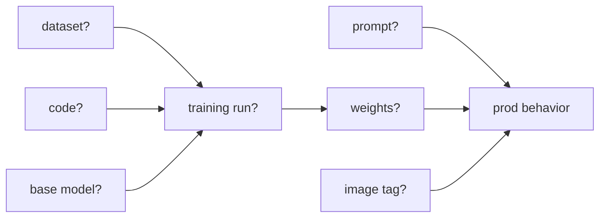
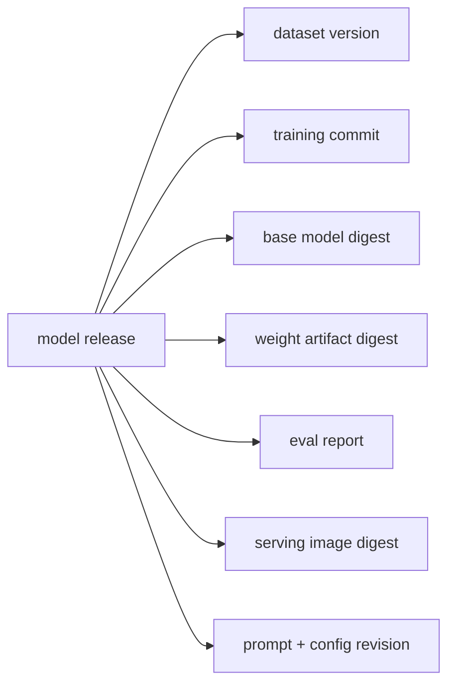

# Pain G.02: I can't reproduce the model I shipped

> *A customer asks why the model behaved differently last Tuesday. You know the image tag, maybe the prompt, maybe the checkpoint. But the dataset snapshot, base model digest, training commit, eval run, and deployment config are scattered across notebooks, buckets, dashboards, and chat messages.*

## The pattern

Reproducibility is more than rebuilding the container. For AI systems, the shipped behavior is the product of many artifacts: data, code, base model, fine-tuned weights, prompt, runtime image, feature flags, and deployment config. If any one of those is mutable or untracked, "what was running?" becomes archaeology.

**Without lineage, the running model is a bundle of guesses:**

**With lineage, one release points to every input:**

## The primitives

- **Immutable artifact references**: use digests for images, model artifacts, base models, and dataset snapshots rather than floating tags.
- **Model registry or artifact registry**: store weights and metadata together: version, producer, input artifacts, eval results, and approval state.
- **Dataset versioning**: record the exact snapshot, shard list, or table version used to train and evaluate the model.
- **GitOps history**: connect the model release to the environment revision that deployed it.
- **Provenance records** (SLSA-style build provenance, ML metadata stores): capture which job produced the artifact from which inputs.

This connects [Pain F.01](../foundation/F01-model-works-locally.md), [Pain G.01](G01-prompt-version.md), and [Pain F.02](../foundation/F02-model-supply-chain.md). Those cover runtime reproducibility, prompt/config history, and artifact trust. This pain ties them into one answerable release record.

Where it stops: cloud native pins exactly what shipped through digests, GitOps, and provenance. Reconstructing how the model was trained stays with MLflow, Weights and Biases, and DVC, see [where cloud native doesn't help](../../reference/where-cn-doesnt-help.md).

## Trade-offs

**What you keep**: your training and deployment flow.

**What you give up**: ad hoc promotion. Every shipped model needs a manifest that names the exact inputs that created and served it.

---

[← Pain G.01: Prompt version in prod](G01-prompt-version.md) · [Landscape](../../README.md) · [Pain G.03: Deploy guardrails →](G03-deploy-guardrails.md)
