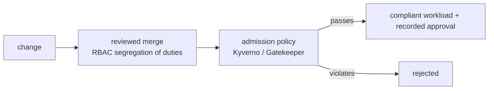

# Pain G.03: Anything can deploy, and I can't prove who approved it

> *A model shipped to prod. It pulled from an unapproved registry, carried no data-residency label, and skipped review. Nothing blocked it. Later an auditor asks who approved it, and the honest answer is that no gate required an approval and no durable record says one happened.*

## The pattern

Two gaps, one cause: deploys aren't governed. Without a policy gate, any workload that parses can reach prod, compliant or not. Without an enforced approval step, "who signed off?" is a question nobody can answer after the fact. Cloud native closes both at the same chokepoint: admission control rejects what violates policy, and a reviewed change path is the only way in, with identity and approval attached. Cloud native can enforce the rules and record the gate; it cannot decide what the rules should be.

**Without a gate, anything reaches prod unaccountably:**

**With a gate, only compliant changes pass, with an owner:**

## The primitives

- **Policy-as-code admission control** (Kyverno, OPA Gatekeeper): `validate` in Enforce mode blocks deploys that violate policy, unapproved registries, missing residency or owner labels, unsigned images, disallowed resources. Pod Security Admission covers the baseline.
- **Enforced change path** (GitOps + branch protection): the cluster only changes through a reviewed, approved merge; direct `kubectl` write is closed off by RBAC.
- **Segregation of duties** (RBAC): the person who authors a change is not the only one who can approve it.
- **Signed commits and signed approvals**: tie the approval to an identity that can't be trivially forged.

Honest limit: Git history by itself is mutable, it can be force-pushed and rewritten. Branch protection, RBAC, signed commits, and an external audit log are what make the approval trail trustworthy, not "it's in Git." The durable, tamper-evident record of what was actually admitted lives in the audit log, see [Pain R.03](../compliance/R03-audit-evidence.md).

This builds on [Pain F.02](../foundation/F02-model-supply-chain.md) and [Pain G.02](G02-model-reproducibility.md). Pain F.02 asks "is this model trustworthy," Pain G.02 asks "what exactly shipped," this pain asks "was it allowed, and who said yes." The AI angle: the policy can require an approved base model, a model bill of materials, and residency labels, which is what AI Act auditors are starting to ask for. What CN cannot do is decide whether your policy actually satisfies the regulation, that judgment is legal and human, see [where cloud native doesn't help](../../reference/where-cn-doesnt-help.md).

## Trade-offs

**What you keep**: your deploy flow, now with a gate in front of it.

**What you give up**: ad hoc deploys and implicit trust. Every change passes a policy check and carries a recorded approval.

---

[← Pain G.02: Reproduce shipped model](G02-model-reproducibility.md) · [Landscape](../../README.md) · [Pain R.01: Data residency →](../compliance/R01-data-residency.md)
