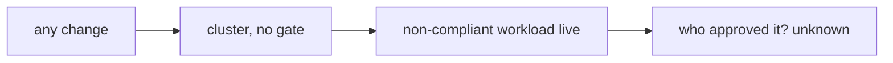
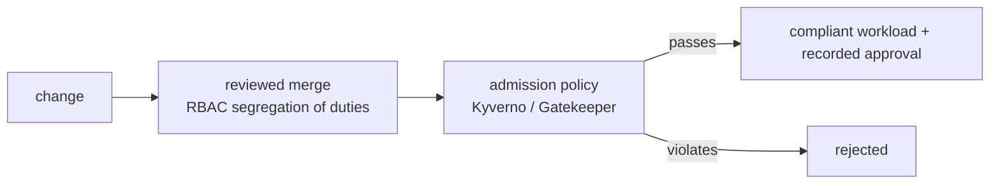

# Pain G.03: Anything can deploy, and I can't prove who approved it

> *A model shipped to prod. It pulled from an unapproved registry, carried no data-residency label, and skipped review. Nothing blocked it. Later an auditor asks who approved it, and the honest answer is that no gate required an approval and no durable record says one happened.*

## The pattern

A deploy reaches prod without passing through anyone. With no policy gate, any workload that is valid YAML is admitted, compliant or not, so an unapproved registry, a mutable `:latest` tag, or a missing residency label all wave through. With no enforced approval, when an auditor later asks who signed off, the honest answer is that nothing required that anyone did. It is one gap seen twice: the cluster accepts whatever it is handed and keeps no record of who decided it should. The fix is to route every change through one chokepoint, a policy gate that rejects what breaks the rules and a reviewed change path that is the only way in, so each deploy carries an identity and an approval.

**Without cloud native (no gate, anything reaches prod unaccountably)**

**With cloud native (a gate, only compliant changes pass, with an owner)**

## The primitives

- **Policy-as-code admission control** (Kyverno, OPA Gatekeeper): `validate` in Enforce mode blocks deploys that violate policy, unapproved registries, missing residency or owner labels, unsigned images, disallowed resources. Pod Security Admission covers the baseline.
- **Enforced change path** (GitOps + branch protection): the cluster only changes through a reviewed, approved merge; direct `kubectl` write is closed off by RBAC.
- **Segregation of duties** (RBAC): the person who authors a change is not the only one who can approve it.
- **Signed commits and signed approvals**: tie the approval to an identity that can't be trivially forged.

Honest limit: Git history by itself is mutable, it can be force-pushed and rewritten. Branch protection, RBAC, signed commits, and an external audit log are what make the approval trail trustworthy, not "it's in Git." The durable, tamper-evident record of what was actually admitted lives in the audit log, see [Pain R.03](../compliance/R03-audit-evidence.md).

This builds on [Pain F.02](../foundation/F02-model-supply-chain.md) and [Pain G.02](G02-model-reproducibility.md). Pain F.02 asks "is this model trustworthy," Pain G.02 asks "what exactly shipped," this pain asks "was it allowed, and who said yes." The AI angle: the policy can require an approved base model, a model bill of materials, and residency labels, which is what AI Act auditors are starting to ask for. What CN cannot do is decide whether your policy actually satisfies the regulation, that judgment is legal and human, see [where cloud native doesn't help](../../reference/where-cn-doesnt-help.md).

## Trade-offs

**What you keep**: your deploy flow, now with a gate in front of it.

**What you give up**: ad hoc deploys and implicit trust. Every change passes a policy check and carries a recorded approval.

## Try it

A working demonstration lives in [`examples/governance/G03-deploy-guardrails/`](../../examples/governance/G03-deploy-guardrails/). [`before/`](../../examples/governance/G03-deploy-guardrails/before/README.md) deploys a non-compliant workload (unapproved registry, a mutable `:latest` tag, no `owner` or `data-residency` label) into an ungoverned cluster and nothing stops it. [`after/`](../../examples/governance/G03-deploy-guardrails/after/README.md) installs [Kyverno](https://kyverno.io/) and applies one `ClusterPolicy` with three Enforce-mode rules: the same manifest is now rejected at admission with the rejection naming every rule it broke, only a compliant Deployment passes, and the pass is recorded as a PolicyReport. Runnable on a local Kind cluster with no GPU required. This covers the admission-control half of the pain; the reviewed-merge approval path is described above, not scripted.

---

[← Pain G.02: Reproduce shipped model](G02-model-reproducibility.md) · [Landscape](../../README.md) · [Pain R.01: Data residency →](../compliance/R01-data-residency.md)
