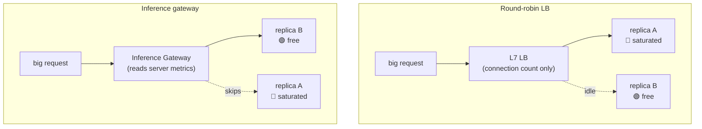

# Pain S.05: My load balancer sends a 10k-token request to a saturated replica

> *Your model server runs behind a standard L7 load balancer doing round-robin. But inference requests are not uniform: one is 50 tokens, the next is 10,000. Round-robin lands a heavy request on a replica already mid-generation, while an idle replica sits free. p99 climbs and adding replicas barely helps, because the balancer cannot see which ones are actually busy.*

## The pattern

A web load balancer balances connections. It assumes requests are short, cheap, and roughly equal, so round-robin or least-connections is good enough. Inference breaks every one of those assumptions. A request's cost is set by its token count and the replica's current KV cache pressure, none of which a connection-level balancer can see. The fix is a balancer that speaks inference: it reads model-server metrics and routes on real load.

**Connection-blind vs inference-aware:**

## The primitives

- **Gateway API Inference Extension (GAIE)**: a standard extension to the Kubernetes Gateway API that adds an endpoint picker. It routes each request based on live model-server signals instead of connection counts.
- **The signals that matter**: KV cache utilization, request-queue depth, prefix-cache locality, and LoRA adapter affinity. These decide which replica will actually answer fastest.
- **llm-d and similar**: distributed inference stacks that combine cache-aware routing with disaggregated serving, so routing and the serving layer share the same view of load.
- **Why the generic LB fails**: it balances at the connection layer and never sees token-level cost, so it cannot avoid the saturated replica.

## Trade-offs

**What you keep**: your model server (vLLM, TGI, or similar) and the Deployment and Service underneath it.

**What you give up**: the assumption that HTTP load balancing is a solved, workload-agnostic problem. Inference needs a balancer that understands inference, which is one more component to run and to reason about. Routing by adapter affinity also connects directly to [Pain S.06](S06-serving-many-models.md).

---

[← Pain S.04: Quality gates](S04-quality-gates.md) · [Landscape](../../README.md) · [Pain S.06: Serving many models →](S06-serving-many-models.md)
