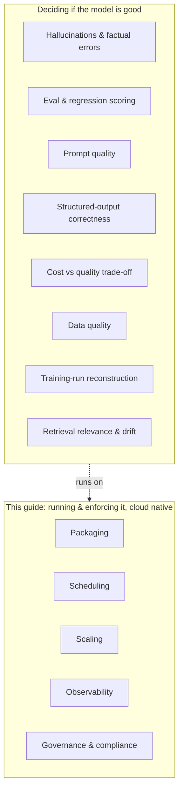

# Where cloud native doesn't help

A field guide is only credible if it admits its limits. Cloud native answers a specific class of problems: packaging, scheduling, scaling, network, observability, governance, compliance. There is one thing it cannot answer: whether your model is any good. Knowing the difference saves you from forcing a Kubernetes-shaped answer onto a non-Kubernetes-shaped problem.

But the line runs through the middle of most AI concerns, not around them. Almost every item below has two halves: **deciding whether the output is good** (not cloud native) and **running, enforcing, or observing the thing that decides** (cloud native). Cloud native owns the second half and none of the first. The earlier drafts of this page drew the line too far out, writing off whole concerns that cloud native genuinely operates.

Where the line falls:

- **Hallucinations and factual errors.** No primitive here makes your model more truthful. That is retrieval design, fine-tuning, and prompting. Cloud native can host a guardrail or validation service, but it cannot decide what is true.
- **Eval and regression: cloud native runs it, it does not score it.** Whether the new model got worse at your top intent is an eval question, and cloud native has no opinion on the score. But running the eval as a Job, gating a rollout on its result, shifting traffic with a canary, and rolling back automatically are all cloud native. See [Pain 22](../pains/22-quality-gates.md). The verdict is yours; the gate is the platform's.
- **Prompt quality.** Cloud native can version your prompts and ship them safely ([Pain 12](../pains/12-prompt-version.md)). It cannot tell you whether they are any good.
- **Tool calls: the service is cloud native, the output is not.** Whether your model emits valid JSON 99% or 80% of the time is a model and prompt problem. Whether the tool service is reachable, retried, rate limited, and timed out is a platform problem, and at agent scale a large one. See the Agent Systems pains.
- **Cost: cloud native caps it, it does not optimize it.** Picking a smaller model, more caching, or less context is your trade-off to make. Enforcing budgets, quotas, per-tenant rate limits, and routing to a cheaper model are cloud native ([Pain 11](../pains/11-costs-out-of-control.md), [Pain 25](../pains/25-tenant-isolation.md)). It does more than show you the bill; it can refuse to let it grow.
- **Data quality.** Garbage in, garbage out is older than Kubernetes and unfixable by it. Cloud native can run a validation pipeline; it cannot judge the data.
- **Reproducibility: the deployment is cloud native, the experiment is not.** Reconstructing a training run, the dataset snapshot, hyperparameters, and eval, belongs to MLflow, Weights and Biases, and DVC. But pinning exactly what shipped, the image digest, the GitOps config, and signed provenance, is cloud native ([Pain 23](../pains/23-model-reproducibility.md), [Pain 20](../pains/20-model-supply-chain.md)). Cloud native answers "what was running," not "how was it trained."
- **Drift: cloud native carries the signal, it does not detect the drift.** Whether the input distribution or retrieval corpus shifted is a modeling question, and operating Weaviate, Qdrant, or Milvus on Kubernetes does not make retrieval good. But sampling production traffic, exporting metrics, running a detector on a schedule, and alerting are cloud native ([Pain 26](../pains/26-model-drift.md)). It gives the detector somewhere to run and something to read; it does not define what counts as drift.

A working AI system needs both halves: the decision about whether the model is good, and the platform that runs, enforces, and observes that decision. Don't expect either to do the other's job.

---

[Back to landscape](../README.md)
